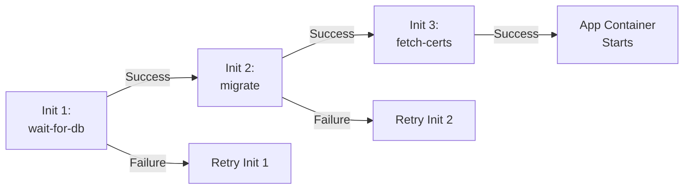

> 💡 **Quick Answer:** Init containers run sequentially before app containers start. Use them for: waiting on dependencies (`wait-for-db`), running database migrations, fetching certificates/configs, and setting file permissions on shared volumes.

## The Problem

Applications often need prerequisites before starting: database must be reachable, migrations must run, config files must exist, TLS certificates must be fetched. Without init containers, you embed this logic in the application — mixing concerns and complicating the image.

## The Solution

### Pattern 1: Wait for Dependency

```yaml
initContainers:
  - name: wait-for-db
    image: busybox:1.36
    command: ['sh', '-c']
    args:
      - |
        until nc -z postgres-svc 5432; do
          echo "Waiting for PostgreSQL..."
          sleep 2
        done
        echo "PostgreSQL is ready"
```

### Pattern 2: Database Migration

```yaml
initContainers:
  - name: migrate
    image: registry.example.com/my-app:1.5.0
    command: ['./migrate', '--direction', 'up']
    env:
      - name: DATABASE_URL
        valueFrom:
          secretKeyRef:
            name: db-credentials
            key: url
```

### Pattern 3: Fetch TLS Certificates

```yaml
initContainers:
  - name: fetch-certs
    image: registry.example.com/cert-fetcher:1.0
    command: ['sh', '-c']
    args:
      - |
        vault read -field=certificate secret/tls/my-app > /certs/tls.crt
        vault read -field=private_key secret/tls/my-app > /certs/tls.key
        chmod 600 /certs/tls.key
    volumeMounts:
      - name: certs
        mountPath: /certs
containers:
  - name: app
    volumeMounts:
      - name: certs
        mountPath: /etc/tls
        readOnly: true
volumes:
  - name: certs
    emptyDir: {}
```

### Pattern 4: Fix Volume Permissions

```yaml
initContainers:
  - name: fix-permissions
    image: busybox:1.36
    command: ['sh', '-c', 'chown -R 1000:1000 /data']
    securityContext:
      runAsUser: 0
    volumeMounts:
      - name: data
        mountPath: /data
```



## Common Issues

**Init container stuck — pod stays in `Init:0/3`**

The init container is failing or waiting indefinitely. Check logs:
```bash
kubectl logs my-pod -c wait-for-db
```

**Init container can't resolve DNS**

Init containers run before the pod network is fully configured on some CNIs. Add a small sleep or use IP addresses instead of service names.

## Best Practices

- **Keep init containers lightweight** — use `busybox` or `alpine`, not your full app image
- **One responsibility per init container** — easier to debug when they're sequential
- **Share data via emptyDir volumes** — init containers write, app containers read
- **Set resource requests on init containers** — they count toward pod scheduling
- **Use `restartPolicy: Always` on init containers** (K8s 1.29+ sidecar containers) for long-running helpers

## Key Takeaways

- Init containers run sequentially, each must succeed before the next starts
- They share volumes with app containers via emptyDir or PVC
- Common patterns: dependency wait, migration, cert fetch, permission fix
- Init container resources count toward pod resource calculation
- K8s 1.29+ adds native sidecar containers (`restartPolicy: Always` on init containers)
