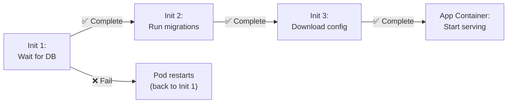

> 💡 **Quick Answer:** Init containers run before app containers start, executing one at a time in order. Use them to wait for dependencies (\`until nslookup my-db; do sleep 2; done\`), run database migrations, clone Git repos, set file permissions, or download config files. If any init container fails, the pod restarts.

## The Problem

Your application needs preconditions before starting: a database must be reachable, config files must exist, migrations must run, or permissions must be set. Putting these checks in the app container leads to complex entrypoint scripts, race conditions, and difficult debugging. Init containers separate concerns cleanly.



## The Solution

### Wait for a Dependency

```yaml
apiVersion: v1
kind: Pod
metadata:
  name: my-app
spec:
  initContainers:
    - name: wait-for-db
      image: busybox
      command: ["sh", "-c"]
      args:
        - |
          until nslookup postgres.default.svc.cluster.local; do
            echo "Waiting for postgres..."
            sleep 2
          done
          echo "Database is ready!"
  containers:
    - name: app
      image: myapp:v1.0
```

### Run Database Migrations

```yaml
initContainers:
  - name: run-migrations
    image: myapp:v1.0
    command: ["python", "manage.py", "migrate", "--noinput"]
    env:
      - name: DATABASE_URL
        valueFrom:
          secretKeyRef:
            name: db-secret
            key: url
```

### Clone a Git Repository

```yaml
initContainers:
  - name: clone-repo
    image: alpine/git
    command: ["git", "clone", "https://github.com/org/config.git", "/config"]
    volumeMounts:
      - name: config-volume
        mountPath: /config
containers:
  - name: app
    image: nginx
    volumeMounts:
      - name: config-volume
        mountPath: /usr/share/nginx/html
volumes:
  - name: config-volume
    emptyDir: {}
```

### Download and Prepare Files

```yaml
initContainers:
  - name: download-model
    image: curlimages/curl
    command: ["sh", "-c"]
    args:
      - |
        curl -L -o /models/model.bin \
          https://models.example.com/llama-7b.bin
        echo "Model downloaded successfully"
    volumeMounts:
      - name: model-storage
        mountPath: /models
```

### Set Permissions

```yaml
initContainers:
  - name: fix-permissions
    image: busybox
    command: ["sh", "-c", "chown -R 1000:1000 /data && chmod 750 /data"]
    securityContext:
      runAsUser: 0     # Root — only for permission fixing
    volumeMounts:
      - name: data
        mountPath: /data
containers:
  - name: app
    securityContext:
      runAsUser: 1000   # Non-root
    volumeMounts:
      - name: data
        mountPath: /data
```

### Multiple Init Containers (Ordered)

```yaml
initContainers:
  # Step 1: Wait for dependency
  - name: wait-for-redis
    image: busybox
    command: ["sh", "-c", "until nc -z redis 6379; do sleep 1; done"]

  # Step 2: Wait for another dependency
  - name: wait-for-db
    image: busybox
    command: ["sh", "-c", "until nc -z postgres 5432; do sleep 1; done"]

  # Step 3: Run migrations (only after both are ready)
  - name: migrate
    image: myapp:v1.0
    command: ["./migrate.sh"]
    env:
      - name: DB_HOST
        value: postgres

# All init containers must succeed before app starts
containers:
  - name: app
    image: myapp:v1.0
```

### Debug Init Container Failures

```bash
# Check which init container is failing
kubectl get pod my-app
# NAME    READY   STATUS     RESTARTS   AGE
# my-app  0/1     Init:1/3   0          5m    ← stuck on 2nd init container

# Check init container logs
kubectl logs my-app -c wait-for-db
# Waiting for postgres...
# Waiting for postgres...

# Describe pod for events
kubectl describe pod my-app | grep -A20 "Init Containers"

# Exec into running init container (if it's still running)
kubectl exec -it my-app -c wait-for-db -- sh
```

### Init Containers vs Startup Probes

| Feature | Init Containers | Startup Probes |
|---------|:--------------:|:--------------:|
| Run before app starts | ✅ | ❌ (runs alongside) |
| Different image | ✅ | ❌ (same container) |
| Access different volumes | ✅ | ❌ |
| Block app startup | ✅ | ✅ (delays readiness) |
| Use case | External setup tasks | Slow-starting apps |

## Common Issues

| Issue | Cause | Fix |
|-------|-------|-----|
| Pod stuck in \`Init:0/1\` | Init container failing or waiting | Check logs: \`kubectl logs pod -c init-name\` |
| Init container CrashLoopBackOff | Command exits non-zero | Fix the script, check exit codes |
| Init container slow | Downloading large files | Use a PVC with pre-populated data |
| Volume not shared | Missing shared emptyDir volume | Ensure both init and app mount same volume |
| Permission denied | Init runs as non-root | Add \`securityContext.runAsUser: 0\` to init container only |

## Best Practices

- **One concern per init container** — don't combine wait + migrate + download
- **Set resource limits** — init containers consume resources too
- **Use timeouts** — don't wait forever: \`timeout 120 sh -c "until ..."\`
- **Keep images minimal** — use busybox/alpine, not your full app image
- **Prefer \`fsGroupChangePolicy\`** over permission-fixing init containers
- **Log what's happening** — echo progress messages for debugging

## Key Takeaways

- Init containers run sequentially before app containers, in order
- If any init container fails, the pod restarts (all init containers re-run)
- Use them for: dependency waits, migrations, file downloads, permission setup
- Can use different images from app containers (e.g., busybox for waiting)
- Debug with \`kubectl logs <pod> -c <init-container-name>\`
- Each init container must complete successfully before the next one starts
