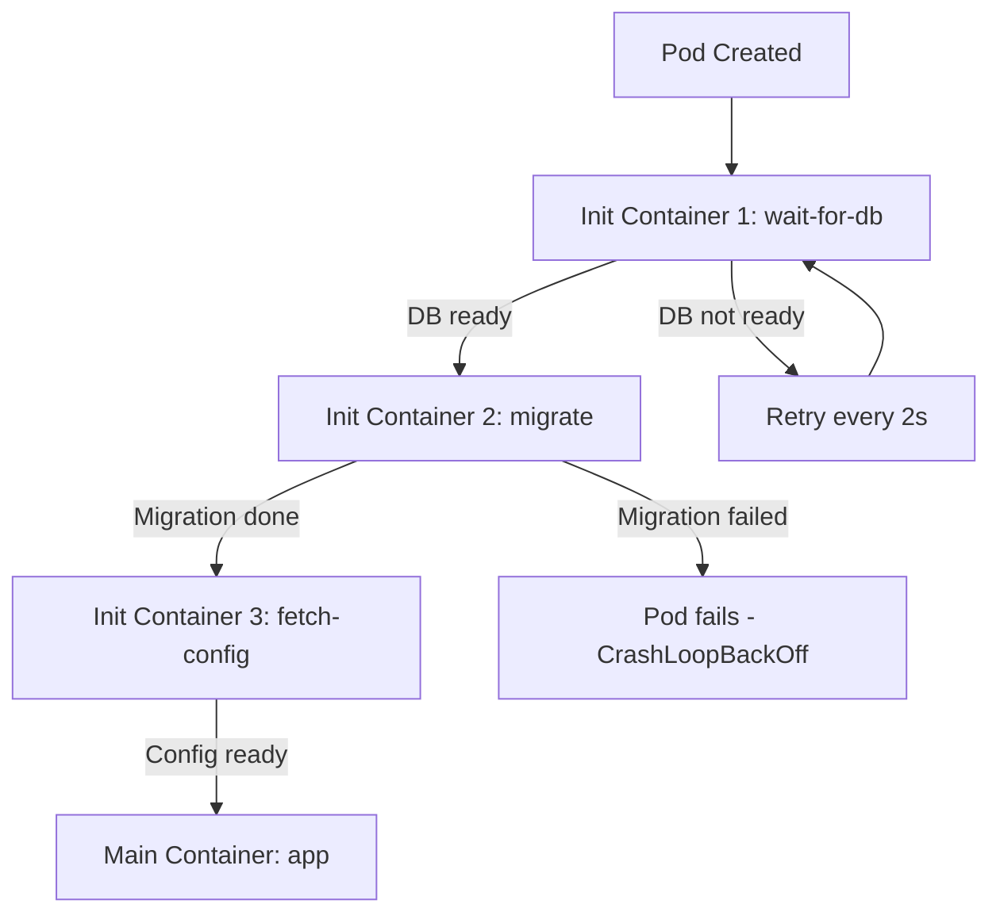

> 💡 **Quick Answer:** Use init containers for database migrations, config loading, dependency waiting, and secret fetching. Patterns for sequential initialization in Kubernetes pods.

## The Problem

Init containers run before your main application container starts. They're essential for pre-flight checks, database migrations, waiting for dependencies, and fetching secrets.

## The Solution

### Common Init Container Patterns

#### Wait for a Dependency

```yaml
apiVersion: v1
kind: Pod
metadata:
  name: my-app
spec:
  initContainers:
    - name: wait-for-postgres
      image: busybox:1.36
      command: ['sh', '-c', 'until nc -z postgres-svc 5432; do echo waiting for postgres; sleep 2; done']
    - name: wait-for-redis
      image: busybox:1.36
      command: ['sh', '-c', 'until nc -z redis-svc 6379; do echo waiting for redis; sleep 2; done']
  containers:
    - name: app
      image: my-app:v1
```

#### Run Database Migrations

```yaml
initContainers:
  - name: migrate
    image: my-app:v1
    command: ['python', 'manage.py', 'migrate', '--no-input']
    env:
      - name: DATABASE_URL
        valueFrom:
          secretKeyRef:
            name: db-credentials
            key: url
```

#### Fetch Secrets from Vault

```yaml
initContainers:
  - name: vault-agent
    image: hashicorp/vault:1.15
    command: ['vault', 'agent', '-config=/etc/vault/agent.hcl', '-exit-after-auth']
    volumeMounts:
      - name: vault-token
        mountPath: /vault/secrets
      - name: vault-config
        mountPath: /etc/vault
containers:
  - name: app
    image: my-app:v1
    volumeMounts:
      - name: vault-token
        mountPath: /vault/secrets
        readOnly: true
```

#### Download Configuration Files

```yaml
initContainers:
  - name: download-config
    image: curlimages/curl:8.5.0
    command:
      - sh
      - -c
      - |
        curl -o /config/app.yaml https://config-server.example.com/my-app/production
        curl -o /config/features.json https://feature-flags.example.com/flags
    volumeMounts:
      - name: config
        mountPath: /config
containers:
  - name: app
    volumeMounts:
      - name: config
        mountPath: /app/config
        readOnly: true
```

#### Fix File Permissions

```yaml
initContainers:
  - name: fix-permissions
    image: busybox:1.36
    command: ['sh', '-c', 'chown -R 1000:1000 /data']
    securityContext:
      runAsUser: 0
    volumeMounts:
      - name: data
        mountPath: /data
```



## Best Practices

- **Start small and iterate** — don't over-engineer on day one
- **Monitor and measure** — you can't improve what you don't measure
- **Automate repetitive tasks** — reduce human error and toil
- **Document your decisions** — future you will thank present you

## Key Takeaways

- This is essential knowledge for production Kubernetes operations
- Start with the simplest approach that solves your problem
- Monitor the impact of every change you make
- Share knowledge across your team with internal runbooks
