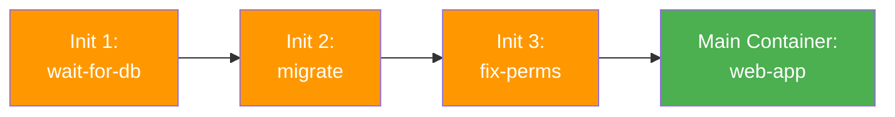

> 💡 **Quick Answer:** Init containers run before app containers, execute sequentially, and must succeed before the main container starts. Use them for dependency waiting (`wait-for-db`), config file generation, schema migrations, permission setup, and file downloads. Each init container runs to completion before the next one starts.

## The Problem

Applications often need setup tasks before they can start:

- Wait for a database to be ready
- Run schema migrations before the app connects
- Download configuration from a remote source
- Set file permissions on shared volumes
- Clone a git repository for content
- Check that upstream services are healthy

Putting these in the main container bloats the image and complicates the entrypoint.

## The Solution

### Basic Init Container

```yaml
apiVersion: apps/v1
kind: Deployment
metadata:
  name: web-app
spec:
  replicas: 3
  selector:
    matchLabels:
      app: web-app
  template:
    metadata:
      labels:
        app: web-app
    spec:
      initContainers:
      # Wait for database
      - name: wait-for-db
        image: busybox:1.36
        command:
        - sh
        - -c
        - |
          until nc -z postgres-svc 5432; do
            echo "Waiting for database..."
            sleep 2
          done
          echo "Database is ready!"
      
      # Run migrations
      - name: run-migrations
        image: myapp:v1
        command: ["python", "manage.py", "migrate"]
        env:
        - name: DATABASE_URL
          valueFrom:
            secretKeyRef:
              name: db-creds
              key: url
      
      # Fix volume permissions
      - name: fix-permissions
        image: busybox:1.36
        command: ["sh", "-c", "chown -R 1000:1000 /data"]
        volumeMounts:
        - name: data
          mountPath: /data
      
      containers:
      - name: web-app
        image: myapp:v1
        ports:
        - containerPort: 8080
        volumeMounts:
        - name: data
          mountPath: /data
      
      volumes:
      - name: data
        persistentVolumeClaim:
          claimName: app-data
```

### Download Config Init Container

```yaml
initContainers:
- name: download-config
  image: curlimages/curl:8.7.1
  command:
  - sh
  - -c
  - |
    curl -sSL https://config.example.com/app/prod.yaml \
      -o /config/app.yaml
    echo "Config downloaded"
  volumeMounts:
  - name: config
    mountPath: /config

containers:
- name: app
  image: myapp:v1
  volumeMounts:
  - name: config
    mountPath: /etc/app
    readOnly: true
```

### Git Clone Init Container

```yaml
initContainers:
- name: git-clone
  image: alpine/git:2.43.0
  command:
  - git
  - clone
  - --depth=1
  - https://github.com/example/website-content.git
  - /content
  volumeMounts:
  - name: content
    mountPath: /content

containers:
- name: nginx
  image: nginx:1.27
  volumeMounts:
  - name: content
    mountPath: /usr/share/nginx/html
    readOnly: true
```



## Common Issues

**Pod stuck in Init:0/3**

First init container is failing or stuck. Check: `kubectl logs <pod> -c wait-for-db`. The dependency service may not be ready.

**Init container succeeds but main container fails**

Init containers share volumes but NOT environment from the main container. Ensure volume mount paths match between init and main containers.

**Init containers re-run on pod restart**

By design — init containers run every time the pod starts. Make init logic idempotent (safe to run multiple times).

## Best Practices

- **Keep init containers lightweight** — use small images like `busybox` or `alpine`
- **Make init logic idempotent** — migrations should be re-runnable
- **Set resource limits on init containers** — they consume cluster resources too
- **Use init containers instead of entrypoint scripts** — cleaner separation of concerns
- **Timeout your waits** — don't wait forever for dependencies; fail and let Kubernetes retry

## Key Takeaways

- Init containers run sequentially before main containers, must succeed to proceed
- Common uses: dependency waiting, migrations, config download, permission setup
- Share volumes with main containers for data passing
- Each init container runs to completion before the next starts
- Failed init containers cause pod restart — Kubernetes retries with backoff
