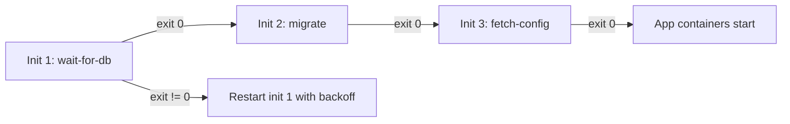

> 💡 **Quick Answer:** Init containers are defined in `spec.initContainers[]`, run **sequentially** before the app containers, and each must exit 0 before the next starts. A failing init container is retried per the pod's `restartPolicy` (with `Never`, the pod fails). They share the pod's volumes, Secrets and ServiceAccount but can use a different image. Use them to wait for a dependency, fetch config, clone code, fix permissions or generate certs — anything that must finish before the app starts. The pod shows `Init:X/Y` until all complete.

## The Problem

- Application crashes on startup because the database isn't ready yet
- Need to run migrations before the app starts
- Need to clone a Git repo or fetch config before the main container uses it
- File permissions on mounted volumes are wrong for the app user
- Want to separate initialization concerns from the application image

## The Solution

### Init Container Rules

| Rule | Detail |
|------|--------|
| Sequential | Init 1 must exit 0 before init 2 starts; app containers start after the last one |
| Must succeed | Non-zero exit → kubelet restarts that init container with backoff (`restartPolicy: Always/OnFailure`); `Never` → pod `Failed` |
| No probes | `readinessProbe`/`livenessProbe`/`startupProbe` aren't allowed on regular init containers |
| Share volumes | Write to an `emptyDir`, the app reads it |
| Own image | Bring tools (`nc`, `git`, `openssl`) you don't want in the app image |
| Re-run | All init containers run again if the pod is recreated or its sandbox restarts — make them idempotent |



### Wait for Dependency

```yaml
apiVersion: apps/v1
kind: Deployment
metadata:
  name: api-server
spec:
  template:
    spec:
      initContainers:
        # Wait until database service is resolvable
        - name: wait-for-db
          image: busybox:1.36
          command:
            - sh
            - -c
            - |
              until nslookup postgres.production.svc.cluster.local; do
                echo "Waiting for database..."
                sleep 2
              done
              echo "Database is ready!"

        # Wait until database accepts connections
        - name: wait-for-db-ready
          image: postgres:16-alpine
          command:
            - sh
            - -c
            - |
              until pg_isready -h postgres.production -p 5432; do
                echo "Database not accepting connections..."
                sleep 2
              done

      containers:
        - name: api
          image: registry.example.com/api:v2
```

### Database Migration

> In a Deployment with N replicas this runs N times **concurrently** on every rollout and scale-up. Only do it if the migration tool takes a lock (Flyway, Liquibase, Django, Rails all do). Otherwise run migrations once as a Job — a [Helm pre-upgrade hook](/recipes/helm/helm-hooks-lifecycle/) or an [Argo CD sync wave](/recipes/deployments/argocd-sync-waves-database-migration/).

```yaml
spec:
  initContainers:
    - name: migrate
      image: registry.example.com/api:v2    # Same image as app
      command: ["./migrate", "--up"]
      env:
        - name: DATABASE_URL
          valueFrom:
            secretKeyRef:
              name: db-credentials
              key: url
      resources:
        requests:
          cpu: "100m"
          memory: "128Mi"
        limits:
          cpu: "500m"
          memory: "256Mi"
  containers:
    - name: api
      image: registry.example.com/api:v2
```

### Clone Git Repository

```yaml
spec:
  initContainers:
    - name: git-clone
      image: alpine/git:2.43
      command:
        - git
        - clone
        - --single-branch
        - --branch=main
        - --depth=1
        - https://github.com/example/config-repo.git
        - /config
      volumeMounts:
        - name: config-volume
          mountPath: /config
  containers:
    - name: app
      image: registry.example.com/app:v1
      volumeMounts:
        - name: config-volume
          mountPath: /app/config
          readOnly: true
  volumes:
    - name: config-volume
      emptyDir: {}
```

### Fix Volume Permissions

```yaml
spec:
  initContainers:
    - name: fix-permissions
      image: busybox:1.36
      command: ["sh", "-c", "chown -R 1000:1000 /data && chmod 750 /data"]
      securityContext:
        runAsUser: 0    # Root needed to chown
      volumeMounts:
        - name: data-volume
          mountPath: /data
  containers:
    - name: app
      image: registry.example.com/app:v1
      securityContext:
        runAsUser: 1000
      volumeMounts:
        - name: data-volume
          mountPath: /data
  volumes:
    - name: data-volume
      persistentVolumeClaim:
        claimName: app-data
```

### Generate Certificates

```yaml
spec:
  initContainers:
    - name: generate-certs
      image: alpine:3.20
      command:
        - sh
        - -c
        - |
          set -e
          apk add --no-cache openssl
          openssl req -x509 -nodes -days 365 -newkey rsa:2048 \
            -keyout /certs/tls.key -out /certs/tls.crt -subj "/CN=myapp.default.svc"
          chmod 400 /certs/tls.key
      volumeMounts:
        - name: certs
          mountPath: /certs
  containers:
    - name: nginx
      image: nginx:1.27
      volumeMounts:
        - name: certs
          mountPath: /etc/nginx/ssl
          readOnly: true
  volumes:
    - name: certs
      emptyDir:
        medium: Memory    # tmpfs — never written to disk
```

For certificates that already exist as a Secret, mount the Secret volume directly — don't give an init container RBAC to `kubectl get secret`. For real certs use cert-manager.

### Multiple Init Containers (Sequential)

```yaml
spec:
  initContainers:
    # Runs first
    - name: wait-for-cache
      image: busybox:1.36
      command: ["sh", "-c", "until nc -z redis.production 6379; do sleep 1; done"]

    # Runs second (after first completes)
    - name: wait-for-db
      image: busybox:1.36
      command: ["sh", "-c", "until nc -z postgres.production 5432; do sleep 1; done"]

    # Runs third
    - name: migrate
      image: registry.example.com/api:v2
      command: ["./migrate", "--up"]

    # Runs fourth
    - name: seed-cache
      image: registry.example.com/api:v2
      command: ["./seed-cache"]

  # Only starts after ALL init containers succeed
  containers:
    - name: api
      image: registry.example.com/api:v2
```

### Download and Extract

```yaml
spec:
  initContainers:
    - name: download-model
      image: curlimages/curl:8.5.0
      command:
        - sh
        - -c
        - |
          curl -L -o /models/model.bin \
            "https://models.example.com/llm/v1/model.bin"
          echo "Model downloaded: $(ls -lh /models/model.bin)"
      volumeMounts:
        - name: model-volume
          mountPath: /models
  containers:
    - name: inference
      image: registry.example.com/inference:v1
      volumeMounts:
        - name: model-volume
          mountPath: /models
          readOnly: true
  volumes:
    - name: model-volume
      emptyDir:
        sizeLimit: 10Gi
```

### Resource Accounting

```yaml
initContainers:
  - name: heavy-init
    resources:
      requests: {cpu: "2", memory: 2Gi}
containers:
  - name: app
    resources:
      requests: {cpu: 500m, memory: 256Mi}
# Effective pod request = max(largest init container, sum of app containers)
# → scheduler reserves 2 CPU / 2Gi for this pod for its whole life
```

A heavy init container inflates the pod's scheduling footprint even after it exits. Native sidecars (restartable init containers) are different: their requests are **added** to the app containers because they keep running.

### Init vs Native Sidecar vs App Container

| Feature | Init container | Native sidecar (`restartPolicy: Always`) | App container |
|---------|---------------|---------------------|----------------|
| Starts before app | Yes, sequential | Yes, then keeps running | — |
| Runs continuously | No, must exit | Yes | Yes |
| Probes | No | Yes | Yes |
| Blocks next init until | Exit 0 | Started (startupProbe passes) | — |
| Requests | max(inits) vs sum(apps) | Added to app sum | Summed |

Native sidecars: alpha 1.28, on by default 1.29, GA 1.33. See [native sidecar containers](/recipes/configuration/kubernetes-sidecar-patterns/).

### Debugging Init Containers

```bash
kubectl get pod myapp                                             # STATUS Init:1/3, Init:CrashLoopBackOff
kubectl describe pod myapp                                        # "Init Containers" section: state, exit code
kubectl logs myapp -c wait-for-db                                 # specific init container
kubectl logs myapp -c wait-for-db --previous                      # previous crashed attempt
kubectl get pod myapp -o jsonpath='{.status.initContainerStatuses[*].state}'
```

## Common Issues

### Init container keeps restarting (CrashLoopBackOff)
- **Cause**: Command failing (dependency not available yet); exit code != 0
- **Fix**: Add retry loop with `until`; check init container logs: `kubectl logs <pod> -c <init-container>`

### Pod stuck in "Init:0/3" forever
- **Cause**: First init container never completes (infinite wait, wrong hostname)
- **Fix**: Check: `kubectl describe pod`; verify service DNS resolves; add timeout to wait loops

### Init container can't access volume
- **Cause**: Volume not mounted in init container spec
- **Fix**: Add `volumeMounts` to init container (same as app container)

### Init containers inflate pod requests
- **Cause**: The pod's effective request is `max(largest init, sum of apps)`
- **Fix**: Right-size init container requests; move heavy one-off work to a Job

### DNS not resolving in init container
- **Cause**: Service/CoreDNS not ready yet, or a one-shot `nslookup`
- **Fix**: Loop with sleep and a timeout rather than a single lookup

## Best Practices

1. **Keep init containers fast** — long init = long pod startup time
2. **Add timeouts to wait loops** — don't wait forever (exit non-zero to trigger restart)
3. **Use lightweight images** — `busybox`, `alpine` for simple tasks
4. **Share data via emptyDir** — init writes, app reads (same volume)
5. **Set resource limits** — init containers have separate resource accounting
6. **Log progress** — `echo` statements help debugging stuck init containers
7. **Make them idempotent** — they re-run whenever the pod is recreated
8. **`set -e` in multi-step scripts** — fail instead of silently continuing
9. **Use readiness probes instead** — for runtime dependencies that may flap; an init check only runs once at startup

## Key Takeaways

- Init containers run sequentially before app containers, must complete successfully
- Pod stays in `Init:X/Y` status until all init containers finish
- Common patterns: wait for deps, migrate DB, clone repos, fix permissions, fetch config
- Share data between init and app containers via shared volumes (emptyDir)
- Init containers have their own images, commands, and resource limits
- Sequential execution: second init waits for first to exit 0
- `kubectl logs <pod> -c <init-name>` — debug specific init container

## Frequently Asked Questions

### What is an init container in Kubernetes?

A container in `spec.initContainers` that runs to completion before the pod's app containers start. Multiple init containers run one after another, and each must exit successfully.

### What happens if an init container fails?

The kubelet restarts that init container with exponential backoff (`Init:CrashLoopBackOff`) until it succeeds, if `restartPolicy` is `Always` or `OnFailure`. With `restartPolicy: Never` the whole pod is marked `Failed`. App containers never start until all init containers succeed.

### Init containers vs startup probes?

Init containers run separate setup steps before the app starts. A startup probe checks whether the app container itself has finished booting and holds off liveness checks. Use init containers for external preconditions, startup probes for slow-starting apps.

### Init container vs sidecar container?

Init containers must exit before the app starts. Sidecars keep running alongside the app (log shippers, proxies). Since 1.29 you declare a native sidecar as an init container with `restartPolicy: Always`.

### Can init containers access Secrets and ConfigMaps?

Yes. They can mount the same volumes and use the same env sources and ServiceAccount token as app containers.
