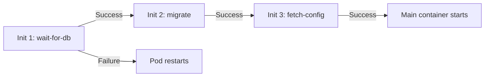

> 💡 **Quick Answer:** Init containers run sequentially before the main container(s), each must exit 0 before the next starts, and if any fails the pod restarts per its `restartPolicy`. Define them under `spec.initContainers[]`; they share the pod's volumes with the main containers. Use them to wait for a dependency, run a migration, fetch config, or fix file permissions — anything that must finish before the app starts.

## The Problem

Your application needs certain conditions met before it can start: a database must be reachable, a config file needs to be generated or downloaded, file permissions need fixing, or a schema migration must run — none of which belong inside the app's own startup code.

## The Solution

### Init Container Example

```yaml
apiVersion: v1
kind: Pod
metadata:
  name: web-app
spec:
  initContainers:
    # 1. Wait for database to be ready
    - name: wait-for-db
      image: busybox:1.36
      command: ['sh', '-c', 'until nc -z postgres.default 5432; do echo waiting for db; sleep 2; done']

    # 2. Run database migrations
    - name: run-migrations
      image: my-app:v1
      command: ['python', 'manage.py', 'migrate']
      env:
        - name: DATABASE_URL
          valueFrom:
            secretKeyRef:
              name: db-secret
              key: url

    # 3. Download config from external source
    - name: fetch-config
      image: curlimages/curl:8.5.0
      command: ['sh', '-c', 'curl -o /config/app.json https://config.example.com/app.json']
      volumeMounts:
        - name: config
          mountPath: /config

  containers:
    - name: app
      image: my-app:v1
      volumeMounts:
        - name: config
          mountPath: /config
          readOnly: true

  volumes:
    - name: config
      emptyDir: {}
```

### Init Container Rules

| Rule | Description |
|------|-------------|
| Run sequentially | Init container 1 must complete before 2 starts |
| Must succeed | If any init container fails, pod restarts |
| Run to completion | Each init container must exit 0 |
| Share volumes | Init and main containers can share emptyDir volumes |
| Different image | Can use specialized tools not in main image |

### Common Use Cases

| Use Case | Init Container |
|----------|---------------|
| Wait for dependency | `nc -z service port` loop |
| Database migration | Run migration script |
| Download config/certs | `curl` or `wget` |
| Set file permissions | `chmod`/`chown` on volumes |
| Clone git repo | `git clone` into shared volume |
| Register with service | API call to register |



### More Use Cases: Permissions, Git Clone, Certificates

```yaml
# Fix volume ownership before a non-root main container starts
initContainers:
  - name: fix-permissions
    image: busybox:1.36
    command: ['sh', '-c', 'chown -R 1000:1000 /data']
    securityContext: {runAsUser: 0}
    volumeMounts: [{name: data, mountPath: /data}]
```

```yaml
# Clone a repo into a shared emptyDir for the main container to serve/read
initContainers:
  - name: git-clone
    image: alpine/git:2.40.1
    command: ["git", "clone", "--depth=1", "https://github.com/myorg/myrepo.git", "/data"]
    volumeMounts: [{name: repo, mountPath: /data}]
```

```yaml
# Generate a self-signed cert before the app needs TLS
initContainers:
  - name: generate-certs
    image: alpine:3.19
    command:
      - sh
      - -c
      - |
        apk add --no-cache openssl
        openssl req -x509 -nodes -days 365 -newkey rsa:2048 \
          -keyout /certs/tls.key -out /certs/tls.crt -subj "/CN=myapp.default.svc"
    volumeMounts: [{name: certs, mountPath: /certs}]
```

### Debugging Init Containers

```bash
kubectl get pod myapp -o jsonpath='{.status.initContainerStatuses}'
kubectl logs myapp -c wait-for-db              # a specific init container's logs
kubectl logs myapp -c wait-for-db --previous   # if it crashed and restarted
kubectl describe pod myapp                     # look for the "Init Containers" section
```

## Frequently Asked Questions

### Init containers vs startup probes?

Init containers run separate containers for setup tasks. Startup probes check if the main container's app is ready. Use init containers for external dependencies, startup probes for slow-starting apps.

### Can init containers access secrets and configmaps?

Yes — init containers have the same access to volumes, secrets, configmaps, and service accounts as main containers.

## Best Practices

- **Set resource requests/limits on every init container** — they still consume scheduling capacity even though they don't run concurrently with the app
- **Use minimal images** (`busybox`, `curlimages/curl`) over general-purpose ones (`ubuntu`) — smaller pull time, smaller attack surface
- **Add a timeout to wait-loops** (`timeout 60 sh -c '...'`) so a permanently-unreachable dependency fails fast instead of hanging the pod indefinitely
- **`set -e` in multi-step shell scripts** so a failed step stops the init container instead of silently continuing
- **Debug with `kubectl logs -c <init-container-name>`**, not `kubectl logs` alone — the default only shows the main container

## Key Takeaways

- Init containers run sequentially, each must exit 0, and share the pod's volumes with the main containers
- Common uses: wait-for-dependency loops, migrations, config/cert fetching, permission fixes, git clone
- A failed init container restarts the whole pod per its `restartPolicy` — it doesn't just retry that one container in place
- Init containers can use a completely different image than the main container — pull in tools you don't want in your production image
- `kubectl describe pod` and `kubectl logs -c <name>` are the two commands for diagnosing a stuck init container
