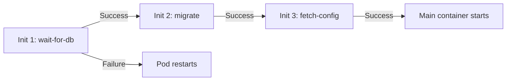

> 💡 **Quick Answer:** configuration

## The Problem

This is a fundamental Kubernetes topic that engineers search for frequently. A comprehensive reference with production-ready examples saves hours of trial and error.

## The Solution

### Init Container Example

```yaml
apiVersion: v1
kind: Pod
metadata:
  name: web-app
spec:
  initContainers:
    # 1. Wait for database to be ready
    - name: wait-for-db
      image: busybox:1.36
      command: ['sh', '-c', 'until nc -z postgres.default 5432; do echo waiting for db; sleep 2; done']

    # 2. Run database migrations
    - name: run-migrations
      image: my-app:v1
      command: ['python', 'manage.py', 'migrate']
      env:
        - name: DATABASE_URL
          valueFrom:
            secretKeyRef:
              name: db-secret
              key: url

    # 3. Download config from external source
    - name: fetch-config
      image: curlimages/curl:8.5.0
      command: ['sh', '-c', 'curl -o /config/app.json https://config.example.com/app.json']
      volumeMounts:
        - name: config
          mountPath: /config

  containers:
    - name: app
      image: my-app:v1
      volumeMounts:
        - name: config
          mountPath: /config
          readOnly: true

  volumes:
    - name: config
      emptyDir: {}
```

### Init Container Rules

| Rule | Description |
|------|-------------|
| Run sequentially | Init container 1 must complete before 2 starts |
| Must succeed | If any init container fails, pod restarts |
| Run to completion | Each init container must exit 0 |
| Share volumes | Init and main containers can share emptyDir volumes |
| Different image | Can use specialized tools not in main image |

### Common Use Cases

| Use Case | Init Container |
|----------|---------------|
| Wait for dependency | `nc -z service port` loop |
| Database migration | Run migration script |
| Download config/certs | `curl` or `wget` |
| Set file permissions | `chmod`/`chown` on volumes |
| Clone git repo | `git clone` into shared volume |
| Register with service | API call to register |



## Frequently Asked Questions

### Init containers vs startup probes?

Init containers run separate containers for setup tasks. Startup probes check if the main container's app is ready. Use init containers for external dependencies, startup probes for slow-starting apps.

### Can init containers access secrets and configmaps?

Yes — init containers have the same access to volumes, secrets, configmaps, and service accounts as main containers.

## Best Practices

- Start with the simplest configuration that meets your needs
- Test changes in staging before production
- Use `kubectl describe` and events for troubleshooting
- Document your decisions for the team

## Key Takeaways

- This is essential Kubernetes knowledge for production operations
- Follow the principle of least privilege and minimal configuration
- Monitor and iterate based on real-world behavior
- Automation reduces human error and improves consistency
