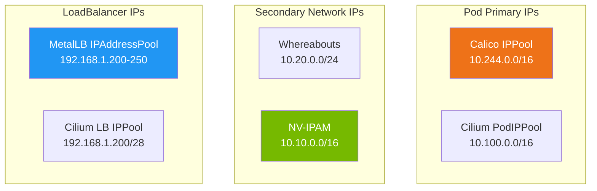

> 💡 **Quick Answer:** IPPools define ranges of IP addresses that Kubernetes allocates to pods, secondary interfaces, or LoadBalancer Services. Use **Whereabouts** for secondary network IPAM (Multus), **NV-IPAM** for NVIDIA GPU networking, **Calico IPPool** for pod CIDR management, and **MetalLB IPAddressPool** for bare-metal LoadBalancer IPs. Each solves a different IPAM layer.

## The Problem

Kubernetes networking requires IP address management at multiple layers:

- **Pod IPs** — primary pod CIDR managed by the CNI (Calico, Cilium)
- **Secondary network IPs** — SR-IOV, Multus, RDMA interfaces need their own IPs
- **LoadBalancer IPs** — bare-metal clusters need IP pools for Service type LoadBalancer
- **GPU/HPC networking** — dedicated RDMA/RoCE subnets for inter-node communication
- **Multi-tenant isolation** — separate IP ranges per team or namespace

Without proper IPAM, you get IP conflicts, exhausted ranges, and broken networking.

## The Solution

### 1. Whereabouts — Secondary Network IPAM

Whereabouts is the standard IPAM plugin for Multus secondary networks:

```yaml
# NetworkAttachmentDefinition with Whereabouts IPAM
apiVersion: k8s.cni.cncf.io/v1
kind: NetworkAttachmentDefinition
metadata:
  name: storage-network
  namespace: gpu-workloads
spec:
  config: |
    {
      "cniVersion": "0.3.1",
      "name": "storage-net",
      "type": "macvlan",
      "master": "ens8f0",
      "mode": "bridge",
      "ipam": {
        "type": "whereabouts",
        "range": "10.20.0.0/24",
        "exclude": ["10.20.0.0/32", "10.20.0.1/32", "10.20.0.255/32"],
        "gateway": "10.20.0.1"
      }
    }
```

Whereabouts IPPool CRD for cluster-wide ranges:

```yaml
apiVersion: whereabouts.cni.cncf.io/v1alpha1
kind: IPPool
metadata:
  name: storage-pool
  namespace: kube-system
spec:
  range: 10.20.0.0/24
  allocations: {}
```

```bash
# Check IP allocations
kubectl get ippools.whereabouts.cni.cncf.io -A
kubectl get overlappingrangeipreservations.whereabouts.cni.cncf.io -A

# View specific pool allocations
kubectl get ippool storage-pool -n kube-system -o yaml
```

### 2. NV-IPAM — NVIDIA Network IPAM

Purpose-built for GPU cluster networking:

```yaml
apiVersion: nv-ipam.nvidia.com/v1alpha1
kind: IPPool
metadata:
  name: rdma-pool
  namespace: nvidia-network-operator
spec:
  subnet: 10.10.0.0/16
  perNodeBlockSize: 64        # 64 IPs reserved per node
  gateway: 10.10.0.1
  nodeSelector:
    matchLabels:
      nvidia.com/gpu.present: "true"
```

```yaml
# NetworkAttachmentDefinition using NV-IPAM
apiVersion: k8s.cni.cncf.io/v1
kind: NetworkAttachmentDefinition
metadata:
  name: rdma-net
  namespace: gpu-workloads
  annotations:
    k8s.v1.cni.cncf.io/resourceName: nvidia.com/mlnx_rdma_pf
spec:
  config: |
    {
      "cniVersion": "0.3.1",
      "name": "rdma-network",
      "type": "host-device",
      "ipam": {
        "type": "nv-ipam",
        "poolName": "rdma-pool"
      }
    }
```

### 3. Calico IPPool — Pod CIDR Management

Calico IPPools define the ranges from which pods get their primary IPs:

```yaml
apiVersion: projectcalico.org/v3
kind: IPPool
metadata:
  name: default-pool
spec:
  cidr: 10.244.0.0/16
  ipipMode: Always             # or CrossSubnet, Never
  vxlanMode: Never
  natOutgoing: true
  nodeSelector: all()
  blockSize: 26                # /26 = 64 IPs per node block

---
# Namespace-specific pool
apiVersion: projectcalico.org/v3
kind: IPPool
metadata:
  name: team-backend-pool
spec:
  cidr: 10.245.0.0/16
  ipipMode: CrossSubnet
  natOutgoing: true
  nodeSelector: "team == 'backend'"
  blockSize: 26
```

Assign pool to namespace:

```yaml
apiVersion: v1
kind: Namespace
metadata:
  name: team-backend
  annotations:
    cni.projectcalico.org/ipv4pools: '["team-backend-pool"]'
```

```bash
# List Calico IPPools
calicoctl get ippools -o wide

# Check IPAM allocations
calicoctl ipam show

# Show per-block allocation
calicoctl ipam show --show-blocks
```

### 4. MetalLB IPAddressPool — LoadBalancer IPs

```yaml
apiVersion: metallb.io/v1beta1
kind: IPAddressPool
metadata:
  name: production-pool
  namespace: metallb-system
spec:
  addresses:
  - 192.168.1.200-192.168.1.250     # Range
  - 10.0.0.100/32                     # Single IP
  autoAssign: true
  avoidBuggyIPs: true                 # Skip .0 and .255

---
# L2 advertisement
apiVersion: metallb.io/v1beta1
kind: L2Advertisement
metadata:
  name: l2-advert
  namespace: metallb-system
spec:
  ipAddressPools:
  - production-pool
  nodeSelectors:
  - matchLabels:
      node-role.kubernetes.io/worker: ""
```

```yaml
# Service requesting from specific pool
apiVersion: v1
kind: Service
metadata:
  name: web-app
  annotations:
    metallb.universe.tf/address-pool: production-pool
spec:
  type: LoadBalancer
  loadBalancerIP: 192.168.1.200      # Optional: request specific IP
  ports:
  - port: 443
```

### 5. Cilium IPPool — Pod and LB IPAM

```yaml
apiVersion: cilium.io/v2alpha1
kind: CiliumPodIPPool
metadata:
  name: tenant-a-pool
spec:
  ipv4:
    cidrs:
    - 10.100.0.0/16
    maskSize: 24               # /24 allocated per node

---
# Cilium LB IPAM (replaces MetalLB)
apiVersion: cilium.io/v2alpha1
kind: CiliumLoadBalancerIPPool
metadata:
  name: lb-pool
spec:
  blocks:
  - cidr: 192.168.1.200/28
```

### IPPool Comparison



| IPPool Type | Layer | Use Case | Scope |
|------------|-------|----------|-------|
| **Calico IPPool** | Pod CIDR | Primary pod IPs | Cluster/namespace |
| **Cilium PodIPPool** | Pod CIDR | Primary pod IPs | Cluster/namespace |
| **Whereabouts** | Secondary IPAM | Multus, macvlan, SR-IOV | Per NetworkAttachmentDef |
| **NV-IPAM** | Secondary IPAM | GPU/RDMA networks | Per node block |
| **MetalLB** | LoadBalancer | Service external IPs | Cluster |
| **Cilium LB** | LoadBalancer | Service external IPs | Cluster |

## Common Issues

**Whereabouts IP leak — allocated IPs not released**

Pods deleted but IPs stuck in Whereabouts IPPool. Run the IP reconciler: `kubectl create job --from=cronjob/whereabouts-ip-reconciler manual-cleanup -n kube-system`.

**Calico IPPool exhausted**

`blockSize: 26` gives 64 IPs per node. If nodes run many pods, decrease block size (smaller number = more IPs). Check with `calicoctl ipam show --show-blocks`.

**MetalLB IP conflict with network**

The IPAddressPool range must not overlap with DHCP ranges or other static assignments on the network. Coordinate with network team.

**NV-IPAM "no available IPs"**

`perNodeBlockSize` too small for the number of GPU pods. Increase it or widen the subnet.

## Best Practices

- **Separate pools per purpose** — don't mix pod, storage, and RDMA subnets
- **Use Whereabouts for Multus** — de facto standard for secondary network IPAM
- **Use NV-IPAM for GPU clusters** — topology-aware, per-node block allocation
- **Calico namespace annotations** — assign specific pools per team namespace
- **MetalLB `avoidBuggyIPs: true`** — skip .0 and .255 that some clients mishandle
- **Monitor pool utilization** — alert at 80% capacity to prevent exhaustion
- **Document IP ranges** — maintain a central IPAM spreadsheet/NetBox

## Key Takeaways

- Four layers of IPAM in Kubernetes: pod CIDRs, secondary networks, LoadBalancer, and external
- Whereabouts is the standard IPAM for Multus secondary interfaces
- NV-IPAM is optimized for GPU/RDMA clusters with per-node block allocation
- Calico and Cilium IPPools manage primary pod CIDR ranges per namespace
- MetalLB IPAddressPool provides external IPs for bare-metal LoadBalancer Services
- Always separate IP pools by function — storage, compute, RDMA, management
