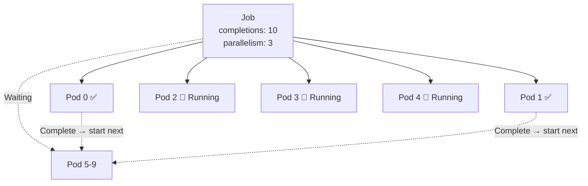

> 💡 **Quick Answer:** `completions` = total successful pod runs needed. `parallelism` = maximum pods running simultaneously. A Job with `completions: 10, parallelism: 3` runs 3 pods at a time until 10 complete successfully. Indexed Jobs (completionMode: Indexed) give each pod a unique `JOB_COMPLETION_INDEX` for partitioned work.

## The Problem

You need to process a batch of work — 100 images to resize, 50 database shards to migrate, or 1000 reports to generate. Running one pod at a time is too slow. Running all at once overwhelms your cluster. Jobs let you control exactly how many run in parallel and how many must complete.


```mermaid
flowchart TB
    JOB["Job<br/>completions: 10<br/>parallelism: 3"] --> P1["Pod 0 ✅"]
    JOB --> P2["Pod 1 ✅"]
    JOB --> P3["Pod 2 🔄 Running"]
    JOB --> P4["Pod 3 🔄 Running"]
    JOB --> P5["Pod 4 🔄 Running"]
    JOB -.->|"Waiting"| P6["Pod 5-9"]
    P1 & P2 -.->|"Complete → start next"| P6
```

## The Solution

### Basic Parallel Job

```yaml
apiVersion: batch/v1
kind: Job
metadata:
  name: image-resize
spec:
  completions: 10          # Need 10 successful completions
  parallelism: 3           # Run 3 pods at a time
  backoffLimit: 5          # Max 5 retries for failures
  template:
    spec:
      containers:
        - name: resize
          image: imagetools:v1
          command: ["./resize.sh"]
      restartPolicy: Never
```

### Job Patterns

| Pattern | completions | parallelism | Use Case |
|---------|:-----------:|:-----------:|----------|
| Single pod | 1 (default) | 1 (default) | One-off task |
| Fixed count | N | M | Process N items, M at a time |
| Work queue | unset | M | Process until queue empty |
| Indexed | N | M | Each pod gets unique index |

### Indexed Jobs (Partitioned Work)

Each pod gets a unique index via `JOB_COMPLETION_INDEX`:

```yaml
apiVersion: batch/v1
kind: Job
metadata:
  name: shard-migration
spec:
  completions: 50
  parallelism: 10
  completionMode: Indexed     # ← Each pod gets unique index
  template:
    spec:
      containers:
        - name: migrate
          image: db-tools:v1
          command: ["./migrate-shard.sh"]
          env:
            - name: SHARD_ID
              value: "$(JOB_COMPLETION_INDEX)"  # 0, 1, 2, ... 49
      restartPolicy: Never
```

```bash
# Inside pod with index 7:
echo $JOB_COMPLETION_INDEX
# 7

# Use index to partition work
# Shard 7 of 50 → process items 7000 to 7999
```

The index is also exposed as the annotation/label `batch.kubernetes.io/job-completion-index` (usable via the Downward API) and as the pod hostname `<job-name>-<index>` — pair with a headless Service for stable per-index DNS (MPI/PyTorch-style workers).

### Work Queue Pattern

Pods pull from a queue and exit when empty — no fixed completion count:

```yaml
apiVersion: batch/v1
kind: Job
metadata:
  name: queue-worker
spec:
  # completions: not set → work queue mode
  parallelism: 5
  template:
    spec:
      containers:
        - name: worker
          image: worker:v1
          command: ["./process-queue.sh"]
          env:
            - name: REDIS_URL
              value: "redis://queue-svc:6379"
      restartPolicy: Never
# Job completes when ALL pods exit with 0
```

### Failure Handling

```yaml
apiVersion: batch/v1
kind: Job
metadata:
  name: reliable-job
spec:
  completions: 10
  parallelism: 3
  backoffLimit: 6                    # Total failures before job fails
  activeDeadlineSeconds: 3600        # Kill entire job after 1 hour
  ttlSecondsAfterFinished: 300       # Clean up 5 min after completion
  template:
    spec:
      containers:
        - name: task
          image: task:v1
      restartPolicy: Never           # Never = create new pod on failure
                                     # OnFailure = restart in same pod
```

### Pod Failure Policy (K8s 1.26+)

Handle specific exit codes differently:

```yaml
spec:
  podFailurePolicy:
    rules:
      - action: FailJob              # Fail entire job
        onExitCodes:
          containerName: task
          operator: In
          values: [42]               # Exit code 42 = unrecoverable
      - action: Ignore               # Don't count as failure
        onPodConditions:
          - type: DisruptionTarget   # Pod was preempted — retry
      - action: Count                # Count toward backoffLimit
        onExitCodes:
          containerName: task
          operator: NotIn
          values: [0]                # Any other non-zero exit
```

`podFailurePolicy` requires `restartPolicy: Never` (GA since 1.31).

### Per-Index Retries and Early Success (Indexed Jobs, GA 1.33)

```yaml
spec:
  completions: 100
  parallelism: 10
  completionMode: Indexed
  backoffLimitPerIndex: 2     # each index retried at most twice
  maxFailedIndexes: 5         # fail the Job once >5 indexes have failed
  successPolicy:
    rules:
      - succeededIndexes: "0"   # e.g. leader index 0 succeeded → Job succeeds
```

With `backoffLimitPerIndex`, one flaky shard no longer burns the Job-wide `backoffLimit`; failed indexes are listed in `.status.failedIndexes`.

### Monitor Jobs

```bash
# Job status
kubectl get jobs
# NAME           COMPLETIONS   DURATION   AGE
# image-resize   7/10          3m         3m

# Watch progress
kubectl get jobs -w

# Pod status per job
kubectl get pods -l job-name=image-resize
# NAME                 READY   STATUS      RESTARTS   AGE
# image-resize-abc12   0/1     Completed   0          3m
# image-resize-def34   0/1     Completed   0          2m
# image-resize-ghi56   1/1     Running     0          30s

# Check failed pods
kubectl get pods -l job-name=image-resize --field-selector=status.phase=Failed
```

## Common Issues

| Issue | Cause | Fix |
|-------|-------|-----|
| Job stuck at N-1 completions | Last pod keeps failing | Check pod logs, increase `backoffLimit` |
| Only one pod runs at a time | `parallelism` not set (defaults to 1) | Set `parallelism` explicitly |
| Fewer pods than `parallelism` | Active pods are capped at remaining completions, or quota/requests block scheduling | Expected near the end; otherwise check `kubectl describe job` and quota |
| Job pods not cleaned up | No `ttlSecondsAfterFinished` | Add TTL or manually delete |
| Index out of range | Pod logic doesn't handle `JOB_COMPLETION_INDEX` correctly | Validate index bounds in code |
| Job takes forever | Parallelism too low for completion count | Increase `parallelism` |
| Zombie jobs | `activeDeadlineSeconds` not set | Add deadline to prevent infinite running |

## Best Practices

- **Use Indexed Jobs for partitioned data** — cleaner than work queues for fixed datasets
- **Set `activeDeadlineSeconds`** — prevents jobs from running indefinitely
- **Set `ttlSecondsAfterFinished`** — automatic cleanup of completed jobs
- **Use `restartPolicy: Never`** over `OnFailure` — easier to debug (pod logs preserved)
- **Add `podFailurePolicy`** to distinguish retryable from fatal errors
- **Monitor with `kubectl get jobs -w`** — watch completion progress

## Key Takeaways

- `completions` = how many pods must succeed; `parallelism` = how many run concurrently
- Indexed Jobs give each pod a unique `JOB_COMPLETION_INDEX` (0 to N-1)
- Work queue pattern (no completions set) = pods process until queue is empty
- `backoffLimit` controls total retries; `activeDeadlineSeconds` caps total runtime
- `podFailurePolicy` (GA 1.31) enables exit-code-based retry decisions; `backoffLimitPerIndex` isolates retries per shard
- Always set TTL cleanup to prevent orphaned job pods consuming resources

## Frequently Asked Questions

### What is the difference between completions and parallelism in a Kubernetes Job?

`completions` is how many pods must finish successfully for the Job to succeed. `parallelism` is the maximum number of pods running at once. `completions: 10, parallelism: 3` runs three pods at a time until ten have succeeded.

### What are the defaults for completions and parallelism?

Both default to 1. If you set `parallelism` but leave `completions` unset, the Job runs in work-queue mode: it succeeds when any pod exits 0 and all pods have terminated.

### What is an Indexed Job?

A Job with `completionMode: Indexed`. Each pod gets a unique index from 0 to `completions-1` in `JOB_COMPLETION_INDEX`, and the Job is complete when every index has one successful pod — ideal for static sharding.

### Does backoffLimit count per pod or for the whole Job?

For the whole Job by default — failures across all parallel pods add up. For Indexed Jobs, use `backoffLimitPerIndex` to limit retries per index instead.

### How do I change parallelism on a running Job?

`parallelism` is mutable: `kubectl patch job image-resize -p '{"spec":{"parallelism":6}}'`. Setting it to 0 pauses the Job (or use `spec.suspend: true`). `completions` is immutable except for Indexed Jobs, where it can be changed together with `parallelism` to the same value (elastic Indexed Jobs).

