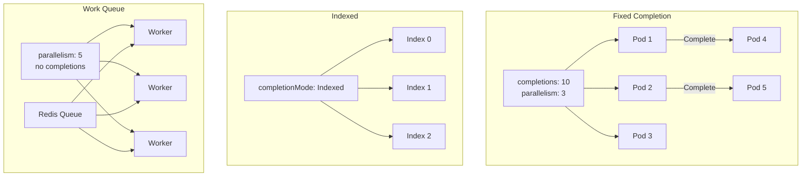

> 💡 **Quick Answer:** Use `completions: N` with `parallelism: M` for fixed-count parallel jobs, `completionMode: Indexed` for worker-index-aware processing, and `ttlSecondsAfterFinished: 3600` for automatic cleanup.

## The Problem

Batch workloads — data processing, ML training, ETL pipelines — need different execution patterns than long-running services. You need parallel processing, indexed workers, automatic retry, and cleanup of completed jobs.

## The Solution

### Fixed Completion Count

```yaml
apiVersion: batch/v1
kind: Job
metadata:
  name: data-processor
spec:
  completions: 10
  parallelism: 3
  backoffLimit: 4
  ttlSecondsAfterFinished: 3600
  template:
    spec:
      restartPolicy: Never
      containers:
        - name: processor
          image: registry.example.com/processor:1.0
          command: ["python", "process.py"]
```

10 completions, 3 running at a time — each pod processes one unit of work.

### Indexed Completions

```yaml
apiVersion: batch/v1
kind: Job
metadata:
  name: indexed-job
spec:
  completions: 5
  parallelism: 5
  completionMode: Indexed
  template:
    spec:
      restartPolicy: Never
      containers:
        - name: worker
          image: registry.example.com/worker:1.0
          env:
            - name: JOB_COMPLETION_INDEX
              value: "placeholder"
```

Each pod gets `JOB_COMPLETION_INDEX` (0, 1, 2, 3, 4) — use it to partition work (e.g., process shard N of N).

### Work Queue Pattern

```yaml
apiVersion: batch/v1
kind: Job
metadata:
  name: queue-worker
spec:
  parallelism: 5
  # No completions set — runs until all pods succeed (work queue empty)
  template:
    spec:
      restartPolicy: Never
      containers:
        - name: worker
          image: registry.example.com/queue-worker:1.0
          env:
            - name: QUEUE_URL
              value: "redis://redis:6379/0"
```



## Common Issues

**Job pods keep restarting — backoffLimit exceeded**

Check pod logs: `kubectl logs job/data-processor`. The `backoffLimit` (default 6) controls total retries. Increase for flaky workloads.

**Completed Jobs cluttering the namespace**

Set `ttlSecondsAfterFinished: 3600` — Kubernetes auto-deletes the Job and its pods 1 hour after completion.

## Best Practices

- **Set `ttlSecondsAfterFinished`** — prevent Job accumulation
- **`restartPolicy: Never`** for Jobs — let Kubernetes create new pods on failure (not restart in-place)
- **`backoffLimit: 4-6`** — enough retries for transient failures, not infinite loops
- **Indexed mode for sharded data** — each worker processes a specific partition
- **Work queue for dynamic workloads** — workers pull items until queue is empty

## Key Takeaways

- `completions` + `parallelism` controls how many pods run and how many must succeed
- `completionMode: Indexed` gives each pod a unique index for data partitioning
- Work queue pattern: no completions set, workers pull from a queue until done
- `ttlSecondsAfterFinished` auto-cleans completed Jobs — essential for CronJob hygiene
- `backoffLimit` prevents infinite retries — set based on expected failure rate
