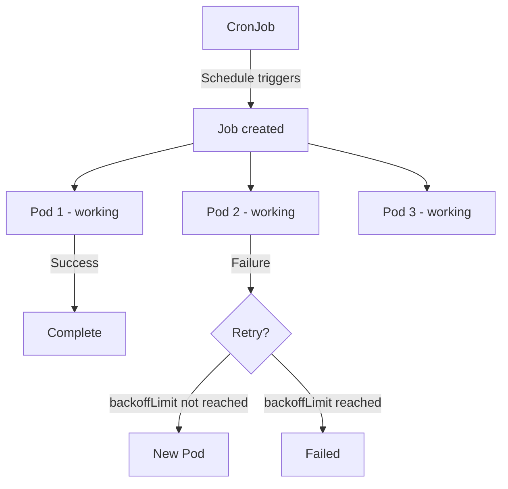

> 💡 **Quick Answer:** Create Kubernetes Jobs for one-time tasks and CronJobs for scheduled work. Covers parallelism, backoff limits, completion tracking, and time zones.

## The Problem

This is one of the most searched Kubernetes topics. Having a comprehensive, well-structured guide helps both beginners and experienced users quickly find what they need.

## The Solution

### Create a Job

```yaml
apiVersion: batch/v1
kind: Job
metadata:
  name: data-migration
spec:
  backoffLimit: 3               # Retry up to 3 times on failure
  activeDeadlineSeconds: 600    # Timeout after 10 minutes
  ttlSecondsAfterFinished: 3600 # Clean up after 1 hour
  template:
    spec:
      containers:
        - name: migrate
          image: my-app:v1
          command: ["python", "migrate.py"]
          env:
            - name: DATABASE_URL
              valueFrom:
                secretKeyRef:
                  name: db-secret
                  key: url
      restartPolicy: Never       # Required for Jobs
```

### Parallel Jobs

```yaml
apiVersion: batch/v1
kind: Job
metadata:
  name: process-queue
spec:
  parallelism: 5        # Run 5 pods simultaneously
  completions: 20       # Total tasks to complete
  backoffLimit: 3
  template:
    spec:
      containers:
        - name: worker
          image: worker:v1
      restartPolicy: Never
```

### CronJob (Scheduled Jobs)

```yaml
apiVersion: batch/v1
kind: CronJob
metadata:
  name: nightly-backup
spec:
  schedule: "0 2 * * *"         # 2 AM daily
  timeZone: "Europe/Paris"      # K8s 1.27+
  concurrencyPolicy: Forbid     # Don't overlap
  successfulJobsHistoryLimit: 3
  failedJobsHistoryLimit: 3
  startingDeadlineSeconds: 300  # Skip if >5min late
  jobTemplate:
    spec:
      template:
        spec:
          containers:
            - name: backup
              image: backup-tool:v1
              command: ["./backup.sh"]
          restartPolicy: OnFailure
```

### Cron Schedule Reference

| Schedule | Meaning |
|----------|---------|
| `*/5 * * * *` | Every 5 minutes |
| `0 * * * *` | Every hour |
| `0 2 * * *` | Daily at 2 AM |
| `0 2 * * 1` | Weekly Monday 2 AM |
| `0 0 1 * *` | Monthly 1st at midnight |

```bash
# Check jobs
kubectl get jobs
kubectl get cronjobs

# Manually trigger a CronJob
kubectl create job manual-backup --from=cronjob/nightly-backup

# Check job logs
kubectl logs job/data-migration

# Delete completed jobs
kubectl delete jobs --field-selector status.successful=1
```



## Frequently Asked Questions

### What's the difference between Job and CronJob?

A **Job** runs once and completes. A **CronJob** creates Jobs on a schedule (like cron on Linux). CronJobs are for recurring tasks.

### Why use `restartPolicy: Never` vs `OnFailure`?

`Never` creates a new pod on failure (good for debugging — you can see logs). `OnFailure` restarts the same pod in-place.

## Best Practices

- **Start simple** — use the basic form first, add complexity as needed
- **Be consistent** — follow naming conventions across your cluster
- **Document your choices** — add annotations explaining why, not just what
- **Monitor and iterate** — review configurations regularly

## Key Takeaways

- This is fundamental Kubernetes knowledge every engineer needs
- Start with the simplest approach that solves your problem
- Use `kubectl explain` and `kubectl describe` when unsure
- Practice in a test cluster before applying to production
