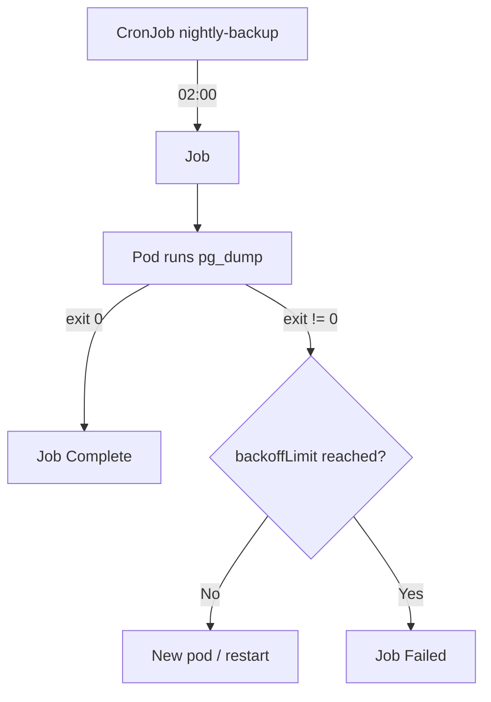

> 💡 **Quick Answer:** A **Job** runs pods until a set number exit 0: `kubectl create job myjob --image=busybox:1.36 -- echo hello`. Key fields: `backoffLimit` (retries, default 6), `activeDeadlineSeconds` (timeout), `completions` + `parallelism` (batch size and concurrency), `completionMode: Indexed` (shard work by `$JOB_COMPLETION_INDEX`), `ttlSecondsAfterFinished` (auto-delete). A **CronJob** creates Jobs on a cron schedule (`schedule: "0 * * * *"`) with `concurrencyPolicy: Forbid` to stop overlaps.

## Basic Job

```yaml
apiVersion: batch/v1
kind: Job
metadata:
  name: data-migration
spec:
  backoffLimit: 4                  # pod failures before the Job is Failed (default 6)
  activeDeadlineSeconds: 600       # whole-Job timeout, overrides backoffLimit
  ttlSecondsAfterFinished: 3600    # delete Job + pods 1h after it finishes
  template:
    spec:
      restartPolicy: Never         # Never or OnFailure — Always is invalid for Jobs
      containers:
        - name: migrate
          image: myapp:v2
          command: ["./migrate", "--target", "latest"]
          env:
            - name: DATABASE_URL
              valueFrom:
                secretKeyRef:
                  name: db-creds
                  key: url
          resources:
            requests: {cpu: 200m, memory: 256Mi}
            limits: {memory: 512Mi}
```

```bash
kubectl create job myjob --image=busybox:1.36 -- echo "hello world"   # imperative

kubectl get jobs -w
# NAME             STATUS     COMPLETIONS   DURATION   AGE
# data-migration   Complete   1/1           45s        2m

kubectl logs job/data-migration
kubectl wait --for=condition=complete job/data-migration --timeout=10m   # CI gate
kubectl delete job data-migration                                        # also deletes its pods
kubectl delete jobs --field-selector status.successful=1                 # all succeeded Jobs
```

### restartPolicy: Never vs OnFailure

- **Never** — each failure creates a new pod; failed pods remain for `kubectl logs`. Best for debugging and for `podFailurePolicy`.
- **OnFailure** — the kubelet restarts the container in the same pod; fewer pods, but logs of earlier attempts are lost (only `--previous`) and the pod may be deleted when `backoffLimit` is hit.

Retries use exponential backoff: 10 s, 20 s, 40 s … capped at 6 minutes.

## Parallel Jobs

```yaml
# Fixed completion count: 10 successful pods, 3 at a time (work queue style)
apiVersion: batch/v1
kind: Job
metadata:
  name: batch-processor
spec:
  completions: 10
  parallelism: 3
  backoffLimit: 5
  template:
    spec:
      restartPolicy: Never
      containers:
        - name: worker
          image: myworker:v1        # pulls its next item from a queue
```

```yaml
# Indexed: each pod gets a unique index 0..completions-1
apiVersion: batch/v1
kind: Job
metadata:
  name: image-processor
spec:
  completions: 10
  parallelism: 3
  completionMode: Indexed
  backoffLimitPerIndex: 2          # per-shard retries (GA 1.33)
  maxFailedIndexes: 1              # tolerate one bad shard
  template:
    spec:
      restartPolicy: Never
      containers:
        - name: processor
          image: myapp/processor:v1
          # JOB_COMPLETION_INDEX is injected automatically in Indexed mode
          command: ["python", "process.py", "--shard=$(JOB_COMPLETION_INDEX)"]
```

| Pattern | completions | parallelism | completionMode |
|---------|------------|-------------|----------------|
| Single run | 1 (default) | 1 | NonIndexed |
| Fixed count, shared queue | N | M | NonIndexed |
| Static sharding | N | M | Indexed |
| Work queue until empty | unset | M | NonIndexed (workers exit 0 when queue drained) |

`JOB_COMPLETION_INDEX` and the `batch.kubernetes.io/job-completion-index` annotation only exist in **Indexed** mode. Pods also get the hostname `<job>-<index>`, so an Indexed Job plus a headless Service gives stable peer DNS for MPI/PyTorch-style workers. More: [Job completions and parallelism](/recipes/deployments/kubernetes-job-completion-parallelism/).

## Failure Handling with podFailurePolicy

```yaml
spec:
  backoffLimit: 6
  podFailurePolicy:                # GA 1.31; requires restartPolicy: Never
    rules:
      - action: FailJob            # bug in the code: don't retry
        onExitCodes:
          containerName: main
          operator: In
          values: [42]
      - action: Ignore             # node drain / preemption: retry without counting
        onPodConditions:
          - type: DisruptionTarget
```

## Jobs with Sidecars

A regular sidecar container (proxy, log shipper) keeps the pod running and the Job never completes. Declare it as a native sidecar — `initContainers` with `restartPolicy: Always` — and it's stopped automatically when the main container exits. See [sidecar containers](/recipes/configuration/kubernetes-sidecar-patterns/).

## CronJob

```yaml
apiVersion: batch/v1
kind: CronJob
metadata:
  name: nightly-backup
spec:
  schedule: "0 2 * * *"            # 02:00 daily
  timeZone: "Europe/Rome"          # GA 1.27
  concurrencyPolicy: Forbid        # skip if the previous run is still active
  startingDeadlineSeconds: 600     # missed run may start up to 10 min late
  successfulJobsHistoryLimit: 3
  failedJobsHistoryLimit: 3
  jobTemplate:
    spec:
      backoffLimit: 2
      activeDeadlineSeconds: 3600
      template:
        spec:
          restartPolicy: OnFailure
          containers:
            - name: backup
              image: postgres:16
              command: ["/bin/sh", "-c", "pg_dump -h $DB_HOST -U $DB_USER $DB_NAME | gzip > /backup/db-$(date +%Y%m%d).sql.gz"]
              env:
                - name: DB_HOST
                  value: postgres.default.svc
                - name: DB_NAME
                  value: myapp
                - name: DB_USER
                  valueFrom: {secretKeyRef: {name: db-credentials, key: username}}
                - name: PGPASSWORD
                  valueFrom: {secretKeyRef: {name: db-credentials, key: password}}
              volumeMounts:
                - name: backup
                  mountPath: /backup
          volumes:
            - name: backup
              persistentVolumeClaim:
                claimName: backup-pvc
```

| Schedule | Meaning |
|----------|---------|
| `*/15 * * * *` | Every 15 minutes |
| `0 * * * *` | Every hour |
| `0 6 * * 1-5` | Weekdays at 06:00 |
| `0 6,18 * * *` | 06:00 and 18:00 |
| `0 0 1 * *` | Midnight on the 1st |

| concurrencyPolicy | Behaviour when the previous run is still active |
|--------|----------|
| `Allow` (default) | Runs both |
| `Forbid` | Skips the new run |
| `Replace` | Deletes the running Job, starts a new one |

```bash
kubectl create cronjob hourly-cleanup --image=busybox:1.36 --schedule="0 * * * *" -- /bin/sh -c "echo cleanup"
kubectl create job manual-run --from=cronjob/nightly-backup          # run now
kubectl patch cronjob nightly-backup -p '{"spec":{"suspend":true}}'  # pause
```

Schedule syntax, time zones, missed runs and monitoring: [CronJob best practices](/recipes/deployments/kubernetes-cronjob-best-practices/). Overlap semantics: [concurrencyPolicy](/recipes/deployments/cronjob-concurrency-policy/).


```mermaid
graph TD
    A[CronJob nightly-backup] -->|02:00| B[Job]
    B --> C[Pod runs pg_dump]
    C -->|exit 0| D[Job Complete]
    C -->|exit != 0| E{backoffLimit reached?}
    E -->|No| F[New pod / restart]
    E -->|Yes| G[Job Failed]
```

## Common Issues

**Job stuck at 0/1, pods CrashLooping** — once `backoffLimit` is exhausted the Job is `Failed` with reason `BackoffLimitExceeded`. `kubectl describe job`, then `kubectl logs` on the failed pod (keep them with `restartPolicy: Never`).

**Job never completes** — a regular sidecar container is still running, or a work-queue worker never exits 0. Use native sidecars; make workers exit when the queue is empty.

**Completed Jobs and pods pile up** — standalone Jobs need `ttlSecondsAfterFinished`; CronJob Jobs are pruned by history limits.

**Job killed at exactly N seconds** — `activeDeadlineSeconds` reached (reason `DeadlineExceeded`); it applies to the whole Job, not per pod.

**Pods evicted during node drain count as failures** — add a `podFailurePolicy` rule that ignores `DisruptionTarget`.

## Best Practices

- **Always set `activeDeadlineSeconds` and a sane `backoffLimit`** — no runaway retries
- **`ttlSecondsAfterFinished` on standalone Jobs** — completed objects add etcd and API load
- **Make work idempotent** — pods can be retried or run twice after node failures
- **Resource requests on every Job pod** — batch bursts starve neighbours without them
- **Indexed Jobs for sharded work** instead of hand-rolled coordination
- **`concurrencyPolicy: Forbid`** for CronJobs unless overlap is explicitly safe
- **Use `kubectl wait --for=condition=complete`** in pipelines instead of polling

## Frequently Asked Questions

### What's the difference between a Job and a CronJob?

A Job runs pods to completion once. A CronJob is a controller that creates a new Job from its `jobTemplate` on every schedule tick.

### What does backoffLimit do?

It's the number of pod failures (or container restarts with `OnFailure`) allowed before the Job is marked `Failed`. The default is 6, with exponential backoff between retries.

### How do completions and parallelism work?

`completions` is how many pods must succeed; `parallelism` is how many run at once. `completions: 10, parallelism: 3` runs up to 3 pods at a time until 10 have exited 0.

### How do I clean up finished Jobs automatically?

Set `ttlSecondsAfterFinished` on the Job. For CronJobs, `successfulJobsHistoryLimit` and `failedJobsHistoryLimit` prune old Jobs.

### Should I use restartPolicy Never or OnFailure?

`Never` keeps every failed pod for inspection and is required for `podFailurePolicy`. `OnFailure` retries in place and creates fewer pods. Both are valid; `Always` is not allowed in a Job.
