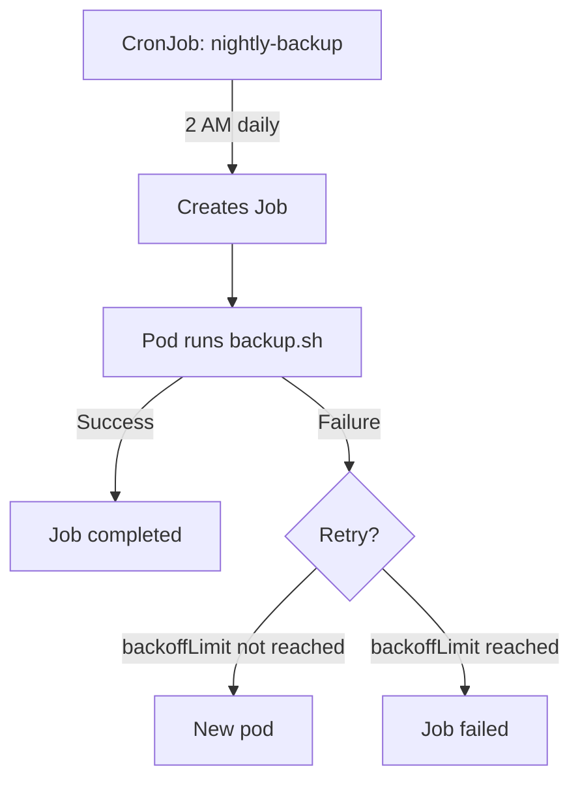

> 💡 **Quick Answer:** deployments

## The Problem

This is one of the most searched Kubernetes topics with thousands of monthly searches. A comprehensive, production-ready guide prevents hours of trial and error.

## The Solution

### Create a Job

```yaml
apiVersion: batch/v1
kind: Job
metadata:
  name: data-migration
spec:
  backoffLimit: 3            # Retry 3 times on failure
  activeDeadlineSeconds: 600 # Timeout after 10 minutes
  ttlSecondsAfterFinished: 3600  # Auto-cleanup after 1 hour
  template:
    spec:
      restartPolicy: Never   # Required: Never or OnFailure
      containers:
        - name: migrate
          image: my-app:v1
          command: ["python", "migrate.py"]
          env:
            - name: DATABASE_URL
              valueFrom:
                secretKeyRef:
                  name: db-creds
                  key: url
```

### Parallel Jobs

```yaml
apiVersion: batch/v1
kind: Job
metadata:
  name: batch-processor
spec:
  completions: 10          # Total tasks to complete
  parallelism: 3           # Run 3 pods at a time
  completionMode: Indexed  # Each pod gets JOB_COMPLETION_INDEX (0-9)
  template:
    spec:
      restartPolicy: Never
      containers:
        - name: worker
          image: batch-worker:v1
          command: ["process", "--partition=$(JOB_COMPLETION_INDEX)"]
```

### CronJob

```yaml
apiVersion: batch/v1
kind: CronJob
metadata:
  name: nightly-backup
spec:
  schedule: "0 2 * * *"           # 2 AM daily
  timeZone: "Europe/Rome"         # K8s 1.27+
  concurrencyPolicy: Forbid       # Don't overlap runs
  successfulJobsHistoryLimit: 3   # Keep last 3 successful
  failedJobsHistoryLimit: 3       # Keep last 3 failed
  startingDeadlineSeconds: 300    # Skip if >5min late
  jobTemplate:
    spec:
      backoffLimit: 2
      template:
        spec:
          restartPolicy: OnFailure
          containers:
            - name: backup
              image: backup-tool:v1
              command: ["backup.sh"]
```

### Cron Schedule Reference

| Schedule | Meaning |
|----------|---------|
| `*/5 * * * *` | Every 5 minutes |
| `0 * * * *` | Every hour |
| `0 2 * * *` | 2 AM daily |
| `0 9 * * 1-5` | 9 AM weekdays |
| `0 0 1 * *` | Midnight, 1st of month |

```bash
# Manual trigger
kubectl create job manual-backup --from=cronjob/nightly-backup

# Check status
kubectl get jobs
kubectl get cronjobs
kubectl describe job data-migration
```



## Frequently Asked Questions

### Job restartPolicy: Never vs OnFailure?

**Never**: failed pods stay (for log inspection), new pods created for retries. **OnFailure**: same pod restarts in-place. Use Never for debugging, OnFailure for production.

### What if a CronJob takes longer than the interval?

`concurrencyPolicy: Forbid` skips the new run. `Replace` kills the running job and starts new. `Allow` (default) runs both concurrently — usually not what you want.

## Best Practices

- Start with the simplest configuration that solves your problem
- Test in staging before production
- Use `kubectl describe` and events for troubleshooting
- Document team conventions for consistency

## Key Takeaways

- This is fundamental Kubernetes operational knowledge
- Follow established conventions and recommended labels
- Monitor and iterate based on real production behavior
- Automate repetitive tasks to reduce human error
