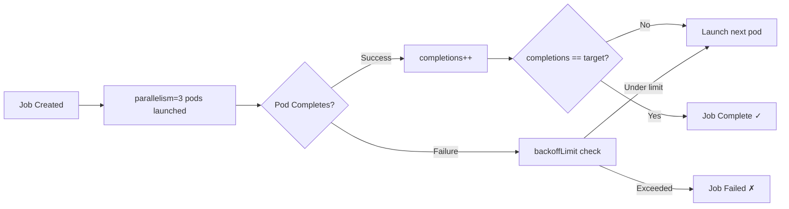

> 💡 **Quick Answer:** Set `parallelism` to run multiple pod workers simultaneously and `completions` to define total work units. Use indexed completion mode for deterministic task assignment.

## The Problem

Single-pod Jobs are too slow for batch workloads. You need to:
- Process thousands of items in parallel
- Assign specific work units to specific pods
- Control resource usage while maximizing throughput
- Handle partial failures without restarting everything

## The Solution

### Fixed Completion Count (Work Queue)

```yaml
apiVersion: batch/v1
kind: Job
metadata:
  name: batch-processor
spec:
  completions: 10
  parallelism: 3
  completionMode: NonIndexed
  template:
    spec:
      restartPolicy: Never
      containers:
        - name: worker
          image: batch-worker:1.0
          env:
            - name: QUEUE_URL
              value: "redis://queue:6379"
```

### Indexed Job (Deterministic Assignment)

```yaml
apiVersion: batch/v1
kind: Job
metadata:
  name: indexed-processor
spec:
  completions: 5
  parallelism: 5
  completionMode: Indexed
  template:
    spec:
      restartPolicy: Never
      containers:
        - name: worker
          image: data-processor:2.0
          command:
            - /bin/sh
            - -c
            - |
              echo "Processing partition $JOB_COMPLETION_INDEX"
              process-data --partition=$JOB_COMPLETION_INDEX --total=5
```

### Parallel Job with Backoff Limit

```yaml
apiVersion: batch/v1
kind: Job
metadata:
  name: resilient-batch
spec:
  completions: 100
  parallelism: 10
  backoffLimit: 5
  activeDeadlineSeconds: 3600
  template:
    spec:
      restartPolicy: Never
      containers:
        - name: worker
          image: processor:1.0
          resources:
            requests:
              cpu: 500m
              memory: 256Mi
            limits:
              cpu: "1"
              memory: 512Mi
```

### Pod Failure Policy (1.28+)

```yaml
apiVersion: batch/v1
kind: Job
metadata:
  name: smart-retry
spec:
  completions: 20
  parallelism: 5
  backoffLimit: 6
  podFailurePolicy:
    rules:
      - action: Ignore
        onExitCodes:
          containerName: worker
          operator: In
          values: [42]  # Known non-retriable
      - action: FailJob
        onPodConditions:
          - type: DisruptionTarget
  template:
    spec:
      restartPolicy: Never
      containers:
        - name: worker
          image: processor:1.0
```



## Common Issues

**Indexed job pods can't determine their work partition**
The index is available via:
- `JOB_COMPLETION_INDEX` environment variable
- Annotation `batch.kubernetes.io/job-completion-index`
- Hostname suffix: `jobname-<index>`

**Job never completes with parallelism > completions**
Parallelism is capped at completions. Setting `parallelism: 10` with `completions: 3` runs at most 3 pods.

**Pods stuck in backoff loop**
```bash
kubectl get pods -l job-name=batch-processor --field-selector=status.phase=Failed
kubectl describe job batch-processor
```

## Best Practices

- Use indexed mode when each pod processes a distinct data partition
- Set `activeDeadlineSeconds` to prevent runaway jobs
- Configure `backoffLimit` based on expected transient failure rate
- Use `podFailurePolicy` to distinguish retriable from fatal errors
- Set resource requests to ensure cluster can schedule `parallelism` pods simultaneously
- Monitor with `kubectl get jobs -w` for real-time completion tracking

## Key Takeaways

- `parallelism` = concurrent pods; `completions` = total successful pods needed
- Indexed mode provides `JOB_COMPLETION_INDEX` (0 to completions-1) per pod
- `backoffLimit` counts total pod failures across all parallel workers
- `activeDeadlineSeconds` is a hard wall-clock deadline for the entire Job
- Pod failure policy (1.26+) enables smarter retry logic based on exit codes
- Default `completionMode: NonIndexed` suits work-queue patterns
