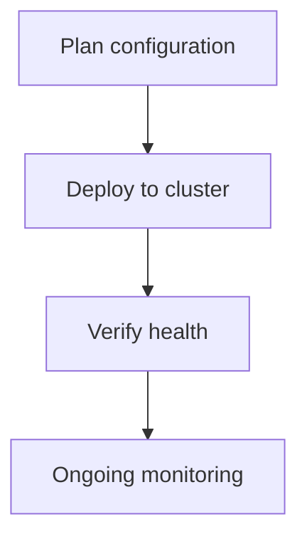

> 💡 **Quick Answer:** Automate Kubernetes Job cleanup with TTL controller. ttlSecondsAfterFinished, CronJob history limits, and preventing completed Job accumulation.

## The Problem

Production Kubernetes environments need job ttl and cleanup automation for reliability, security, and operational efficiency. Without proper configuration, teams face downtime, security gaps, or operational overhead.

## The Solution

### Configuration

```yaml
# Job TTL and Cleanup Automation configuration
apiVersion: v1
kind: ConfigMap
metadata:
  name: kubernetes-job-ttl-cleanup-config
data:
  config.yaml: |
    enabled: true
```

### Deployment Steps

```bash
# Apply configuration
kubectl apply -f kubernetes-job-ttl-cleanup.yaml

# Verify
kubectl get all -l app=job-ttl-cleanup
```



## Common Issues

**Resources not created**

Check RBAC permissions and namespace exists. Use `kubectl auth can-i create <resource>` to verify.

**Configuration drift**

Use GitOps (ArgoCD/Flux) to prevent manual changes from diverging from desired state.

## Best Practices

- Test in staging before production
- Version all configuration in Git
- Monitor metrics after deployment
- Document operational procedures
- Automate with CI/CD pipelines

## Key Takeaways

- Job TTL and Cleanup Automation improves Kubernetes operational maturity
- Start simple, iterate based on real-world experience
- Combine with observability for full visibility
- Automate repetitive operations
- Keep security as a first-class concern
