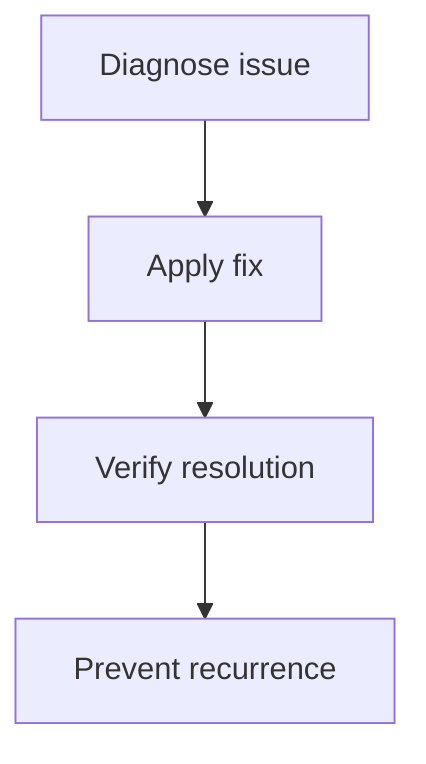

> 💡 **Quick Answer:** Scale Kubernetes nodes with Karpenter. NodePool configuration, instance selection, consolidation, and cost optimization vs Cluster Autoscaler.

## The Problem

karpenter node autoscaling guide is a common operational challenge in production Kubernetes clusters. This recipe provides systematic debugging steps and production-proven solutions.

## The Solution

### Configuration

```yaml
# Karpenter Node Autoscaling Guide configuration
apiVersion: v1
kind: ConfigMap
metadata:
  name: kubernetes-karpenter-node-autoscaling-config
data:
  config.yaml: |
    enabled: true
```

### Steps

```bash
# Verify current state
kubectl get all -A

# Apply fix
kubectl apply -f config.yaml

# Confirm resolution
kubectl get events --sort-by=.metadata.creationTimestamp
```



## Common Issues

**Issue persists after fix**

Check for multiple root causes. Kubernetes issues often cascade — fix the root cause first.

**Recurrence after node restart**

Ensure configuration is persistent (not just in-memory). Use DaemonSets or MachineConfig for node-level settings.

## Best Practices

- Monitor proactively — don't wait for failures
- Automate remediation for known issues
- Document runbooks for on-call teams
- Test recovery procedures regularly
- Keep cluster components updated

## Key Takeaways

- Systematic debugging saves time — follow the diagnostic flowchart
- Most issues have 2-3 common root causes — check those first
- Prevention is better than cure — monitoring and alerts catch issues early
- Document every incident — build institutional knowledge
- Automate recurring fixes — reduce MTTR
