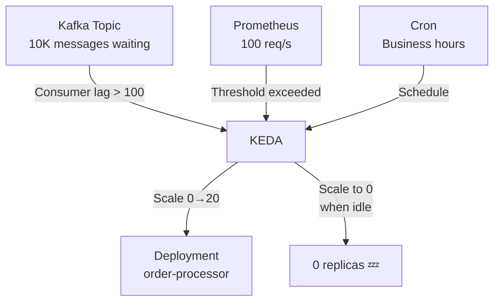

> 💡 **Quick Answer:** Install KEDA and create `ScaledObject` resources that define custom scaling triggers. Scale on Kafka consumer lag, Prometheus query results, cron schedules, or any of 60+ supported scalers. KEDA enables true scale-to-zero — 0 pods when no events, instant scale-up on first event.

## The Problem

HPA scales on CPU and memory — but event-driven workloads need to scale on queue depth, message backlog, or scheduled patterns. A Kafka consumer sitting at 5% CPU shouldn't scale down if 10,000 messages are waiting in the topic. KEDA bridges this gap with event-source-aware autoscaling.

## The Solution

### Install KEDA

```bash
helm repo add kedacore https://kedacore.github.io/charts
helm install keda kedacore/keda --namespace keda --create-namespace
```

### Scale on Kafka Consumer Lag

```yaml
apiVersion: keda.sh/v1alpha1
kind: ScaledObject
metadata:
  name: kafka-consumer
  namespace: production
spec:
  scaleTargetRef:
    name: order-processor
  pollingInterval: 15
  cooldownPeriod: 300
  minReplicaCount: 0
  maxReplicaCount: 20
  triggers:
    - type: kafka
      metadata:
        bootstrapServers: kafka.messaging:9092
        consumerGroup: order-group
        topic: orders
        lagThreshold: "100"
```

### Scale on Prometheus Metric

```yaml
apiVersion: keda.sh/v1alpha1
kind: ScaledObject
metadata:
  name: api-scaler
spec:
  scaleTargetRef:
    name: api-server
  minReplicaCount: 2
  maxReplicaCount: 50
  triggers:
    - type: prometheus
      metadata:
        serverAddress: http://prometheus.monitoring:9090
        query: sum(rate(http_requests_total{service="api"}[2m]))
        threshold: "100"
```

### Cron-Based Scaling

```yaml
triggers:
  - type: cron
    metadata:
      timezone: America/New_York
      start: "0 8 * * 1-5"
      end: "0 18 * * 1-5"
      desiredReplicas: "10"
```

Scale to 10 replicas during business hours, scale down after hours.



## Common Issues

**Pods not scaling to zero**: `minReplicaCount: 0` must be set AND the trigger must report 0. Check: `kubectl get scaledobject -o yaml` for trigger status.

**Scaling too slow**: Reduce `pollingInterval` from 30s to 10s. For Kafka, ensure the consumer group is active — inactive groups don't report lag.

## Best Practices

- **Scale-to-zero for cost savings** — 0 pods when no events to process
- **Kafka lag threshold** — tune based on processing time per message
- **Combine triggers** — Kafka lag + cron for pre-scaling before peak hours
- **`cooldownPeriod: 300`** — prevent rapid scale-down oscillation
- **60+ scalers available** — AWS SQS, RabbitMQ, Redis, HTTP, Prometheus, cron

## Key Takeaways

- KEDA enables event-driven autoscaling with 60+ supported scalers
- True scale-to-zero — 0 replicas when no events, instant scale-up on first event
- Scale on Kafka lag, Prometheus metrics, cron schedules, and more
- Complements HPA — KEDA handles the event sources, HPA handles the scaling mechanics
- Essential for event-driven architectures: message queues, batch processing, scheduled jobs
