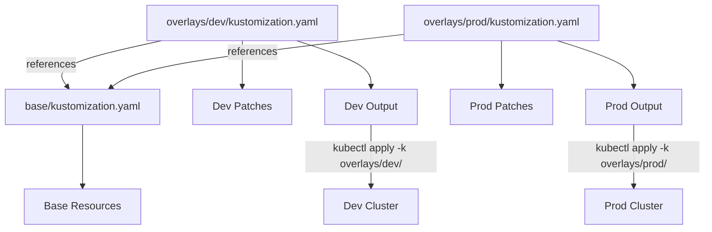

> 💡 **Quick Answer:** `kustomization.yaml` is the manifest file for Kustomize — it declares which resources to include, patches to apply, and generators to run. Use `kubectl apply -k ./` to deploy. Overlays extend a base for different environments without duplicating YAML.

## The Problem

Managing Kubernetes manifests across environments means:
- Duplicating YAML files with minor differences (dev vs staging vs prod)
- Forgetting to update all copies when base config changes
- No templating needed — just declarative patching
- Want to use `kubectl` natively without Helm

## The Solution

### Basic kustomization.yaml

```yaml
# kustomization.yaml
apiVersion: kustomize.config.k8s.io/v1beta1
kind: Kustomization

# Resources to include
resources:
  - deployment.yaml
  - service.yaml
  - configmap.yaml

# Common labels applied to ALL resources
commonLabels:
  app: myapp
  team: platform

# Common annotations
commonAnnotations:
  managed-by: kustomize

# Namespace override (applies to all resources)
namespace: production

# Name prefix/suffix
namePrefix: prod-
nameSuffix: -v2
```

```bash
# Preview rendered output
kubectl kustomize ./

# Apply directly
kubectl apply -k ./
```

### Directory Structure

```
myapp/
├── base/
│   ├── kustomization.yaml
│   ├── deployment.yaml
│   ├── service.yaml
│   └── configmap.yaml
└── overlays/
    ├── dev/
    │   ├── kustomization.yaml
    │   └── replica-patch.yaml
    ├── staging/
    │   ├── kustomization.yaml
    │   └── resource-patch.yaml
    └── prod/
        ├── kustomization.yaml
        ├── replica-patch.yaml
        └── hpa.yaml
```

### Base kustomization.yaml

```yaml
# base/kustomization.yaml
apiVersion: kustomize.config.k8s.io/v1beta1
kind: Kustomization
resources:
  - deployment.yaml
  - service.yaml
```

### Overlay kustomization.yaml

```yaml
# overlays/prod/kustomization.yaml
apiVersion: kustomize.config.k8s.io/v1beta1
kind: Kustomization

resources:
  - ../../base            # Include base resources
  - hpa.yaml             # Additional prod-only resources

namespace: production

# Strategic merge patch
patches:
  - path: replica-patch.yaml
  # Or inline patch:
  - patch: |-
      apiVersion: apps/v1
      kind: Deployment
      metadata:
        name: myapp
      spec:
        replicas: 5

# Image override
images:
  - name: myapp
    newName: registry.example.com/myapp
    newTag: v1.2.3

# ConfigMap generator
configMapGenerator:
  - name: app-config
    literals:
      - LOG_LEVEL=info
      - DB_HOST=postgres.production.svc
    files:
      - configs/app.properties

# Secret generator
secretGenerator:
  - name: app-secrets
    literals:
      - API_KEY=supersecret
    type: Opaque
```

### Patches

```yaml
# Strategic Merge Patch (overlays/prod/replica-patch.yaml)
apiVersion: apps/v1
kind: Deployment
metadata:
  name: myapp
spec:
  replicas: 5
  template:
    spec:
      containers:
        - name: app
          resources:
            requests:
              cpu: "500m"
              memory: "512Mi"
            limits:
              cpu: "1000m"
              memory: "1Gi"
```

```yaml
# JSON6902 Patch (more precise)
# kustomization.yaml
patches:
  - target:
      kind: Deployment
      name: myapp
    patch: |-
      - op: replace
        path: /spec/replicas
        value: 5
      - op: add
        path: /metadata/annotations/deploy-env
        value: production
```

### ConfigMap and Secret Generators

```yaml
# kustomization.yaml
configMapGenerator:
  # From literal values
  - name: app-env
    literals:
      - DATABASE_URL=postgres://db:5432/app
      - REDIS_URL=redis://redis:6379

  # From files
  - name: nginx-config
    files:
      - nginx.conf
      - mime.types

  # From env file
  - name: dotenv
    envs:
      - .env.production

secretGenerator:
  - name: tls-certs
    files:
      - tls.crt=certs/server.crt
      - tls.key=certs/server.key
    type: kubernetes.io/tls

# Disable hash suffix (not recommended for production)
generatorOptions:
  disableNameSuffixHash: true
```

### Architecture



### Image Transformers

```yaml
# Override image tags without patching
images:
  - name: nginx             # Match container image name
    newName: my-registry.com/nginx
    newTag: "1.27-alpine"
  - name: myapp
    newTag: "abc123"        # Git SHA as tag
    digest: sha256:abc...   # Or pin by digest
```

## Common Issues

| Issue | Cause | Fix |
|-------|-------|-----|
| "no matches for kind Kustomization" | Missing `apiVersion` field | Add `apiVersion: kustomize.config.k8s.io/v1beta1` |
| Resource not found in base | Wrong relative path | Use `../../base` from overlay |
| Patch doesn't apply | Name mismatch between patch and resource | Ensure `metadata.name` matches exactly |
| ConfigMap hash changes break refs | Hash suffix changes on content update | Use `generatorOptions.disableNameSuffixHash` or let rolling update handle it |
| Duplicate resource error | Same resource in base and overlay `resources` | Only add NEW resources in overlay |

## Best Practices

1. **Keep base minimal** — only shared config; all env-specific goes in overlays
2. **Use `images` transformer** — never hardcode tags in base YAML
3. **Keep hash suffix enabled** — triggers automatic rollout on config changes
4. **One overlay per environment** — dev, staging, prod as separate directories
5. **Commit rendered output in CI** — `kubectl kustomize ./ > rendered.yaml` for review

## Key Takeaways

- `kustomization.yaml` is declarative config management — no templating, just patching
- Base + Overlays pattern eliminates YAML duplication across environments
- `configMapGenerator` / `secretGenerator` create resources with content-hash suffixes
- `images` transformer overrides tags without touching base files — perfect for CI/CD
- Built into `kubectl` — no extra tooling needed (`kubectl apply -k ./`)
