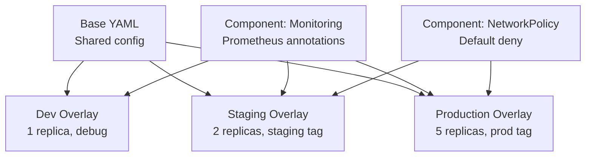

> 💡 **Quick Answer:** Use Kustomize overlays for environment-specific configuration (dev/staging/prod), strategic merge patches for targeted YAML modifications, components for reusable cross-cutting concerns (monitoring sidecar, network policies), and replacements (not vars) for cross-resource references.

## The Problem

Managing Kubernetes YAML across multiple environments leads to copy-paste divergence. Dev, staging, and prod have slightly different configs — replicas, resources, image tags — but 90% of the YAML is identical. Kustomize provides structured overlays without templating.

## The Solution

### Directory Structure

```
├── base/
│   ├── kustomization.yaml
│   ├── deployment.yaml
│   ├── service.yaml
│   └── configmap.yaml
├── components/
│   ├── monitoring/
│   │   └── kustomization.yaml
│   └── network-policy/
│       └── kustomization.yaml
└── overlays/
    ├── dev/
    │   └── kustomization.yaml
    ├── staging/
    │   └── kustomization.yaml
    └── production/
        ├── kustomization.yaml
        ├── replicas-patch.yaml
        └── resources-patch.yaml
```

### Base

```yaml
# base/kustomization.yaml
apiVersion: kustomize.config.k8s.io/v1beta1
kind: Kustomization
resources:
  - deployment.yaml
  - service.yaml
  - configmap.yaml
```

### Production Overlay

```yaml
# overlays/production/kustomization.yaml
apiVersion: kustomize.config.k8s.io/v1beta1
kind: Kustomization
resources:
  - ../../base
components:
  - ../../components/monitoring
  - ../../components/network-policy
namespace: production
namePrefix: prod-
labels:
  - pairs:
      env: production
images:
  - name: registry.example.com/app
    newTag: v2.1.0
replicas:
  - name: app
    count: 5
patches:
  - path: resources-patch.yaml
```

### Strategic Merge Patch

```yaml
# overlays/production/resources-patch.yaml
apiVersion: apps/v1
kind: Deployment
metadata:
  name: app
spec:
  template:
    spec:
      containers:
        - name: app
          resources:
            requests:
              cpu: "1"
              memory: 1Gi
            limits:
              memory: 2Gi
```

### Component (Reusable Cross-Cutting Concern)

```yaml
# components/monitoring/kustomization.yaml
apiVersion: kustomize.config.k8s.io/v1alpha1
kind: Component
patches:
  - patch: |
      apiVersion: apps/v1
      kind: Deployment
      metadata:
        name: not-important
      spec:
        template:
          metadata:
            annotations:
              prometheus.io/scrape: "true"
              prometheus.io/port: "9090"
```

### JSON Patch (Precise Surgery)

```yaml
# Remove a specific container env var
patches:
  - target:
      kind: Deployment
      name: app
    patch: |
      - op: remove
        path: /spec/template/spec/containers/0/env/2
      - op: add
        path: /spec/template/spec/containers/0/env/-
        value:
          name: LOG_LEVEL
          value: warn
```



## Common Issues

**Patch not applying — field not found**

Strategic merge patches match by `name` in the metadata. Ensure the resource name in the patch matches the base resource exactly.

**`namePrefix` breaks Service selectors**

Use `labels` instead of `namePrefix` for selector-based matching. Kustomize updates selectors automatically when using the `labels` transformer.

## Best Practices

- **Overlays for environments** — base + dev/staging/prod overlays
- **Components for cross-cutting concerns** — monitoring, security, observability
- **Strategic merge for additions** — add/modify fields naturally
- **JSON patches for precision** — remove fields, insert at specific positions
- **`replacements` over `vars`** — vars are deprecated, replacements are the future

## Key Takeaways

- Kustomize provides structured configuration management without templating
- Base + overlays pattern: 90% shared YAML, environment-specific patches
- Components are reusable across overlays — monitoring, network policies, security
- Strategic merge patches for natural YAML modifications; JSON patches for precision
- Built into kubectl (`kubectl apply -k`) — no extra tools needed
