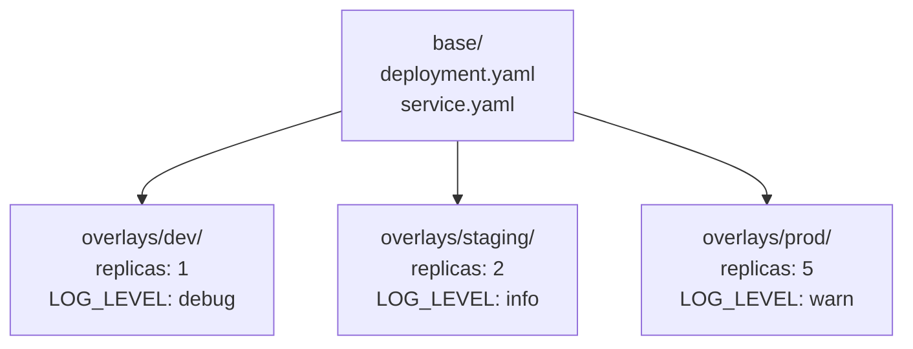

> 💡 **Quick Answer:** Create a `base/` with shared manifests and a `kustomization.yaml`, then create `overlays/dev/` and `overlays/prod/` that patch the base with environment-specific changes. Apply with `kubectl apply -k overlays/prod/`.

## The Problem

Copy-pasting manifests across environments leads to drift. Helm is powerful but complex for simple customizations. Kustomize is built into kubectl and provides template-free manifest customization through overlays and patches.

## The Solution

### Directory Structure

```
app/
├── base/
│   ├── kustomization.yaml
│   ├── deployment.yaml
│   ├── service.yaml
│   └── configmap.yaml
├── overlays/
│   ├── dev/
│   │   ├── kustomization.yaml
│   │   └── replica-patch.yaml
│   └── prod/
│       ├── kustomization.yaml
│       ├── replica-patch.yaml
│       └── resources-patch.yaml
```

### Base

```yaml
# base/kustomization.yaml
apiVersion: kustomize.config.k8s.io/v1beta1
kind: Kustomization
resources:
  - deployment.yaml
  - service.yaml
commonLabels:
  app: my-app
```

### Production Overlay

```yaml
# overlays/prod/kustomization.yaml
apiVersion: kustomize.config.k8s.io/v1beta1
kind: Kustomization
resources:
  - ../../base
namePrefix: prod-
namespace: production
patches:
  - path: replica-patch.yaml
  - path: resources-patch.yaml
configMapGenerator:
  - name: app-config
    literals:
      - LOG_LEVEL=warn
      - ENVIRONMENT=production
images:
  - name: my-app
    newName: registry.example.com/my-app
    newTag: v2.1.0
```

```yaml
# overlays/prod/replica-patch.yaml
apiVersion: apps/v1
kind: Deployment
metadata:
  name: my-app
spec:
  replicas: 5
```

### Apply

```bash
# Preview
kubectl kustomize overlays/prod/

# Apply
kubectl apply -k overlays/prod/

# Diff before applying
kubectl diff -k overlays/prod/
```



## Common Issues

**"resource not found" in overlay**

Resource names must match exactly between base and patch. Check `metadata.name` in both files.

**ConfigMapGenerator creates new names on every change**

This is intentional — the hash suffix triggers rolling updates. Use `generatorOptions: { disableNameSuffixHash: true }` to disable (not recommended).

## Best Practices

- **Base should work standalone** — `kubectl apply -k base/` should produce a valid deployment
- **Use `images` transformer** instead of patching image in deployment — cleaner
- **`configMapGenerator`** for environment-specific config — automatic hash suffix triggers rollouts
- **`kubectl diff -k`** before applying — see exactly what changes
- **Combine with ArgoCD** — point ArgoCD Application at overlay directory

## Key Takeaways

- Kustomize is built into kubectl — no extra tools needed
- Base + overlays pattern: shared manifests customized per environment
- `configMapGenerator` creates ConfigMaps with content-hash suffixes for automatic rollouts
- `images` transformer changes image name/tag without patching the deployment
- `kubectl diff -k` previews changes before applying
