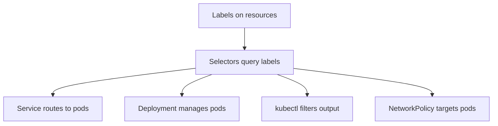

> 💡 **Quick Answer:** Master Kubernetes labels and selectors for organizing and querying resources. Label conventions, equality selectors, set-based selectors, and field selectors.

## The Problem

This is one of the most searched Kubernetes topics. Having a comprehensive, well-structured guide helps both beginners and experienced users quickly find what they need.

## The Solution

### Add Labels

```yaml
apiVersion: v1
kind: Pod
metadata:
  name: web-server
  labels:
    app: web
    version: v2
    tier: frontend
    environment: production
    team: platform
```

```bash
# Add/update labels
kubectl label pod web-server release=stable
kubectl label pod web-server release=canary --overwrite

# Remove label
kubectl label pod web-server release-

# Show labels
kubectl get pods --show-labels
kubectl get pods -L app,version    # Show specific label columns
```

### Query with Selectors

```bash
# Equality-based
kubectl get pods -l app=web
kubectl get pods -l app!=web
kubectl get pods -l app=web,tier=frontend    # AND

# Set-based
kubectl get pods -l 'app in (web, api)'
kubectl get pods -l 'app notin (web)'
kubectl get pods -l 'version'                # Has label
kubectl get pods -l '!version'               # Missing label

# Field selectors (built-in fields)
kubectl get pods --field-selector status.phase=Running
kubectl get pods --field-selector spec.nodeName=worker-1
```

### Recommended Label Convention

```yaml
labels:
  # Standard Kubernetes labels
  app.kubernetes.io/name: web-server
  app.kubernetes.io/instance: web-prod
  app.kubernetes.io/version: "2.0.0"
  app.kubernetes.io/component: frontend
  app.kubernetes.io/part-of: e-commerce
  app.kubernetes.io/managed-by: helm
```

### Labels in Selectors

```yaml
# Service selector — routes traffic to matching pods
apiVersion: v1
kind: Service
spec:
  selector:
    app: web
    version: v2

# Deployment selector
apiVersion: apps/v1
kind: Deployment
spec:
  selector:
    matchLabels:
      app: web
    matchExpressions:
      - key: version
        operator: In
        values: ["v1", "v2"]
```



## Frequently Asked Questions

### Labels vs annotations?

**Labels** identify and select objects (used by selectors). **Annotations** store metadata (build info, git hash, descriptions) — not queryable by selectors.

### Is there a limit on labels?

Each label key must be ≤63 chars (with optional prefix ≤253 chars). Each value must be ≤63 chars. No hard limit on number of labels per resource, but keep it reasonable.

## Best Practices

- **Start simple** — use the basic form first, add complexity as needed
- **Be consistent** — follow naming conventions across your cluster
- **Document your choices** — add annotations explaining why, not just what
- **Monitor and iterate** — review configurations regularly

## Key Takeaways

- This is fundamental Kubernetes knowledge every engineer needs
- Start with the simplest approach that solves your problem
- Use `kubectl explain` and `kubectl describe` when unsure
- Practice in a test cluster before applying to production
