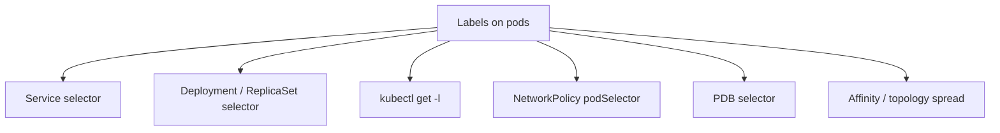

> 💡 **Quick Answer:** Labels are key/value pairs in `metadata.labels`; selectors query them. Add one with `kubectl label pod web release=stable`, remove it with `kubectl label pod web release-`, and filter with `kubectl get pods -l app=web,tier!=cache` (equality) or `-l 'env in (prod,staging)'` (set-based). Services, Deployments, NetworkPolicies, PDBs and affinity rules all find their pods through label selectors.
>
> **Gotcha:** A Deployment's `spec.selector` is immutable and must match its pod template labels — never put changing values like `version` in it.

## Add, Change and Remove Labels

```yaml
apiVersion: v1
kind: Pod
metadata:
  name: web-server
  labels:
    app: web
    tier: frontend
    environment: production
    team: platform
```

```bash
kubectl label pod web-server release=stable
kubectl label pod web-server release=canary --overwrite   # Change an existing value
kubectl label pod web-server release-                     # Remove
kubectl label pods -l app=web tier=frontend               # Bulk: all pods matching a selector
kubectl label nodes worker-1 disktype=ssd                 # Nodes too (for nodeSelector/affinity)

kubectl get pods --show-labels
kubectl get pods -L app,environment                       # Label values as columns
```

Labels changed directly on pods are overwritten on the next rollout — change the pod template in the Deployment instead.

## Query with Selectors

```bash
# Equality-based (comma = AND)
kubectl get pods -l app=web
kubectl get pods -l 'app!=web'
kubectl get pods -l app=web,environment=production

# Set-based
kubectl get pods -l 'environment in (production,staging)'
kubectl get pods -l 'tier notin (frontend)'
kubectl get pods -l 'gpu'                 # Key exists
kubectl get pods -l '!gpu'                # Key absent

# Mixed
kubectl get pods -l 'app=web,environment in (production,staging)'

# Act on the selection
kubectl delete pods -l app=web,environment=dev
kubectl logs -l app=web --all-containers --prefix
```

There is no OR across different keys in a single selector — run two queries or use a common label.

### Field Selectors

Field selectors filter on object fields, not labels, and support only `=`, `==` and `!=` on a limited set of fields:

```bash
kubectl get pods -A --field-selector status.phase=Running
kubectl get pods -A --field-selector spec.nodeName=worker-1
kubectl get events --field-selector involvedObject.kind=Pod,reason=FailedScheduling
```

## Selectors in Manifests

```yaml
# Service: equality only, map = AND
apiVersion: v1
kind: Service
metadata:
  name: web
spec:
  selector:
    app: web
    tier: frontend
---
# Deployment: matchLabels and/or matchExpressions (all ANDed)
apiVersion: apps/v1
kind: Deployment
metadata:
  name: web
spec:
  selector:
    matchLabels:
      app: web
      tier: frontend
  template:
    metadata:
      labels:
        app: web
        tier: frontend
        version: v2          # Extra labels are fine in the template, not in the selector
---
# matchExpressions (NetworkPolicy, PDB, affinity, Deployment)
selector:
  matchExpressions:
    - {key: environment, operator: In, values: [production, staging]}
    - {key: gpu, operator: Exists}
    - {key: tier, operator: NotIn, values: [cache]}
```

Operators: `In`, `NotIn`, `Exists`, `DoesNotExist` (node affinity adds `Gt` and `Lt`). An empty selector `{}` matches **everything** in the namespace — intentional in a default-deny NetworkPolicy, a bug in a PDB.


```mermaid
graph TD
    A[Labels on pods] --> B[Service selector]
    A --> C[Deployment / ReplicaSet selector]
    A --> D[kubectl get -l]
    A --> E[NetworkPolicy podSelector]
    A --> F[PDB selector]
    A --> G[Affinity / topology spread]
```

## Recommended Labels

| Label | Example | Purpose |
|-------|---------|---------|
| `app.kubernetes.io/name` | `web-frontend` | Application name |
| `app.kubernetes.io/instance` | `web-prod` | Unique instance of the app |
| `app.kubernetes.io/version` | `2.1.0` | Version (keep out of selectors) |
| `app.kubernetes.io/component` | `frontend` | Role in the architecture |
| `app.kubernetes.io/part-of` | `ecommerce` | Higher-level application |
| `app.kubernetes.io/managed-by` | `helm` | Tool managing the object |

Add org-specific labels like `team`, `environment` and `cost-center` for ownership and cost allocation. See [labels and annotations best practices](/recipes/configuration/kubernetes-labels-annotations-best-practices/) for a full schema and enforcement.

## Label Syntax Rules

- Key: optional DNS-subdomain prefix (≤253 chars) + `/` + name (≤63 chars, alphanumerics, `-`, `_`, `.`, starting and ending alphanumeric)
- `kubernetes.io/` and `k8s.io/` prefixes are reserved for Kubernetes components
- Value: ≤63 chars, same character set, may be empty

## Frequently Asked Questions

### What is the difference between labels and annotations?

Labels identify objects and can be queried by selectors; they're short and constrained. Annotations hold non-identifying metadata (build info, tool configuration, URLs) of any size and can't be used in selectors.

### How do I select pods by multiple labels?

Comma-separate them: `kubectl get pods -l app=web,environment=production` returns pods with both labels. In manifests, every key in `matchLabels` and every entry in `matchExpressions` must match.

### Can I change a Deployment's selector?

Not in `apps/v1` — `spec.selector` is immutable. Delete and recreate the Deployment (optionally with `--cascade=orphan` to keep pods running), or create a new Deployment and shift traffic.

### Why does my Service have no endpoints?

Its selector doesn't match any Ready pod's labels, or matches pods in another namespace. Compare `kubectl get svc web -o jsonpath='{.spec.selector}'` with `kubectl get pods --show-labels`, and check `kubectl get endpointslices -l kubernetes.io/service-name=web`.

### What are the label length limits?

Names and values are up to 63 characters; an optional prefix can add up to 253 characters. There's no fixed limit on the number of labels, but every label is stored in etcd and indexed, so keep them purposeful.
