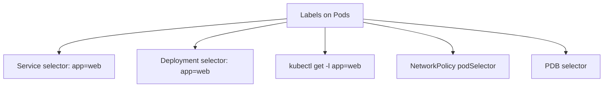

> 💡 **Quick Answer:** configuration

## The Problem

This is one of the most searched Kubernetes topics with thousands of monthly searches. A comprehensive, production-ready guide prevents hours of trial and error.

## The Solution

### Labels

```yaml
metadata:
  labels:
    # Recommended labels (kubernetes.io standard)
    app.kubernetes.io/name: web-frontend
    app.kubernetes.io/version: "2.1.0"
    app.kubernetes.io/component: frontend
    app.kubernetes.io/part-of: ecommerce
    app.kubernetes.io/managed-by: helm
    # Custom labels
    team: platform
    environment: production
    cost-center: engineering
```

### Selectors

```bash
# Equality-based
kubectl get pods -l app=web
kubectl get pods -l app=web,environment=production
kubectl get pods -l 'app!=web'

# Set-based
kubectl get pods -l 'environment in (production,staging)'
kubectl get pods -l 'tier notin (frontend)'
kubectl get pods -l 'gpu'               # Key exists
kubectl get pods -l '!gpu'              # Key doesn't exist

# Multiple conditions (AND)
kubectl get pods -l 'app=web,environment in (production,staging)'
```

### Service Selector

```yaml
# Service routes traffic to pods matching selector
apiVersion: v1
kind: Service
spec:
  selector:
    app: web            # Must match pod labels
    version: v2         # Multiple labels = AND
```

### Label Operations

```bash
# Add label
kubectl label pod my-pod environment=production

# Update label (overwrite)
kubectl label pod my-pod environment=staging --overwrite

# Remove label
kubectl label pod my-pod environment-

# Label all pods matching a selector
kubectl label pods -l app=web tier=frontend

# Show labels
kubectl get pods --show-labels
kubectl get pods -L app,environment    # Specific columns
```

### Recommended Label Schema

| Label | Example | Purpose |
|-------|---------|---------|
| `app.kubernetes.io/name` | `web-frontend` | Application name |
| `app.kubernetes.io/version` | `2.1.0` | Version |
| `app.kubernetes.io/component` | `frontend` | Component role |
| `app.kubernetes.io/part-of` | `ecommerce` | Parent application |
| `app.kubernetes.io/managed-by` | `helm` | Management tool |



## Frequently Asked Questions

### Labels vs annotations?

**Labels** are for selection/filtering — used by Services, Deployments, kubectl queries. **Annotations** are for metadata that isn't used for selection — build info, URLs, tool config.

### Maximum label size?

Key: 253 chars (prefix) + 63 chars (name). Value: 63 chars max, alphanumeric + `-_.`. Keep labels short and consistent across your org.

## Best Practices

- Start with the simplest configuration that solves your problem
- Test in staging before production
- Use `kubectl describe` and events for troubleshooting
- Document team conventions for consistency

## Key Takeaways

- This is fundamental Kubernetes operational knowledge
- Follow established conventions and recommended labels
- Monitor and iterate based on real production behavior
- Automate repetitive tasks to reduce human error
