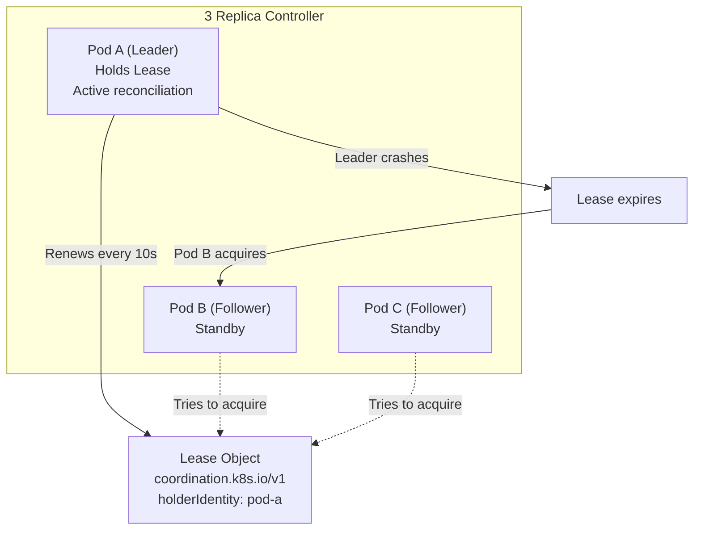

> 💡 **Quick Answer:** Kubernetes Lease objects in the \`coordination.k8s.io/v1\` API provide lightweight leader election. One pod acquires the lease, becomes leader, and renews periodically. If the leader crashes, another pod acquires the lease after \`leaseDurationSeconds\` expires. Used by kube-controller-manager, kube-scheduler, and custom operators.

## The Problem

Running multiple replicas of a controller or operator for high availability creates a coordination problem — only one instance should perform reconciliation at a time. Without leader election, you get duplicate actions, conflicting writes, and race conditions. Kubernetes Lease objects provide a built-in distributed lock mechanism.



## The Solution

### Lease Object Structure

```yaml
apiVersion: coordination.k8s.io/v1
kind: Lease
metadata:
  name: my-controller-leader
  namespace: default
spec:
  holderIdentity: "pod-a-7b8f4d"    # Current leader pod
  leaseDurationSeconds: 15           # Lease validity period
  acquireTime: "2026-04-12T10:00:00Z"
  renewTime: "2026-04-12T10:00:30Z"  # Last renewal
  leaseTransitions: 3                # Number of leader changes
```

### View Leases in Your Cluster

```bash
# System leases (kube-controller-manager, kube-scheduler)
kubectl get leases -n kube-system
# NAME                              HOLDER                                            AGE
# kube-controller-manager           master-01_abc123                                  45d
# kube-scheduler                    master-01_def456                                  45d

# Node heartbeat leases (one per node)
kubectl get leases -n kube-node-lease
# NAME           HOLDER         AGE
# worker-01      worker-01      45d
# worker-02      worker-02      45d

# Custom operator leases
kubectl get leases -n operators
# NAME                          HOLDER                          AGE
# my-operator-leader-election   my-operator-pod-abc123          2h
```

### Go Client: Leader Election with client-go

```go
package main

import (
    "context"
    "fmt"
    "os"
    "time"

    metav1 "k8s.io/apimachinery/pkg/apis/meta/v1"
    "k8s.io/client-go/kubernetes"
    "k8s.io/client-go/rest"
    "k8s.io/client-go/tools/leaderelection"
    "k8s.io/client-go/tools/leaderelection/resourcelock"
)

func main() {
    config, _ := rest.InClusterConfig()
    client, _ := kubernetes.NewForConfig(config)

    // Pod identity from Downward API
    id := os.Getenv("POD_NAME")

    lock := &resourcelock.LeaseLock{
        LeaseMeta: metav1.ObjectMeta{
            Name:      "my-controller-leader",
            Namespace: "default",
        },
        Client: client.CoordinationV1(),
        LockConfig: resourcelock.ResourceLockConfig{
            Identity: id,
        },
    }

    leaderelection.RunOrDie(context.TODO(), leaderelection.LeaderElectionConfig{
        Lock:            lock,
        LeaseDuration:   15 * time.Second,
        RenewDeadline:   10 * time.Second,
        RetryPeriod:     2 * time.Second,
        Callbacks: leaderelection.LeaderCallbacks{
            OnStartedLeading: func(ctx context.Context) {
                // This pod is the leader — start reconciliation
                fmt.Println("Started leading")
                runController(ctx)
            },
            OnStoppedLeading: func() {
                // Lost leadership — stop reconciliation
                fmt.Println("Stopped leading")
                os.Exit(0)
            },
            OnNewLeader: func(identity string) {
                if identity == id {
                    return
                }
                fmt.Printf("New leader: %s\n", identity)
            },
        },
    })
}
```

### Kubernetes Deployment with Leader Election

```yaml
apiVersion: apps/v1
kind: Deployment
metadata:
  name: my-controller
spec:
  replicas: 3    # HA: multiple replicas
  template:
    metadata:
      labels:
        app: my-controller
    spec:
      serviceAccountName: my-controller
      containers:
        - name: controller
          image: my-controller:v1.0
          args:
            - --leader-elect=true
            - --leader-election-id=my-controller-leader
            - --leader-election-namespace=$(POD_NAMESPACE)
          env:
            - name: POD_NAME
              valueFrom:
                fieldRef:
                  fieldPath: metadata.name
            - name: POD_NAMESPACE
              valueFrom:
                fieldRef:
                  fieldPath: metadata.namespace
---
# RBAC for lease management
apiVersion: rbac.authorization.k8s.io/v1
kind: Role
metadata:
  name: leader-election
spec:
  rules:
    - apiGroups: ["coordination.k8s.io"]
      resources: ["leases"]
      verbs: ["get", "create", "update"]
---
apiVersion: rbac.authorization.k8s.io/v1
kind: RoleBinding
metadata:
  name: leader-election
roleRef:
  apiGroup: rbac.authorization.k8s.io
  kind: Role
  name: leader-election
subjects:
  - kind: ServiceAccount
    name: my-controller
```

### Timing Parameters

| Parameter | Default | Description |
|-----------|:-------:|-------------|
| \`leaseDuration\` | 15s | How long a lease is valid |
| \`renewDeadline\` | 10s | How long leader tries to renew before giving up |
| \`retryPeriod\` | 2s | How often followers try to acquire the lease |

```
Timeline:
  Leader acquired lease at t=0
  t=2:  Leader renews ✅
  t=4:  Leader renews ✅
  t=6:  Leader crashes 💥
  t=8:  Lease still valid (expires at t=6+15=t=21)
  t=21: Lease expired
  t=23: Follower acquires lease (retryPeriod=2s)
  → Failover time: ~17 seconds
```

### Node Heartbeat Leases

Kubernetes uses Leases in \`kube-node-lease\` namespace for node heartbeats (replacing the older \`NodeStatus\` mechanism):

```bash
# Check node heartbeat
kubectl get lease worker-01 -n kube-node-lease -o yaml
# renewTime updates every 10s — proves node is alive

# If renewTime stops updating → kubelet down → node marked NotReady
```

## Common Issues

| Issue | Cause | Fix |
|-------|-------|-----|
| Split-brain (two leaders) | Clock skew between nodes | Ensure NTP sync; increase leaseDuration |
| Slow failover | leaseDuration too long | Reduce to 10-15s (not below 10s) |
| Lease never acquired | Missing RBAC for coordination.k8s.io/leases | Add Role with get, create, update |
| Leader flapping | renewDeadline too close to leaseDuration | Keep renewDeadline < leaseDuration |
| Old leader keeps running | OnStoppedLeading not calling os.Exit | Ensure clean shutdown on leadership loss |

## Best Practices

- **Use Lease locks** (not ConfigMap/Endpoints locks) — purpose-built, lower API server load
- **Set \`replicas: 3\`** for HA — survives 1 pod failure with immediate failover
- **Always call \`os.Exit\`** in OnStoppedLeading — prevents stale leader running
- **Use Downward API for pod identity** — unique holderIdentity per pod
- **Monitor leaseTransitions** — frequent transitions indicate instability
- **Don't set leaseDuration < 10s** — too aggressive, causes flapping

## Key Takeaways

- Lease objects (\`coordination.k8s.io/v1\`) are the standard for Kubernetes leader election
- One pod holds the lease (leader), others wait (followers), failover is automatic
- \`holderIdentity\` identifies the current leader; \`renewTime\` proves it's alive
- client-go \`leaderelection\` package handles all the mechanics
- Failover time ≈ leaseDuration + retryPeriod (~17s with defaults)
- Node heartbeats also use Leases in the \`kube-node-lease\` namespace
