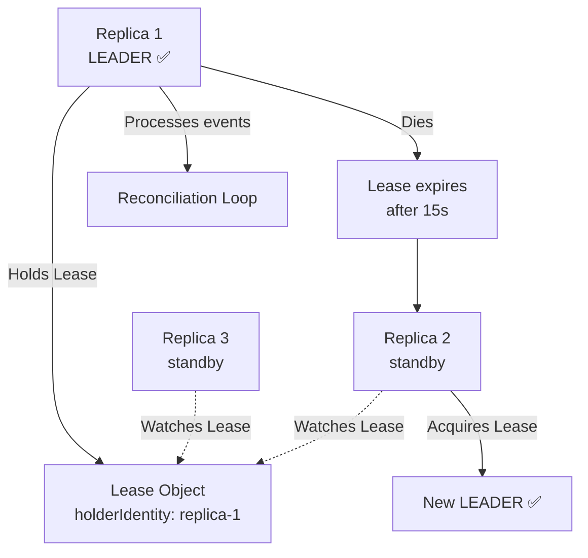

> 💡 **Quick Answer:** Create a `Lease` object in a shared namespace and use the `client-go` leader election package with `LeaseDuration: 15s`, `RenewDeadline: 10s`, `RetryPeriod: 2s`. Only the holder of the lease processes work — all other replicas are standby.

## The Problem

Running multiple replicas of a controller or scheduler for HA, but only one should be active at a time. Without leader election, all replicas process events simultaneously — causing duplicate actions, conflicts, and data corruption.

## The Solution

### Lease Object

```yaml
apiVersion: coordination.k8s.io/v1
kind: Lease
metadata:
  name: my-controller-leader
  namespace: kube-system
spec:
  holderIdentity: controller-pod-abc123
  leaseDurationSeconds: 15
  acquireTime: "2026-04-24T10:00:00Z"
  renewTime: "2026-04-24T10:00:05Z"
  leaseTransitions: 3
```

### Go Controller Pattern

```go
lock := &resourcelock.LeaseLock{
    LeaseMeta: metav1.ObjectMeta{
        Name:      "my-controller",
        Namespace: "kube-system",
    },
    Client: client.CoordinationV1(),
    LockConfig: resourcelock.ResourceLockConfig{
        Identity: hostname,
    },
}

leaderelection.RunOrDie(ctx, leaderelection.LeaderElectionConfig{
    Lock:            lock,
    LeaseDuration:   15 * time.Second,
    RenewDeadline:   10 * time.Second,
    RetryPeriod:     2 * time.Second,
    Callbacks: leaderelection.LeaderCallbacks{
        OnStartedLeading: func(ctx context.Context) {
            // Start reconciliation loop
            controller.Run(ctx)
        },
        OnStoppedLeading: func() {
            log.Fatal("Lost leadership, exiting")
        },
    },
})
```

### Helm Deployment with Leader Election

```yaml
apiVersion: apps/v1
kind: Deployment
metadata:
  name: my-controller
spec:
  replicas: 3
  template:
    spec:
      containers:
        - name: controller
          args:
            - --leader-elect=true
            - --leader-elect-lease-duration=15s
            - --leader-elect-renew-deadline=10s
            - --leader-elect-retry-period=2s
```



## Common Issues

**Split-brain — two leaders active simultaneously**

Can't happen with Lease objects — Kubernetes API provides strong consistency. Ensure `RenewDeadline < LeaseDuration` (typically 2/3 of lease duration).

**Leader failover takes too long**

Reduce `LeaseDuration` from 15s to 10s. Tradeoff: more frequent API server requests. Below 10s adds significant etcd load.

## Best Practices

- **`LeaseDuration: 15s`** is the standard default — good balance of failover speed and API load
- **`RenewDeadline` should be 2/3 of `LeaseDuration`** — gives time for retries before expiry
- **`RetryPeriod: 2s`** — how often non-leaders check if the lease is available
- **Always `log.Fatal` on lost leadership** — ensures clean restart, prevents zombie leaders
- **3 replicas** is sufficient for HA — 5 adds no benefit for leader election

## Key Takeaways

- Lease objects provide distributed leader election without external dependencies
- Only the lease holder processes work — other replicas are standby
- Failover happens automatically when the leader stops renewing (dies, network partition)
- Standard timing: 15s duration, 10s renew deadline, 2s retry period
- Built into most K8s controllers — `--leader-elect=true` flag
