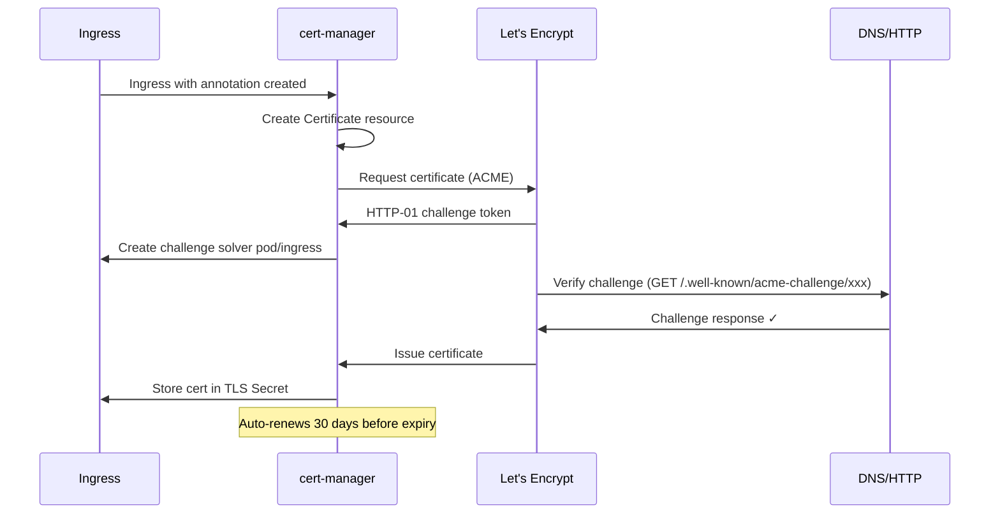

> 💡 **Quick Answer:** Install cert-manager, create a `ClusterIssuer` with Let's Encrypt, annotate your Ingress with `cert-manager.io/cluster-issuer`, and cert-manager automatically provisions and renews TLS certificates.

## The Problem

You need HTTPS for your Kubernetes services but:
- Manually managing TLS certificates doesn't scale
- Certificates expire and cause outages if not renewed
- Let's Encrypt requires ACME challenge automation
- Different ingress controllers need different configurations

## The Solution

### Step 1: Install cert-manager

```bash
# Install cert-manager with CRDs
kubectl apply -f https://github.com/cert-manager/cert-manager/releases/download/v1.16.3/cert-manager.yaml

# Verify installation
kubectl get pods -n cert-manager
# cert-manager-xxx           Running
# cert-manager-cainjector    Running
# cert-manager-webhook       Running
```

Or with Helm:

```bash
helm repo add jetstack https://charts.jetstack.io
helm repo update
helm install cert-manager jetstack/cert-manager \
  --namespace cert-manager \
  --create-namespace \
  --set crds.enabled=true
```

### Step 2: Create ClusterIssuer (Let's Encrypt)

```yaml
# letsencrypt-prod.yaml
apiVersion: cert-manager.io/v1
kind: ClusterIssuer
metadata:
  name: letsencrypt-prod
spec:
  acme:
    server: https://acme-v02.api.letsencrypt.org/directory
    email: admin@example.com  # Your email for expiry notifications
    privateKeySecretRef:
      name: letsencrypt-prod-key
    solvers:
      - http01:
          ingress:
            class: nginx  # Match your ingress controller
---
# Start with staging to avoid rate limits during testing
apiVersion: cert-manager.io/v1
kind: ClusterIssuer
metadata:
  name: letsencrypt-staging
spec:
  acme:
    server: https://acme-staging-v02.api.letsencrypt.org/directory
    email: admin@example.com
    privateKeySecretRef:
      name: letsencrypt-staging-key
    solvers:
      - http01:
          ingress:
            class: nginx
```

```bash
kubectl apply -f letsencrypt-prod.yaml
kubectl get clusterissuer
# NAME                 READY   AGE
# letsencrypt-prod     True    30s
# letsencrypt-staging  True    30s
```

### Step 3: Create Ingress with TLS

```yaml
apiVersion: networking.k8s.io/v1
kind: Ingress
metadata:
  name: myapp
  annotations:
    cert-manager.io/cluster-issuer: letsencrypt-prod
spec:
  ingressClassName: nginx
  tls:
    - hosts:
        - app.example.com
      secretName: app-example-com-tls  # cert-manager creates this
  rules:
    - host: app.example.com
      http:
        paths:
          - path: /
            pathType: Prefix
            backend:
              service:
                name: myapp
                port:
                  number: 80
```

### Architecture



### DNS-01 Challenge (Wildcard Certificates)

```yaml
apiVersion: cert-manager.io/v1
kind: ClusterIssuer
metadata:
  name: letsencrypt-dns
spec:
  acme:
    server: https://acme-v02.api.letsencrypt.org/directory
    email: admin@example.com
    privateKeySecretRef:
      name: letsencrypt-dns-key
    solvers:
      - dns01:
          cloudflare:
            email: admin@example.com
            apiTokenSecretRef:
              name: cloudflare-api-token
              key: api-token
---
# Wildcard certificate
apiVersion: cert-manager.io/v1
kind: Certificate
metadata:
  name: wildcard-example-com
  namespace: default
spec:
  secretName: wildcard-example-com-tls
  issuerRef:
    name: letsencrypt-dns
    kind: ClusterIssuer
  dnsNames:
    - "*.example.com"
    - example.com
```

### Verify Certificate Status

```bash
# Check certificate status
kubectl get certificate
# NAME                   READY   SECRET                  AGE
# app-example-com-tls    True    app-example-com-tls     5m

# Detailed status
kubectl describe certificate app-example-com-tls

# Check the actual secret
kubectl get secret app-example-com-tls -o jsonpath='{.data.tls\.crt}' | base64 -d | openssl x509 -text -noout | head -20

# Check cert-manager logs
kubectl logs -n cert-manager -l app=cert-manager --tail=50
```

## Common Issues

| Issue | Cause | Fix |
|-------|-------|-----|
| Certificate stuck "Issuing" | HTTP-01 challenge failing | Check ingress class, firewall port 80 |
| "rate limited" error | Too many requests to prod | Use staging first, then switch to prod |
| Challenge pod not created | Wrong ingress class in solver | Match `ingress.class` to your controller |
| DNS-01 timeout | API token wrong or propagation slow | Verify DNS credentials, increase timeout |
| Certificate not auto-renewing | cert-manager pod crashed | Check `cert-manager` namespace pods |
| "no matching HTTP01 solver" | Solver selector too restrictive | Use broader selector or match domain |

## Best Practices

1. **Start with staging issuer** — switch to production after testing
2. **Use DNS-01 for wildcards** — HTTP-01 can't issue wildcard certs
3. **Monitor `certmanager_certificate_expiration_timestamp_seconds`** — alert at <14 days
4. **One secret per domain** — don't share TLS secrets across namespaces
5. **Set email on ClusterIssuer** — Let's Encrypt sends 20-day expiry warnings

## Key Takeaways

- cert-manager automates the entire TLS lifecycle — provision, validate, renew
- HTTP-01 is simplest (needs port 80 open); DNS-01 needed for wildcards
- Annotate Ingress with `cert-manager.io/cluster-issuer` — cert-manager handles the rest
- Certificates auto-renew 30 days before expiry — zero manual intervention
- Always test with staging Let's Encrypt first to avoid rate limits (5 certs/domain/week)
