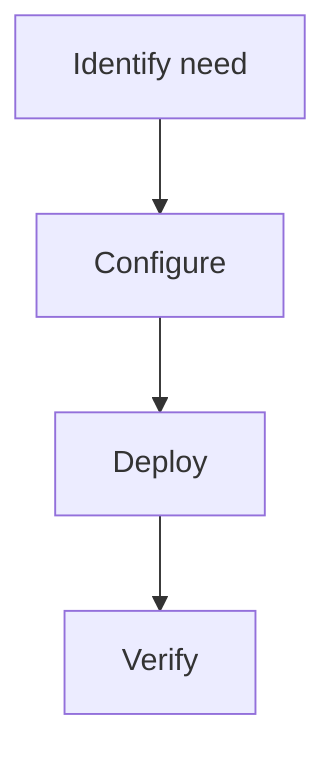

> 💡 **Quick Answer:** Set up Let's Encrypt TLS certificates for Kubernetes Ingress with cert-manager. HTTP-01 challenge, automatic renewal, and HTTPS redirect configuration.

## The Problem

Set up Let's Encrypt TLS certificates for Kubernetes Ingress with cert-manager. Without proper configuration, teams encounter unexpected behavior, errors, or security gaps in production.

## The Solution

### Configuration

```yaml
# Let's Encrypt Ingress Kubernetes example
apiVersion: v1
kind: ConfigMap
metadata:
  name: example
data:
  key: value
```

### Steps

```bash
kubectl apply -f config.yaml
kubectl get all -n production
```



## Common Issues

**Configuration not working**: Check YAML syntax and ensure the namespace exists. Use `kubectl apply --dry-run=server` to validate before applying.

## Best Practices

- Test changes in staging first
- Version all configs in Git
- Monitor after deployment
- Document decisions for the team

## Key Takeaways

- Let's Encrypt Ingress Kubernetes is essential for production Kubernetes
- Follow the configuration patterns shown above
- Always validate before applying to production
- Combine with monitoring for full observability
