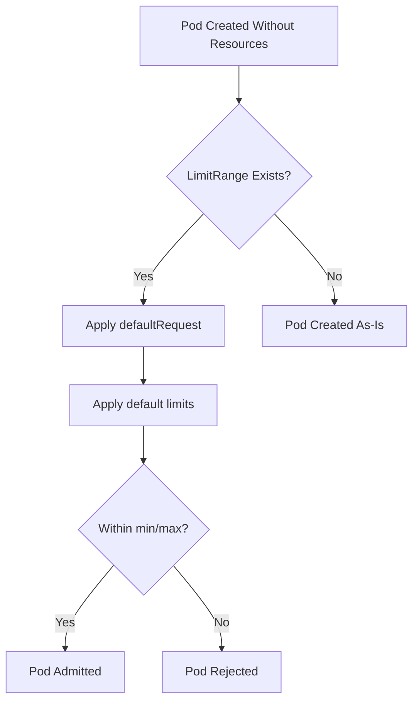

> 💡 **Quick Answer:** LimitRange sets default requests/limits for containers that don't specify them, and enforces min/max boundaries per pod or container in a namespace.

## The Problem

Developers forget to set resource requests and limits. Without defaults:
- Pods consume unlimited resources (noisy neighbor problem)
- Scheduler can't make informed decisions (requests = 0)
- ResourceQuota enforcement fails (quota requires requests to be set)
- OOMKilled surprises when memory is unbounded

## The Solution

### Default Requests and Limits

```yaml
apiVersion: v1
kind: LimitRange
metadata:
  name: default-resources
  namespace: development
spec:
  limits:
    - type: Container
      default:
        cpu: 500m
        memory: 256Mi
      defaultRequest:
        cpu: 100m
        memory: 128Mi
      min:
        cpu: 50m
        memory: 64Mi
      max:
        cpu: "2"
        memory: 2Gi
```

### Pod-Level Limits

```yaml
spec:
  limits:
    - type: Pod
      max:
        cpu: "4"
        memory: 8Gi
```

### PVC Size Limits

```yaml
spec:
  limits:
    - type: PersistentVolumeClaim
      min:
        storage: 1Gi
      max:
        storage: 100Gi
```

### Ratio Enforcement

```yaml
spec:
  limits:
    - type: Container
      maxLimitRequestRatio:
        cpu: "4"
        memory: "2"
      # Limits can be at most 4× requests for CPU
      # and 2× requests for memory
```

### Verify Defaults Applied

```bash
# Create pod without resources
kubectl run test --image=nginx -n development

# Check what was assigned
kubectl get pod test -n development -o yaml | grep -A10 resources
```



## Common Issues

**Pod rejected: minimum memory usage per Container is 64Mi**
The container's requests are below LimitRange minimum. Increase the pod's resource requests.

**Defaults not applied to existing pods**
LimitRange only applies at admission time. Existing pods keep their current values.

**Conflict between LimitRange and ResourceQuota**
Ensure defaults × expected pod count doesn't exceed namespace quota:
```
default CPU (500m) × 20 pods = 10 CPU (must be ≤ quota)
```

**Init containers also subject to LimitRange**
Init container resources count toward pod-level limits.

## Best Practices

- Set `defaultRequest` conservatively (pods get scheduled based on requests)
- Set `default` (limits) higher than requests for burst capacity
- Use `min` to prevent tiny containers that waste scheduling overhead
- Use `max` to prevent runaway containers
- Keep `maxLimitRequestRatio` reasonable (2-4×) to avoid OOM surprise
- Combine with ResourceQuota for total namespace budget control
- Document namespace resource policies for developers

## Key Takeaways

- LimitRange injects defaults when containers omit resource specs
- `defaultRequest` = applied to requests; `default` = applied to limits
- `min`/`max` reject pods that exceed boundaries at admission time
- Applies per-container (type: Container) or per-pod (type: Pod)
- Only affects new pods — existing pods are not retroactively modified
- Works alongside ResourceQuota (LimitRange = per-pod, Quota = per-namespace)
