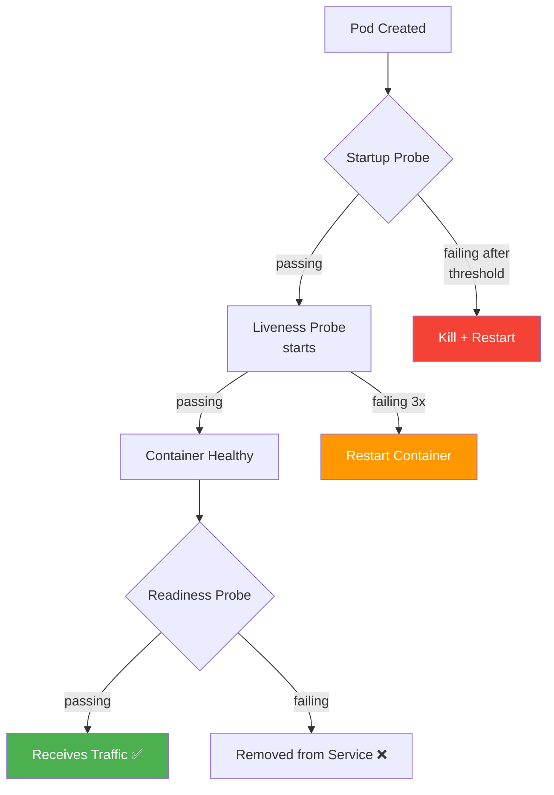

> 💡 **Quick Answer:** Three probe types: **Liveness** (restart if dead), **Readiness** (remove from Service if not ready), **Startup** (protect slow-starting containers). Use HTTP GET for web apps, TCP for databases, exec for custom checks. Critical rule: liveness probes should NEVER check external dependencies like databases — that causes cascading restarts.

## The Problem

Without health probes:

- Dead containers keep running, serving errors
- Pods receive traffic before they're ready
- Slow-starting apps get killed before they initialize
- No automatic recovery from deadlocks or resource leaks

## The Solution

### Liveness Probe (Is it alive?)

```yaml
containers:
- name: web
  livenessProbe:
    httpGet:
      path: /healthz
      port: 8080
    initialDelaySeconds: 15
    periodSeconds: 10
    timeoutSeconds: 3
    failureThreshold: 3     # 3 failures = restart
    successThreshold: 1
```

### Readiness Probe (Can it serve traffic?)

```yaml
containers:
- name: web
  readinessProbe:
    httpGet:
      path: /ready
      port: 8080
    initialDelaySeconds: 5
    periodSeconds: 5
    timeoutSeconds: 3
    failureThreshold: 3     # 3 failures = remove from Service
    successThreshold: 1
```

### Startup Probe (Is it still starting?)

```yaml
containers:
- name: legacy-app
  startupProbe:
    httpGet:
      path: /healthz
      port: 8080
    initialDelaySeconds: 0
    periodSeconds: 10
    failureThreshold: 30    # 30 × 10s = 300s max startup time
  livenessProbe:
    httpGet:
      path: /healthz
      port: 8080
    periodSeconds: 10       # Only starts after startup probe succeeds
```

### Probe Types

```yaml
# HTTP GET
livenessProbe:
  httpGet:
    path: /healthz
    port: 8080
    httpHeaders:
    - name: Authorization
      value: Bearer token123

# TCP Socket
livenessProbe:
  tcpSocket:
    port: 5432              # Just checks port is open

# Exec Command
livenessProbe:
  exec:
    command:
    - cat
    - /tmp/healthy

# gRPC (v1.27+)
livenessProbe:
  grpc:
    port: 50051
    service: my.health.v1.Health
```

### Complete Production Example

```yaml
apiVersion: apps/v1
kind: Deployment
metadata:
  name: api-server
spec:
  template:
    spec:
      containers:
      - name: api
        image: api-server:v2
        ports:
        - containerPort: 8080
        
        # Protect slow startup (Java, ML models)
        startupProbe:
          httpGet:
            path: /healthz
            port: 8080
          periodSeconds: 5
          failureThreshold: 60       # Up to 5 min to start
        
        # Is the process alive? (lightweight, no deps)
        livenessProbe:
          httpGet:
            path: /healthz
            port: 8080
          periodSeconds: 10
          timeoutSeconds: 3
          failureThreshold: 3
        
        # Can it serve requests? (check deps here)
        readinessProbe:
          httpGet:
            path: /ready
            port: 8080
          periodSeconds: 5
          timeoutSeconds: 3
          failureThreshold: 3
```



### Probe Comparison

| Probe | Purpose | On Failure | Check Dependencies? |
|-------|---------|------------|-------------------|
| **Startup** | Protect slow init | Kill + restart | No |
| **Liveness** | Detect deadlocks | Kill + restart | **NEVER** |
| **Readiness** | Traffic gating | Remove from Service | Yes |

## Common Issues

**Liveness probe checking database — cascading restarts**

Database goes down → all pods fail liveness → all pods restart simultaneously → thundering herd on database recovery. **Only check internal health in liveness probes.**

**Too aggressive failureThreshold**

`failureThreshold: 1` with `periodSeconds: 5` kills containers on a single 5-second hiccup. Use at least `failureThreshold: 3`.

**No startup probe on slow apps**

Java/Spring apps or ML model loading can take 60-120s. Without a startup probe, the liveness probe kills them during startup.

## Best Practices

- **Liveness checks internal health ONLY** — never databases, never downstream services
- **Readiness checks dependencies** — database, cache, required services
- **Always use startup probes for slow-starting apps** — Java, ML models, large caches
- **Make liveness lightweight** — a simple `/healthz` that returns 200
- **`failureThreshold: 3` minimum** — tolerate transient issues
- **Different endpoints for liveness vs readiness** — `/healthz` vs `/ready`

## Key Takeaways

- Three probes serve different purposes: startup (init), liveness (alive), readiness (serving)
- Liveness failures restart containers — NEVER check external dependencies
- Readiness failures remove from Service endpoints — safe to check dependencies
- Startup probe protects slow-starting containers from premature liveness kills
- HTTP probes for web apps, TCP for databases, exec for custom checks, gRPC for gRPC services
