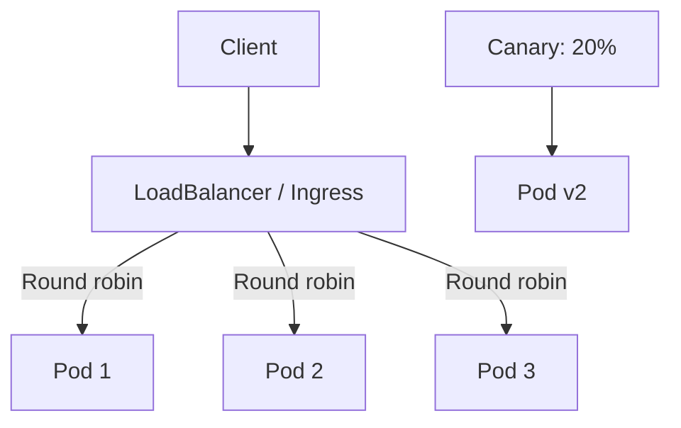

> 💡 **Quick Answer:** Configure Kubernetes load balancing with Services, Ingress, and Gateway API. Round-robin, session affinity, weighted routing, and traffic policy.

## The Problem

This is one of the most searched Kubernetes topics. A comprehensive, well-structured guide helps engineers of all levels quickly find actionable solutions.

## The Solution

Detailed implementation with production-ready examples below.


### Service-Level Load Balancing

```yaml
# Default: round-robin via kube-proxy
apiVersion: v1
kind: Service
metadata:
  name: web-app
spec:
  type: ClusterIP
  selector:
    app: web
  ports:
    - port: 80
      targetPort: 8080
  # Session affinity (sticky sessions)
  sessionAffinity: ClientIP
  sessionAffinityConfig:
    clientIP:
      timeoutSeconds: 10800   # 3 hours
```

### External Traffic Policy

```yaml
apiVersion: v1
kind: Service
metadata:
  name: web-public
spec:
  type: LoadBalancer
  externalTrafficPolicy: Local    # Preserves client IP, skips extra hop
  # Cluster (default): distributes evenly, adds hop, loses client IP
  # Local: only routes to local node pods, preserves source IP
  selector:
    app: web
  ports:
    - port: 80
```

### Ingress-Level Load Balancing

```yaml
apiVersion: networking.k8s.io/v1
kind: Ingress
metadata:
  name: canary-ingress
  annotations:
    nginx.ingress.kubernetes.io/canary: "true"
    nginx.ingress.kubernetes.io/canary-weight: "20"    # 20% to canary
spec:
  ingressClassName: nginx
  rules:
    - host: app.example.com
      http:
        paths:
          - path: /
            pathType: Prefix
            backend:
              service:
                name: web-app-canary
                port:
                  number: 80
```

### Gateway API Traffic Splitting

```yaml
apiVersion: gateway.networking.k8s.io/v1
kind: HTTPRoute
metadata:
  name: traffic-split
spec:
  parentRefs:
    - name: my-gateway
  rules:
    - backendRefs:
        - name: web-v1
          port: 80
          weight: 80
        - name: web-v2
          port: 80
          weight: 20
```



## Frequently Asked Questions

### kube-proxy modes: iptables vs IPVS?

**iptables** (default): O(n) rules, fine for <1000 services. **IPVS**: O(1) lookup, supports round-robin, least-connection, weighted. Use IPVS for large clusters.

### How do I preserve the client source IP?

Set `externalTrafficPolicy: Local` on LoadBalancer/NodePort services. Trade-off: traffic only goes to nodes with matching pods.

## Common Issues

Check `kubectl describe` and `kubectl get events` first — most issues have clear error messages pointing to the root cause.

## Best Practices

- **Follow least privilege** — only grant the access that's needed
- **Test in staging** before applying to production
- **Monitor and alert** on key metrics
- **Document your runbooks** for the team

## Key Takeaways

- Essential knowledge for Kubernetes operations
- Start simple and evolve your approach
- Automation reduces human error
- Share knowledge with your team
