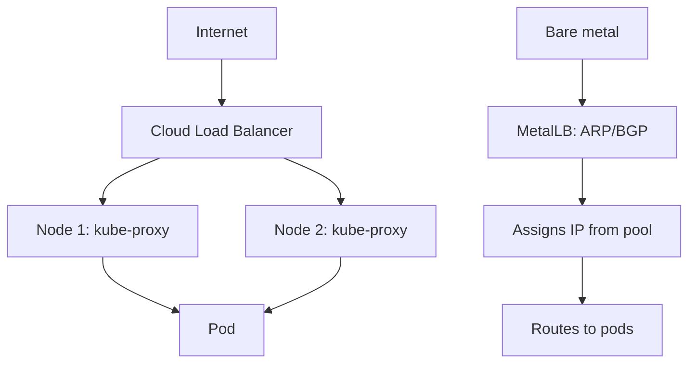

> 💡 **Quick Answer:** networking

## The Problem

This is one of the most searched Kubernetes topics with thousands of monthly searches. A comprehensive, production-ready guide prevents hours of trial and error.

## The Solution

### Create LoadBalancer Service

```yaml
apiVersion: v1
kind: Service
metadata:
  name: web-lb
  annotations:
    # AWS-specific
    service.beta.kubernetes.io/aws-load-balancer-type: nlb
    service.beta.kubernetes.io/aws-load-balancer-scheme: internet-facing
    # GKE-specific
    # cloud.google.com/neg: '{"ingress": true}'
spec:
  type: LoadBalancer
  selector:
    app: web
  ports:
    - port: 80
      targetPort: 8080
    - port: 443
      targetPort: 8443
```

```bash
# Check external IP
kubectl get svc web-lb
# NAME     TYPE           CLUSTER-IP     EXTERNAL-IP      PORT(S)
# web-lb   LoadBalancer   10.96.10.50    203.0.113.100    80:31234/TCP,443:31235/TCP

# Access
curl http://203.0.113.100
```

### MetalLB for Bare-Metal

```bash
helm repo add metallb https://metallb.universe.tf
helm install metallb metallb/metallb --namespace metallb-system --create-namespace
```

```yaml
# IP address pool
apiVersion: metallb.io/v1beta1
kind: IPAddressPool
metadata:
  name: production
  namespace: metallb-system
spec:
  addresses:
    - 192.168.1.200-192.168.1.250
---
apiVersion: metallb.io/v1beta1
kind: L2Advertisement
metadata:
  name: default
  namespace: metallb-system
spec:
  ipAddressPools: [production]
```

### Internal Load Balancer

```yaml
metadata:
  annotations:
    # AWS: internal NLB
    service.beta.kubernetes.io/aws-load-balancer-scheme: internal
    # GKE: internal LB
    networking.gke.io/load-balancer-type: Internal
    # Azure: internal LB
    service.beta.kubernetes.io/azure-load-balancer-internal: "true"
```

### Cost Tip

```yaml
# Each LoadBalancer creates a cloud LB ($15-20/mo each!)
# Use ONE Ingress Controller with LoadBalancer → route to many services
# Instead of:
#   Service A → LoadBalancer ($20/mo)
#   Service B → LoadBalancer ($20/mo)
#   Service C → LoadBalancer ($20/mo)
# Use:
#   Ingress Controller → 1 LoadBalancer ($20/mo) → routes to A, B, C
```



## Frequently Asked Questions

### LoadBalancer stuck on Pending EXTERNAL-IP?

On cloud: check IAM permissions for LB creation. On bare-metal: you need MetalLB or similar — Kubernetes can't create LBs without a provider.

### One LoadBalancer per service?

Yes — each Service of type LoadBalancer gets its own cloud LB. This gets expensive. Use Ingress to multiplex many services behind one LB.

## Best Practices

- Start with the simplest configuration that solves your problem
- Test in staging before production
- Use `kubectl describe` and events for troubleshooting
- Document team conventions for consistency

## Key Takeaways

- This is fundamental Kubernetes operational knowledge
- Follow established conventions and recommended labels
- Monitor and iterate based on real production behavior
- Automate repetitive tasks to reduce human error
