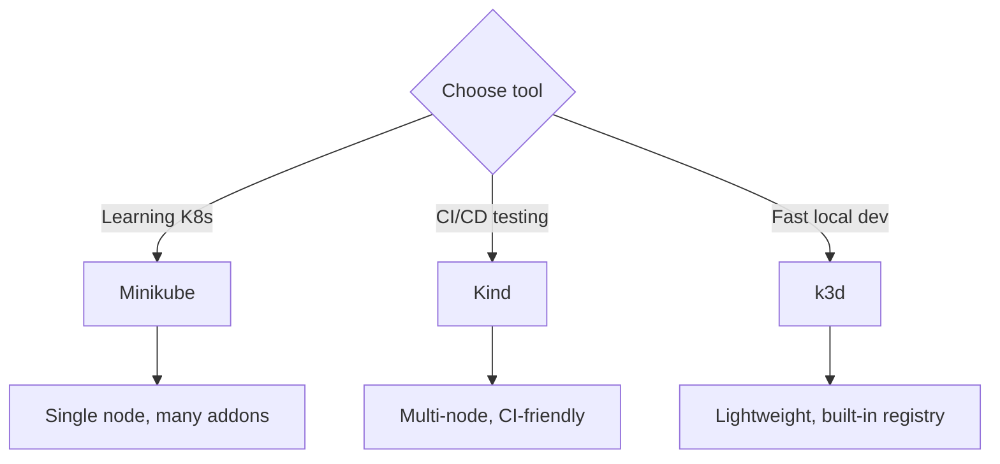

> 💡 **Quick Answer:** Set up local Kubernetes clusters for development with Minikube, Kind, and k3d. Covers installation, configuration, local registries, and hot-reload workflows.

## The Problem

This is one of the most searched Kubernetes topics. A comprehensive, well-structured guide helps engineers of all levels quickly find actionable solutions.

## The Solution

Detailed implementation with production-ready examples below.


### Minikube

```bash
# Install
curl -LO https://storage.googleapis.com/minikube/releases/latest/minikube-linux-amd64
sudo install minikube-linux-amd64 /usr/local/bin/minikube

# Start cluster
minikube start --cpus=4 --memory=8g --driver=docker

# Enable addons
minikube addons enable ingress
minikube addons enable metrics-server
minikube addons enable dashboard

# Access dashboard
minikube dashboard

# Build images directly in Minikube (no registry needed)
eval $(minikube docker-env)
docker build -t my-app:dev .

# Tunnel for LoadBalancer services
minikube tunnel

# Stop/delete
minikube stop
minikube delete
```

### Kind (Kubernetes in Docker)

```bash
# Install
go install sigs.k8s.io/kind@latest
# Or: brew install kind

# Create cluster
cat << 'EOF' > kind-config.yaml
kind: Cluster
apiVersion: kind.x-k8s.io/v1alpha4
nodes:
  - role: control-plane
    extraPortMappings:
      - containerPort: 30000
        hostPort: 30000
      - containerPort: 80
        hostPort: 80
        protocol: TCP
  - role: worker
  - role: worker
EOF

kind create cluster --config kind-config.yaml --name dev

# Load local images (no registry needed)
kind load docker-image my-app:dev --name dev

# Delete
kind delete cluster --name dev
```

### k3d (k3s in Docker)

```bash
# Install
curl -s https://raw.githubusercontent.com/k3d-io/k3d/main/install.sh | bash

# Create cluster with local registry
k3d cluster create dev \
  --agents 2 \
  --port "8080:80@loadbalancer" \
  --registry-create dev-registry:5000

# Push to local registry
docker tag my-app:dev localhost:5000/my-app:dev
docker push localhost:5000/my-app:dev

# Delete
k3d cluster delete dev
```

### Comparison

| Tool | Speed | Multi-node | Registry | Best for |
|------|-------|-----------|----------|----------|
| Minikube | Medium | No (default) | Built-in | Beginners, addons |
| Kind | Fast | Yes | Load images | CI/CD, testing |
| k3d | Fastest | Yes | Built-in | Fast iteration |



## Frequently Asked Questions

### Which local K8s tool should I use?

**Minikube** for beginners (best docs, most addons). **Kind** for CI/CD (fast, reproducible, multi-node). **k3d** for daily development (fastest startup, built-in registry).

## Common Issues

Check `kubectl describe` and `kubectl get events` first — most issues have clear error messages pointing to the root cause.

## Best Practices

- **Follow least privilege** — only grant the access that's needed
- **Test in staging** before applying to production
- **Monitor and alert** on key metrics
- **Document your runbooks** for the team

## Key Takeaways

- Essential knowledge for Kubernetes operations
- Start simple and evolve your approach
- Automation reduces human error
- Share knowledge with your team
