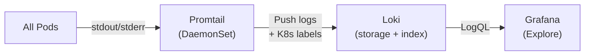

> 💡 **Quick Answer:** Grafana Loki is a log aggregation system that indexes log metadata (labels) instead of full text, making it much cheaper than Elasticsearch. Install with `helm install loki grafana/loki-stack`, then query logs in Grafana using LogQL. Promtail/Alloy collects logs from every pod and ships them to Loki with Kubernetes labels.

## The Problem

Kubernetes logs are ephemeral — when a pod restarts, its logs vanish. EFK (Elasticsearch-Fluentd-Kibana) works but is resource-hungry and expensive to operate. Loki provides a lightweight alternative: it only indexes labels (namespace, pod, container), not log content, reducing storage by 10-100× while still allowing full-text search via grep-like queries.



## The Solution

### Install Loki Stack

```bash
helm repo add grafana https://grafana.github.io/helm-charts
helm install loki grafana/loki-stack \
  --namespace monitoring \
  --create-namespace \
  --set promtail.enabled=true \
  --set grafana.enabled=true \
  --set loki.persistence.enabled=true \
  --set loki.persistence.size=50Gi
```

### Essential LogQL Queries

```logql
# All logs from a namespace
{namespace="my-app"}

# Filter by pod name pattern
{namespace="my-app", pod=~"web-.*"}

# Search for errors (grep-like)
{namespace="my-app"} |= "error"

# Regex matching
{namespace="my-app"} |~ "status=[45]\\d{2}"

# JSON log parsing
{namespace="my-app"} | json | level="error" | line_format "{{.message}}"

# Log rate (lines per second)
rate({namespace="my-app"}[5m])

# Top 5 noisiest pods
topk(5, sum(rate({namespace="my-app"}[1h])) by (pod))
```

### Promtail Configuration for Kubernetes

```yaml
# Promtail auto-discovers pods via Kubernetes API
apiVersion: apps/v1
kind: DaemonSet
metadata:
  name: promtail
  namespace: monitoring
spec:
  template:
    spec:
      containers:
        - name: promtail
          image: grafana/promtail:3.2.0
          args:
            - -config.file=/etc/promtail/config.yaml
          volumeMounts:
            - name: logs
              mountPath: /var/log
            - name: containers
              mountPath: /var/lib/docker/containers
              readOnly: true
      volumes:
        - name: logs
          hostPath:
            path: /var/log
        - name: containers
          hostPath:
            path: /var/lib/docker/containers
```

### Loki vs Elasticsearch Comparison

| Feature | Loki | Elasticsearch |
|---------|------|---------------|
| **Index strategy** | Labels only | Full text |
| **Storage cost** | Low (10-100× less) | High |
| **Query language** | LogQL | KQL/Lucene |
| **Resource usage** | ~2GB RAM | ~8-32GB RAM |
| **Setup complexity** | Helm one-liner | Cluster management |
| **Best for** | K8s-native, Grafana users | Complex full-text search |

### Retention and Storage

```yaml
# Loki retention configuration
loki:
  config:
    compactor:
      retention_enabled: true
    limits_config:
      retention_period: 30d           # Keep 30 days
    storage_config:
      boltdb_shipper:
        active_index_directory: /data/loki/index
        cache_location: /data/loki/cache
      filesystem:
        directory: /data/loki/chunks
```

## Common Issues

| Issue | Cause | Fix |
|-------|-------|-----|
| No logs in Grafana | Promtail not shipping | Check `kubectl logs -n monitoring promtail-xxx` |
| LogQL returns empty | Wrong label selector | Verify labels with `{namespace="x"} ` first |
| Loki OOM | Too many active streams | Set `max_streams_per_user` limit |
| High storage usage | No retention configured | Enable compactor retention |
| Logs delayed | Promtail backpressure | Increase Promtail resources |

## Best Practices

- **Label wisely** — use namespace, pod, container; avoid high-cardinality labels (request ID)
- **Set retention** — 14-30 days covers most debugging needs
- **Use LogQL pipelines** — parse JSON/logfmt at query time, not ingestion
- **Alert on log rate spikes** — `rate({app="x"} |= "error"[5m]) > 10` catches error storms
- **Separate Loki from Prometheus** — different storage requirements and scaling patterns
- **Use Grafana Explore** — purpose-built for log search, better than dashboards for debugging

## Key Takeaways

- Loki indexes labels, not content — 10-100× cheaper than Elasticsearch
- LogQL provides grep-like queries with label filtering and JSON parsing
- Promtail DaemonSet auto-discovers and ships all pod logs
- Perfect for Kubernetes: auto-labels with namespace, pod, container
- Pair with Prometheus (metrics) and Tempo (traces) for full observability
