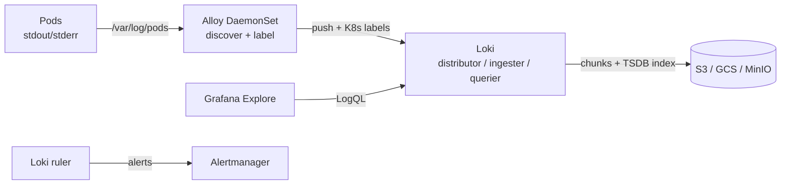

> 💡 **Quick Answer:** Grafana Loki indexes only log labels (namespace, pod, container), not the full text, so it is far cheaper to run than Elasticsearch. Install Loki with the `grafana/loki` Helm chart (single binary for small clusters, distributed for scale) backed by object storage, ship pod logs with a **Grafana Alloy** DaemonSet (Promtail is deprecated), add Loki as a Grafana data source and query with LogQL: `{namespace="production"} |= "error" | json | status >= 500`.
>
> **Gotcha:** The old `grafana/loki-stack` chart and Promtail are deprecated — new installs should use `grafana/loki` + Alloy, TSDB index and schema `v13`.

## The Problem

Container logs disappear when pods are rescheduled, and `kubectl logs` doesn't search across pods or history. EFK works but Elasticsearch needs many GB of RAM per node and full-text indexes are expensive. Loki stores compressed chunks in S3/GCS and greps them at query time, filtered by labels — a 10× or better reduction in cost and resources for typical Kubernetes logging.


```mermaid
flowchart LR
    PODS["Pods<br/>stdout/stderr"] -->|/var/log/pods| ALLOY["Alloy DaemonSet<br/>discover + label"]
    ALLOY -->|push + K8s labels| LOKI["Loki<br/>distributor / ingester / querier"]
    LOKI -->|chunks + TSDB index| S3[(S3 / GCS / MinIO)]
    GRAFANA["Grafana Explore"] -->|LogQL| LOKI
    RULER["Loki ruler"] -->|alerts| AM["Alertmanager"]
```

## The Solution

### Step 1: Install Loki (grafana/loki chart)

```yaml
# loki-values.yaml — single binary + S3, good up to ~100 GB/day
deploymentMode: SingleBinary
loki:
  auth_enabled: false            # true = multi-tenant, requires X-Scope-OrgID
  commonConfig:
    replication_factor: 1
  schemaConfig:
    configs:
      - from: "2025-01-01"
        store: tsdb
        object_store: s3
        schema: v13
        index:
          prefix: loki_index_
          period: 24h
  storage:
    type: s3
    bucketNames:
      chunks: loki-chunks
      ruler: loki-ruler
    s3:
      region: us-east-1
      # endpoint: http://minio.minio.svc:9000  + s3ForcePathStyle: true for MinIO
  limits_config:
    retention_period: 720h       # 30 days
    max_query_lookback: 720h
  compactor:
    retention_enabled: true
    delete_request_store: s3
singleBinary:
  replicas: 1
  persistence:
    size: 20Gi                   # WAL / cache only; chunks live in S3
read:
  replicas: 0
write:
  replicas: 0
backend:
  replicas: 0
```

```bash
helm repo add grafana https://grafana.github.io/helm-charts
helm repo update
helm install loki grafana/loki -n monitoring --create-namespace -f loki-values.yaml
kubectl -n monitoring get pods -l app.kubernetes.io/name=loki
```

For larger volumes use `deploymentMode: Distributed` (separate distributor, ingester, querier, query-frontend, compactor) with `replication_factor: 3`. Credentials: IRSA/Workload Identity, or `loki.storage.s3.accessKeyId/secretAccessKey` from a Secret.

### Step 2: Collect Logs with Grafana Alloy

```yaml
# alloy-values.yaml
alloy:
  mounts:
    varlog: true                 # mounts /var/log (includes /var/log/pods)
  configMap:
    content: |
      discovery.kubernetes "pods" {
        role = "pod"
      }

      discovery.relabel "pods" {
        targets = discovery.kubernetes.pods.targets
        rule {
          source_labels = ["__meta_kubernetes_pod_node_name"]
          regex         = env("HOSTNAME")
          action        = "keep"
        }
        rule {
          source_labels = ["__meta_kubernetes_namespace"]
          target_label  = "namespace"
        }
        rule {
          source_labels = ["__meta_kubernetes_pod_name"]
          target_label  = "pod"
        }
        rule {
          source_labels = ["__meta_kubernetes_pod_container_name"]
          target_label  = "container"
        }
        rule {
          source_labels = ["__meta_kubernetes_pod_label_app_kubernetes_io_name"]
          target_label  = "app"
        }
        rule {
          source_labels = ["__meta_kubernetes_pod_uid", "__meta_kubernetes_pod_container_name"]
          separator     = "/"
          target_label  = "__path__"
          replacement   = "/var/log/pods/*$1/*.log"
        }
      }

      local.file_match "pods" {
        path_targets = discovery.relabel.pods.output
      }

      loki.source.file "pods" {
        targets    = local.file_match.pods.targets
        forward_to = [loki.process.pods.receiver]
      }

      loki.process "pods" {
        stage.cri {}             # parse containerd/CRI-O log format
        forward_to = [loki.write.default.receiver]
      }

      loki.write "default" {
        endpoint {
          url = "http://loki-gateway.monitoring.svc/loki/api/v1/push"
        }
      }
controller:
  type: daemonset
```

```bash
helm install alloy grafana/alloy -n monitoring -f alloy-values.yaml
```

Simpler alternative: `loki.source.kubernetes` tails logs through the API server (no hostPath), fine for small clusters. The `grafana/k8s-monitoring` chart packages Alloy for logs, metrics and events in one release. Fluent Bit and the OpenTelemetry Collector can also push to Loki.

Migrating from Promtail: `alloy convert --source-format=promtail --output=config.alloy promtail.yaml`.

### Step 3: Grafana Data Source

```yaml
# Grafana provisioning (or kube-prometheus-stack: grafana.additionalDataSources)
apiVersion: 1
datasources:
  - name: Loki
    type: loki
    access: proxy
    url: http://loki-gateway.monitoring.svc
    jsonData:
      maxLines: 5000
```

### Step 4: Essential LogQL

```logql
# Stream selectors — always start with labels
{namespace="production"}
{namespace="production", pod=~"web-.*"}

# Line filters (grep-like)
{namespace="production"} |= "error"
{namespace="production"} != "healthz"
{namespace="production"} |~ "status=[45]\\d{2}"

# Parse at query time
{app="api-server"} | json | status >= 500
{app="api-server"} | logfmt | duration > 2s
{app="api-server"} | json | level="error" | line_format "{{.msg}}"

# Metrics from logs
rate({namespace="production"} |= "error" [5m])
sum by (app) (rate({namespace="production"} |= "error" [5m]))
topk(5, sum by (pod) (rate({namespace="production"}[1h])))
topk(10, sum by (msg) (count_over_time({namespace="production"} | json | level="error" [1h])))
```

### Step 5: Alert on Logs (Ruler)

```yaml
# Rule group loaded by the Loki ruler (ruler storage: S3 bucket "loki-ruler")
groups:
  - name: app-errors
    rules:
      - alert: HighErrorLogRate
        expr: sum by (namespace, app) (rate({namespace="production"} |= "error" [5m])) > 10
        for: 5m
        labels:
          severity: warning
        annotations:
          summary: "{{ $labels.app }} logging >10 errors/s"
```

Point the ruler at Alertmanager with `loki.rulerConfig.alertmanager_url`.

### Loki vs Elasticsearch

| | Loki | Elasticsearch/OpenSearch |
|---|---|---|
| Index | Labels only | Full text |
| Storage | Compressed chunks in object storage | Local disks, replicas |
| Resources | Low | High (JVM heap per node) |
| Query | LogQL (Prometheus-like) | KQL / Lucene / DSL |
| Best for | Kubernetes, Grafana users, cost | Heavy full-text search, analytics |

## Common Issues

| Symptom | Cause | Fix |
|---|---|---|
| No logs in Grafana | Collector not shipping / wrong push URL | `kubectl logs ds/alloy -n monitoring`; check `loki-gateway` Service |
| `no org id` (401) | `auth_enabled: true` without tenant header | Set `X-Scope-OrgID` in Alloy and Grafana, or disable auth |
| `entry too far behind` / out of order | Node clock skew or replayed files | Fix NTP; Loki accepts out-of-order within `max_chunk_age` window |
| `max streams limit exceeded` / ingester OOM | High-cardinality labels (pod UID, request ID) | Drop them in relabel rules; raise `max_global_streams_per_user` only after |
| Query timeout | Broad selector over long range | Narrow labels first, shorten range, add query-frontend / more queriers |
| Storage keeps growing | Compactor retention off | `compactor.retention_enabled: true` + `retention_period` |
| Empty `__path__` matches on containerd nodes | Paths copied from Docker setups (`/var/lib/docker/containers`) | Use `/var/log/pods/*<uid>/<container>/*.log` |

## Best Practices

- **Few, low-cardinality labels** — namespace, app, container, pod; everything else via `| json` at query time
- **Object storage + TSDB schema v13** for anything beyond a lab
- **Retention via the compactor** (14–30 days typical); lifecycle rules on the bucket as a backstop
- **Alloy (or OTel Collector) as collector** — Promtail is end-of-life
- **Alert from logs with the ruler**, metrics from Prometheus
- **Correlate** — same labels as Prometheus so Grafana can jump from metrics to logs to Tempo traces

## Frequently Asked Questions

### Is Promtail deprecated?

Yes. Grafana deprecated Promtail in favour of Grafana Alloy, and it only receives critical fixes until end-of-life. Use `alloy convert --source-format=promtail` to migrate existing configs.

### Should I still use the loki-stack Helm chart?

No. `grafana/loki-stack` pins old Loki 2.x and Promtail and is no longer maintained. Use `grafana/loki` for Loki and `grafana/alloy` (or `grafana/k8s-monitoring`) for collection.

### Which Loki deployment mode should I choose?

`SingleBinary` for small clusters and labs; `Distributed` (microservices) for high volume and HA. The simple scalable (read/write/backend) mode still exists but Grafana is steering new installs to the other two.

### How does Loki compare to EFK?

Loki trades full-text indexing for much lower cost and simpler operations; EFK/OpenSearch is better when you need fast arbitrary full-text search and analytics over log fields. See [EFK logging stack](/recipes/observability/kubernetes-efk-logging-stack/).

## Key Takeaways

- Loki indexes labels, not content — far cheaper than Elasticsearch
- Install `grafana/loki` with object storage and TSDB schema v13; collect with Alloy
- LogQL: label selector first, then line filters, parsers and metric queries
- Configure compactor retention and ruler alerts from day one
