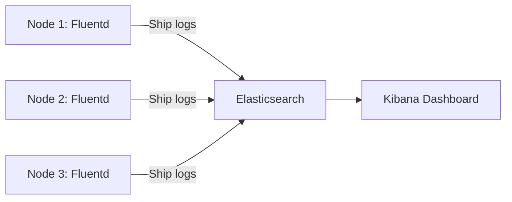

> 💡 **Quick Answer:** Deploy centralized logging for Kubernetes with Elasticsearch, Fluentd, and Kibana. Covers log collection, parsing, indexing, and retention policies.

## The Problem

This is one of the most searched Kubernetes topics. A comprehensive, well-structured guide helps engineers of all levels quickly find actionable solutions.

## The Solution

Detailed implementation with production-ready examples below.


### Deploy EFK Stack (Elasticsearch + Fluentd + Kibana)

```yaml
# Elasticsearch
apiVersion: apps/v1
kind: StatefulSet
metadata:
  name: elasticsearch
  namespace: logging
spec:
  serviceName: elasticsearch
  replicas: 3
  template:
    spec:
      containers:
        - name: elasticsearch
          image: docker.elastic.co/elasticsearch/elasticsearch:8.12.0
          env:
            - name: discovery.type
              value: single-node    # Use zen discovery for multi-node
            - name: ES_JAVA_OPTS
              value: "-Xms1g -Xmx1g"
          resources:
            requests:
              memory: 2Gi
              cpu: 500m
          volumeMounts:
            - name: data
              mountPath: /usr/share/elasticsearch/data
  volumeClaimTemplates:
    - metadata:
        name: data
      spec:
        accessModes: [ReadWriteOnce]
        resources:
          requests:
            storage: 50Gi
---
# Fluentd DaemonSet
apiVersion: apps/v1
kind: DaemonSet
metadata:
  name: fluentd
  namespace: logging
spec:
  template:
    spec:
      tolerations:
        - operator: Exists     # Run on all nodes
      containers:
        - name: fluentd
          image: fluent/fluentd-kubernetes-daemonset:v1.16-debian-elasticsearch8
          env:
            - name: FLUENT_ELASTICSEARCH_HOST
              value: elasticsearch.logging.svc
          volumeMounts:
            - name: varlog
              mountPath: /var/log
              readOnly: true
      volumes:
        - name: varlog
          hostPath:
            path: /var/log
```

```bash
# Verify logs flowing
kubectl port-forward -n logging svc/kibana 5601:5601
# Open http://localhost:5601, create index pattern: kubernetes-*
```



## Frequently Asked Questions

### ELK vs Loki?

**ELK** (Elasticsearch): Full-text search, powerful but resource-heavy (~2GB+ RAM per ES node). **Loki** (Grafana): Log aggregation without indexing, much lighter, pairs with Grafana. Use Loki for cost-effective logging, ELK for complex search requirements.

## Common Issues

Check `kubectl describe` and `kubectl get events` first — most issues have clear error messages pointing to the root cause.

## Best Practices

- **Follow least privilege** — only grant the access that's needed
- **Test in staging** before applying to production
- **Monitor and alert** on key metrics
- **Document your runbooks** for the team

## Key Takeaways

- Essential knowledge for Kubernetes operations
- Start simple and evolve your approach
- Automation reduces human error
- Share knowledge with your team
