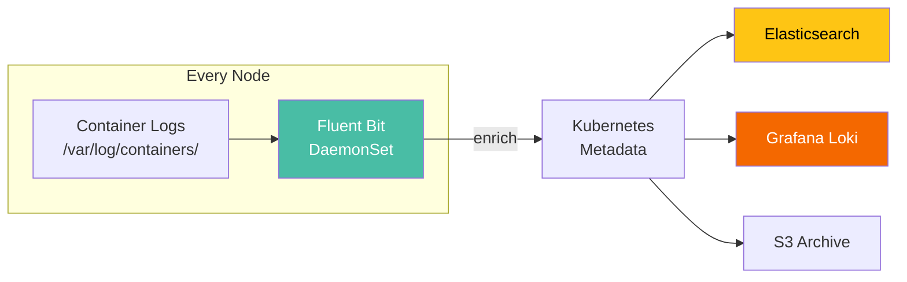

> 💡 **Quick Answer:** Deploy Fluent Bit as a DaemonSet to collect logs from every node. It reads container logs from `/var/log/containers/`, enriches with Kubernetes metadata (pod name, namespace, labels), and forwards to a backend (Elasticsearch, Grafana Loki, S3, Kafka). Install via `helm install fluent-bit fluent/fluent-bit` — it handles log rotation, multiline parsing, and back-pressure automatically.

## The Problem

Without centralized logging:

- Logs are lost when pods restart or get evicted
- No way to search logs across the cluster
- Debugging requires `kubectl logs` on each pod individually
- No log retention after pod deletion
- Multiline logs (Java stack traces) split across entries

## The Solution

### Install Fluent Bit via Helm

```bash
helm repo add fluent https://fluent.github.io/helm-charts
helm repo update

helm install fluent-bit fluent/fluent-bit \
  --namespace logging \
  --create-namespace \
  --set config.outputs=|
    [OUTPUT]
        Name  es
        Match *
        Host  elasticsearch.logging.svc
        Port  9200
        Index kubernetes-logs
        Suppress_Type_Name On
```

### Fluent Bit Configuration

```yaml
# values.yaml for Helm
config:
  inputs: |
    [INPUT]
        Name              tail
        Tag               kube.*
        Path              /var/log/containers/*.log
        Parser            cri
        DB                /var/log/flb_kube.db
        Mem_Buf_Limit     5MB
        Skip_Long_Lines   On
        Refresh_Interval  10

  filters: |
    [FILTER]
        Name                kubernetes
        Match               kube.*
        Kube_URL            https://kubernetes.default.svc:443
        Kube_CA_File        /var/run/secrets/kubernetes.io/serviceaccount/ca.crt
        Kube_Token_File     /var/run/secrets/kubernetes.io/serviceaccount/token
        Merge_Log           On
        K8S-Logging.Parser  On
        K8S-Logging.Exclude On

    [FILTER]
        Name    grep
        Match   kube.*
        Exclude log ^$

  outputs: |
    [OUTPUT]
        Name            es
        Match           kube.*
        Host            elasticsearch.logging.svc
        Port            9200
        Index           k8s-logs-%Y.%m.%d
        Suppress_Type_Name On
        Retry_Limit     5

    [OUTPUT]
        Name            loki
        Match           kube.*
        Host            loki.logging.svc
        Port            3100
        Labels          job=fluent-bit,namespace=$kubernetes['namespace_name']
```

### Forward to Grafana Loki

```yaml
config:
  outputs: |
    [OUTPUT]
        Name        loki
        Match       kube.*
        Host        loki-gateway.logging.svc
        Port        80
        Labels      job=fluent-bit
        Label_Keys  $kubernetes['namespace_name'],$kubernetes['pod_name']
        Auto_Kubernetes_Labels On
```

### Forward to S3 (Long-Term Archive)

```yaml
config:
  outputs: |
    [OUTPUT]
        Name                s3
        Match               kube.*
        bucket              k8s-logs-archive
        region              us-east-1
        total_file_size     50M
        upload_timeout      10m
        s3_key_format       /logs/%Y/%m/%d/$TAG_%H%M%S.gz
        compression         gzip
```

### Multiline Parsing (Java Stack Traces)

```yaml
config:
  customParsers: |
    [MULTILINE_PARSER]
        Name          java-multiline
        Type          regex
        Flush_timeout 1000
        Rule          "start_state"  "/^\d{4}-\d{2}-\d{2}/"  "cont"
        Rule          "cont"         "/^\s+at\s/"              "cont"
        Rule          "cont"         "/^\s+\.\.\./"            "cont"
        Rule          "cont"         "/^Caused by:/"           "cont"
```



## Common Issues

**Logs missing from some pods**

Fluent Bit reads from `/var/log/containers/`. If the node's container runtime uses a different log path, update the `Path` in INPUT config.

**Memory pressure from Fluent Bit**

Set `Mem_Buf_Limit` to prevent unbounded buffering. Default 5MB per input is safe. Increase only if logs are being dropped during backend outages.

**Multiline logs split across entries**

Enable multiline parser matching your application's log format. Docker/CRI runtimes add their own line splitting.

## Best Practices

- **DaemonSet, not sidecar** — one Fluent Bit per node, not per pod
- **Use Loki for cost-effective logging** — indexed labels, not full-text
- **Set `Mem_Buf_Limit`** — prevent Fluent Bit from consuming all node memory
- **Archive to S3 for compliance** — cheap long-term retention
- **Exclude health check logs** — reduce noise and storage cost
- **Use `Merge_Log: On`** — parse JSON log lines into structured fields

## Key Takeaways

- Fluent Bit runs as a DaemonSet, collecting logs from every container on every node
- Kubernetes filter enriches logs with pod name, namespace, labels, and annotations
- Forward to Elasticsearch (search), Loki (cost-effective), or S3 (archive)
- Multiline parser handles Java stack traces and other multi-line formats
- `Mem_Buf_Limit` prevents memory issues during backend outages
- Lightweight (~15MB memory) compared to Fluentd (~100MB+)
