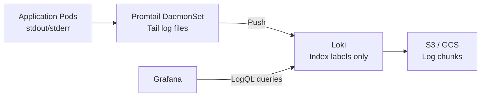

> 💡 **Quick Answer:** Deploy Loki in `SimpleScalable` mode with Promtail DaemonSet for log collection. Use LogQL for querying: `{namespace="production"} |= "error" | json | status >= 500`. Configure 30-day retention with S3/GCS backend storage.

## The Problem

ELK stack (Elasticsearch, Logstash, Kibana) is resource-heavy — Elasticsearch alone needs 4-8GB RAM per node. Loki is 10x more resource-efficient because it only indexes labels, not full text. Combined with Grafana, it provides the same log exploration experience at a fraction of the cost.

## The Solution

### Deploy Loki Stack

```bash
helm repo add grafana https://grafana.github.io/helm-charts
helm install loki grafana/loki-stack \
  --namespace monitoring --create-namespace \
  --set promtail.enabled=true \
  --set loki.persistence.enabled=true \
  --set loki.persistence.size=50Gi
```

### Promtail Configuration

```yaml
apiVersion: apps/v1
kind: DaemonSet
metadata:
  name: promtail
spec:
  template:
    spec:
      containers:
        - name: promtail
          image: grafana/promtail:3.2.0
          args:
            - -config.file=/etc/promtail/promtail.yaml
          volumeMounts:
            - name: logs
              mountPath: /var/log/pods
              readOnly: true
      volumes:
        - name: logs
          hostPath:
            path: /var/log/pods
```

### LogQL Queries

```bash
# All error logs in production
{namespace="production"} |= "error"

# JSON structured logs — filter by status code
{app="api-server"} | json | status >= 500

# Rate of errors per service
sum(rate({namespace="production"} |= "error" [5m])) by (app)

# Top 10 error messages
topk(10, sum(count_over_time({namespace="production"} |= "error" [1h])) by (msg))
```

### Retention Policy

```yaml
# loki-config.yaml
limits_config:
  retention_period: 720h  # 30 days
compactor:
  retention_enabled: true
  retention_delete_delay: 2h
storage_config:
  aws:
    s3: s3://loki-logs-bucket/loki
    region: us-east-1
```



## Common Issues

**No logs appearing in Grafana**: Check Promtail is running: `kubectl get ds promtail -n monitoring`. Verify Loki datasource is configured in Grafana with correct URL.

**LogQL query timeout**: Add label filters first (`{namespace="prod"}`), then string filters. Loki scans less data when labels narrow the search.

## Best Practices

- **Always filter by labels first** in LogQL — `{namespace="prod"}` before `|= "error"`
- **Structured logging (JSON)** enables field extraction with `| json`
- **30-day retention** — good balance of cost and usefulness
- **S3 backend** for production — local storage fills up quickly
- **Alert on log patterns** — Loki ruler can fire alerts from LogQL queries

## Key Takeaways

- Loki is 10x more resource-efficient than Elasticsearch — indexes labels only
- Promtail DaemonSet collects logs from all pods automatically
- LogQL provides powerful querying: label filters, JSON parsing, regex, aggregations
- S3/GCS backend for cost-effective long-term retention
- Integrates natively with Grafana for log exploration alongside metrics
