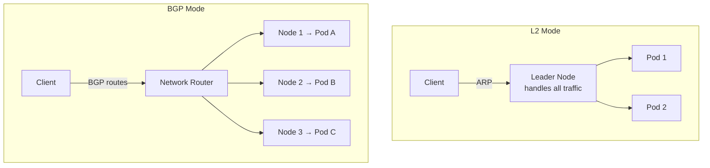

> 💡 **Quick Answer:** Install MetalLB and configure an `IPAddressPool` with your available IPs. Choose L2 mode for simple setups (ARP-based, single node handles traffic) or BGP mode for production (announces routes to your network router, true load distribution).

## The Problem

On bare-metal Kubernetes, `type: LoadBalancer` Services stay in `Pending` forever — there's no cloud provider to create a load balancer. MetalLB fills this gap, providing LoadBalancer IP allocation for bare-metal, on-premises, and homelab clusters.

## The Solution

### Install MetalLB

```bash
helm repo add metallb https://metallb.github.io/metallb
helm install metallb metallb/metallb --namespace metallb-system --create-namespace
```

### L2 Mode (Simple)

```yaml
apiVersion: metallb.io/v1beta1
kind: IPAddressPool
metadata:
  name: production-pool
  namespace: metallb-system
spec:
  addresses:
    - 192.168.1.200-192.168.1.220
---
apiVersion: metallb.io/v1beta1
kind: L2Advertisement
metadata:
  name: production
  namespace: metallb-system
spec:
  ipAddressPools:
    - production-pool
```

### BGP Mode (Production)

```yaml
apiVersion: metallb.io/v1beta2
kind: BGPPeer
metadata:
  name: router
  namespace: metallb-system
spec:
  myASN: 64500
  peerASN: 64501
  peerAddress: 192.168.1.1
---
apiVersion: metallb.io/v1beta1
kind: BGPAdvertisement
metadata:
  name: production
  namespace: metallb-system
spec:
  ipAddressPools:
    - production-pool
  peers:
    - router
```

### Use LoadBalancer Service

```yaml
apiVersion: v1
kind: Service
metadata:
  name: web-app
  annotations:
    metallb.universe.tf/address-pool: production-pool
spec:
  type: LoadBalancer
  selector:
    app: web-app
  ports:
    - port: 80
      targetPort: 8080
```



## Common Issues

**Service still Pending after MetalLB install**: Check IP pool has available addresses: `kubectl get ipaddresspool -n metallb-system`. Ensure the IP range is on the same subnet as your nodes (L2 mode).

**L2 mode: all traffic goes to one node**: Expected behavior. L2 mode uses ARP — one node handles all traffic. For true load distribution, use BGP mode.

## Best Practices

- **L2 for homelab/dev** — simple, no router config needed
- **BGP for production** — true load distribution across nodes
- **Separate pools** for different service tiers
- **Don't overlap pools with DHCP range** — causes IP conflicts
- **Cilium can replace MetalLB** — if already using Cilium, use its LB IPAM

## Key Takeaways

- MetalLB provides LoadBalancer Services on bare-metal Kubernetes
- L2 mode is simple (ARP) but sends all traffic through one node
- BGP mode distributes traffic across nodes via router integration
- IPAddressPool defines available IPs; Advertisement controls how they're announced
- Essential for on-premises, homelab, and edge Kubernetes deployments
