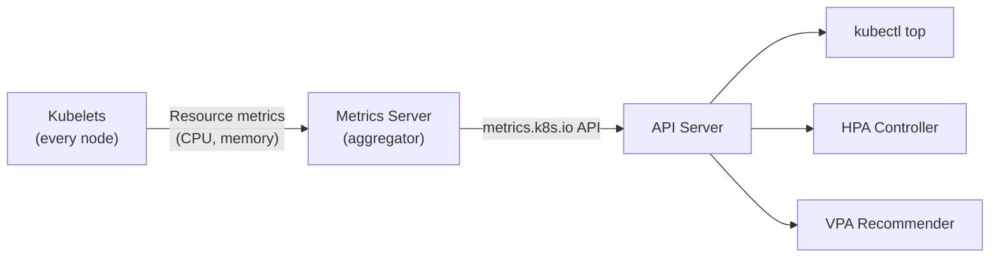

> 💡 **Quick Answer:** Metrics Server is a lightweight, in-memory aggregator of resource metrics (CPU/memory) from kubelets. Install with `kubectl apply -f https://github.com/kubernetes-sigs/metrics-server/releases/latest/download/components.yaml`. It powers `kubectl top`, HPA, and VPA. For self-managed clusters, you may need `--kubelet-insecure-tls` if kubelet certificates are self-signed.

## The Problem

Without Metrics Server, `kubectl top pods` returns "Metrics API not available," HPA can't scale on CPU/memory, and VPA can't recommend resource sizes. Metrics Server is not installed by default on kubeadm or bare-metal clusters (managed services like EKS/GKE/AKS typically include it).



## The Solution

### Install Metrics Server

```bash
# Standard installation
kubectl apply -f \
  https://github.com/kubernetes-sigs/metrics-server/releases/latest/download/components.yaml

# Verify
kubectl get deployment metrics-server -n kube-system
kubectl get apiservice v1beta1.metrics.k8s.io
```

### Fix TLS Issues (Self-Managed Clusters)

```bash
# If metrics-server logs show:
# "x509: cannot validate certificate for <IP> because it doesn't contain any IP SANs"

# Option A: Add --kubelet-insecure-tls (dev/test only)
kubectl patch deployment metrics-server -n kube-system --type=json \
  -p='[{"op":"add","path":"/spec/template/spec/containers/0/args/-","value":"--kubelet-insecure-tls"}]'

# Option B: Proper kubelet certificates (production)
# Ensure kubelet serving certs are signed by a trusted CA
# and include node IP SANs
```

### Helm Installation

```bash
helm repo add metrics-server https://kubernetes-sigs.github.io/metrics-server/
helm install metrics-server metrics-server/metrics-server \
  --namespace kube-system \
  --set args[0]=--kubelet-preferred-address-types=InternalIP \
  --set args[1]=--kubelet-insecure-tls    # Only if needed
```

### Verify It Works

```bash
# Check node metrics
kubectl top nodes
# NAME           CPU(cores)   CPU%   MEMORY(bytes)   MEMORY%
# worker-1       450m         11%    3200Mi          41%
# worker-2       820m         20%    5100Mi          65%

# Check pod metrics
kubectl top pods -n my-app
# NAME                     CPU(cores)   MEMORY(bytes)
# web-app-abc123           150m         256Mi
# web-app-def456           180m         312Mi

# Check API service health
kubectl get apiservice v1beta1.metrics.k8s.io -o yaml | grep -A3 "conditions:"
```

### High Availability Configuration

```yaml
# HA metrics-server for production
apiVersion: apps/v1
kind: Deployment
metadata:
  name: metrics-server
  namespace: kube-system
spec:
  replicas: 2                        # HA: 2 replicas
  strategy:
    rollingUpdate:
      maxUnavailable: 1
  template:
    spec:
      affinity:
        podAntiAffinity:
          requiredDuringSchedulingIgnoredDuringExecution:
            - labelSelector:
                matchLabels:
                  k8s-app: metrics-server
              topologyKey: kubernetes.io/hostname
      containers:
        - name: metrics-server
          image: registry.k8s.io/metrics-server/metrics-server:v0.7.2
          args:
            - --cert-dir=/tmp
            - --secure-port=10250
            - --kubelet-preferred-address-types=InternalIP
            - --kubelet-use-node-status-port
            - --metric-resolution=15s       # Default: 60s
          resources:
            requests:
              cpu: 100m
              memory: 200Mi
            limits:
              cpu: 500m
              memory: 500Mi
```

## Common Issues

| Issue | Cause | Fix |
|-------|-------|-----|
| `Metrics API not available` | Metrics Server not installed | Install with kubectl apply or Helm |
| `x509: cannot validate certificate` | Self-signed kubelet certs | Add `--kubelet-insecure-tls` or fix certs |
| `kubectl top` shows no data | Metrics Server just started | Wait 60s for first scrape cycle |
| `unable to fully scrape metrics` | Kubelet not reachable | Check node firewall, port 10250 |
| HPA shows `<unknown>` target | Metrics API returning errors | Check `kubectl get apiservice` status |

## Best Practices

- **Always install in production clusters** — HPA and VPA depend on it
- **Use proper TLS in production** — `--kubelet-insecure-tls` is for dev only
- **Deploy 2 replicas for HA** — with pod anti-affinity across nodes
- **Set resource requests** — Metrics Server itself needs CPU/memory
- **Metrics Server ≠ Prometheus** — it provides current metrics only (no history)
- **Check metric-resolution** — default 60s; lower to 15s for faster HPA response

## Key Takeaways

- Metrics Server provides real-time CPU/memory metrics from kubelets
- Powers `kubectl top`, HPA, and VPA — essential for autoscaling
- Not installed by default on kubeadm clusters; pre-installed on most managed K8s
- TLS issues are the #1 installation problem on self-managed clusters
- Use Prometheus for historical metrics; Metrics Server for current resource usage
