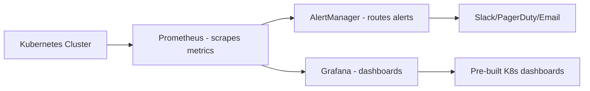

> 💡 **Quick Answer:** Set up Kubernetes monitoring with Prometheus and Grafana. Covers kube-prometheus-stack, custom dashboards, alerting rules, and key metrics to monitor.

## The Problem

This is one of the most searched Kubernetes topics. A comprehensive, well-structured guide helps engineers of all levels quickly find actionable solutions.

## The Solution

Detailed implementation with production-ready examples below.


### Install kube-prometheus-stack

```bash
helm repo add prometheus-community https://prometheus-community.github.io/helm-charts
helm repo update

helm install monitoring prometheus-community/kube-prometheus-stack \
  --namespace monitoring --create-namespace \
  --set grafana.adminPassword=admin \
  --set prometheus.prometheusSpec.retention=30d \
  --set prometheus.prometheusSpec.storageSpec.volumeClaimTemplate.spec.resources.requests.storage=50Gi
```

### Access Dashboards

```bash
# Grafana
kubectl port-forward -n monitoring svc/monitoring-grafana 3000:80
# Open http://localhost:3000 (admin/admin)

# Prometheus
kubectl port-forward -n monitoring svc/monitoring-kube-prometheus-prometheus 9090:9090

# AlertManager
kubectl port-forward -n monitoring svc/monitoring-kube-prometheus-alertmanager 9093:9093
```

### Key Metrics to Monitor

| Metric | Query | Alert Threshold |
|--------|-------|----------------|
| CPU usage | `rate(container_cpu_usage_seconds_total[5m])` | >80% sustained |
| Memory usage | `container_memory_working_set_bytes` | >85% of limit |
| Pod restarts | `kube_pod_container_status_restarts_total` | >5 in 1h |
| Node disk | `node_filesystem_avail_bytes` | <10% free |
| API server latency | `apiserver_request_duration_seconds` | p99 >1s |

### Custom Alert Rules

```yaml
apiVersion: monitoring.coreos.com/v1
kind: PrometheusRule
metadata:
  name: custom-alerts
  namespace: monitoring
spec:
  groups:
    - name: pod-alerts
      rules:
        - alert: PodCrashLooping
          expr: rate(kube_pod_container_status_restarts_total[15m]) > 0
          for: 1h
          labels:
            severity: warning
          annotations:
            summary: "Pod {{ $labels.pod }} is crash looping"
        - alert: HighMemoryUsage
          expr: container_memory_working_set_bytes / container_spec_memory_limit_bytes > 0.9
          for: 5m
          labels:
            severity: critical
          annotations:
            summary: "Pod {{ $labels.pod }} memory >90% of limit"
```



## Frequently Asked Questions

### What's included in kube-prometheus-stack?

Prometheus, Grafana, AlertManager, node-exporter, kube-state-metrics, and pre-configured dashboards + alerts for Kubernetes. It's the standard monitoring stack.

## Common Issues

Check `kubectl describe` and `kubectl get events` first — most issues have clear error messages pointing to the root cause.

## Best Practices

- **Follow least privilege** — only grant the access that's needed
- **Test in staging** before applying to production
- **Monitor and alert** on key metrics
- **Document your runbooks** for the team

## Key Takeaways

- Essential knowledge for Kubernetes operations
- Start simple and evolve your approach
- Automation reduces human error
- Share knowledge with your team
