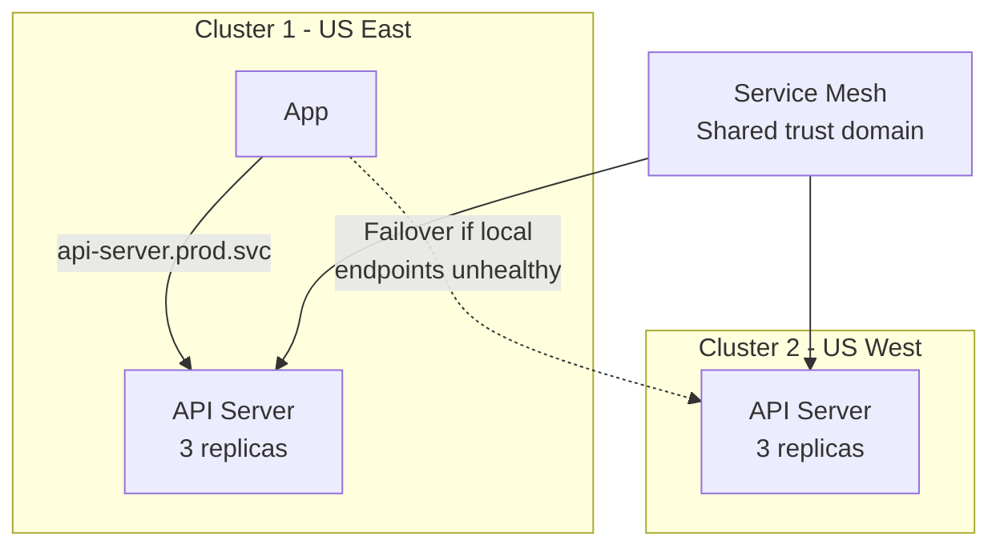

> 💡 **Quick Answer:** Use Istio multi-primary or Linkerd multi-cluster to enable transparent cross-cluster service communication. Services in cluster A can call services in cluster B using the same DNS name. Traffic automatically fails over to the remote cluster if local endpoints are unhealthy.

## The Problem

You have services split across multiple clusters (dev/staging/prod, or regional clusters) that need to communicate. Each cluster is an island — services can't discover or call services in other clusters without complex networking, DNS, or VPN setups.

## The Solution

### Istio Multi-Primary (Shared Trust)

```bash
# Install Istio on both clusters with shared root CA
istioctl install -f cluster1.yaml --set values.global.meshID=mesh1 \
  --set values.global.multiCluster.clusterName=cluster1 \
  --set values.global.network=network1

istioctl install -f cluster2.yaml --set values.global.meshID=mesh1 \
  --set values.global.multiCluster.clusterName=cluster2 \
  --set values.global.network=network2
```

### Cross-Cluster Service Discovery

```yaml
# On cluster1: create remote secret for cluster2
istioctl create-remote-secret --name=cluster2 \
  --context=cluster2-context | kubectl apply -f - --context=cluster1-context

# On cluster2: create remote secret for cluster1
istioctl create-remote-secret --name=cluster1 \
  --context=cluster1-context | kubectl apply -f - --context=cluster2-context
```

Now services in cluster1 can call `svc.namespace.svc.cluster.local` and reach endpoints in both clusters.

### Linkerd Multi-Cluster

```bash
# Install multi-cluster extension
linkerd multicluster install | kubectl apply -f - --context=cluster1
linkerd multicluster install | kubectl apply -f - --context=cluster2

# Link clusters
linkerd multicluster link --cluster-name=cluster2 --context=cluster2 | \
  kubectl apply -f - --context=cluster1

# Mirror a service from cluster2 to cluster1
kubectl label svc api-server -n production \
  mirror.linkerd.io/exported=true --context=cluster2
```

Services appear as `api-server-cluster2.production.svc.cluster.local` in cluster1.

### Traffic Failover

```yaml
apiVersion: networking.istio.io/v1
kind: DestinationRule
metadata:
  name: api-failover
spec:
  host: api-server.production.svc.cluster.local
  trafficPolicy:
    outlierDetection:
      consecutive5xxErrors: 3
      interval: 30s
      baseEjectionTime: 60s
    connectionPool:
      tcp:
        maxConnections: 100
```



## Common Issues

**Cross-cluster calls fail with TLS errors**

Clusters must share a root CA. Generate a shared root certificate and use it for both Istio installations.

**Service not discoverable in remote cluster**

For Istio: verify remote secrets are applied. For Linkerd: ensure service has `mirror.linkerd.io/exported=true` label.

## Best Practices

- **Shared root CA** is mandatory — both clusters must be in the same trust domain
- **Start with Linkerd multi-cluster** for simplicity — explicit service mirroring
- **Istio multi-primary** for transparent mesh — all services automatically discoverable
- **Outlier detection for failover** — eject unhealthy endpoints before failing over
- **Monitor cross-cluster latency** — add latency budget for inter-cluster calls

## Key Takeaways

- Service mesh multi-cluster enables transparent cross-cluster service communication
- Istio multi-primary: automatic discovery across clusters via shared control plane
- Linkerd multi-cluster: explicit service mirroring with gateway-based routing
- Traffic automatically fails over to remote cluster when local endpoints are unhealthy
- Shared root CA is the prerequisite — both clusters must trust the same certificate authority
