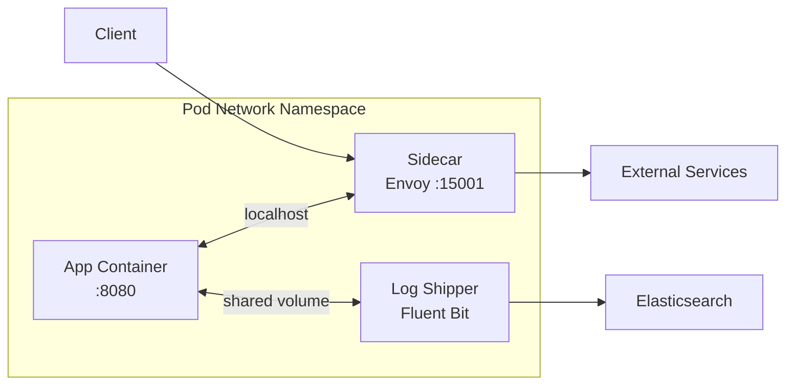

> 💡 **Quick Answer:** Multi-container pods share network (localhost) and volumes. Use sidecar for cross-cutting concerns (logging, proxy), ambassador for outbound abstraction, and adapter for output normalization.

## The Problem

Monolithic containers become bloated when you add logging agents, TLS proxies, config reloaders, and metric exporters. You need:
- Separation of concerns (app code vs infrastructure)
- Independent lifecycle and updates for each concern
- Shared context (files, network) without tight coupling
- Reusable infrastructure containers across services

## The Solution

### Sidecar Pattern (Logging)

```yaml
apiVersion: v1
kind: Pod
metadata:
  name: app-with-logging
spec:
  containers:
    - name: app
      image: myapp:2.0
      volumeMounts:
        - name: logs
          mountPath: /var/log/app
    - name: log-shipper
      image: fluent-bit:3.0
      volumeMounts:
        - name: logs
          mountPath: /var/log/app
          readOnly: true
        - name: fluent-config
          mountPath: /fluent-bit/etc
  volumes:
    - name: logs
      emptyDir: {}
    - name: fluent-config
      configMap:
        name: fluent-bit-config
```

### Ambassador Pattern (Proxy)

```yaml
apiVersion: v1
kind: Pod
metadata:
  name: app-with-proxy
spec:
  containers:
    - name: app
      image: myapp:2.0
      env:
        - name: DB_HOST
          value: "localhost"  # Connects to ambassador
        - name: DB_PORT
          value: "5432"
    - name: cloud-sql-proxy
      image: gcr.io/cloud-sql-connectors/cloud-sql-proxy:2.8
      args:
        - "--port=5432"
        - "project:region:instance"
      securityContext:
        runAsNonRoot: true
```

### Adapter Pattern (Metrics)

```yaml
apiVersion: v1
kind: Pod
metadata:
  name: app-with-adapter
spec:
  containers:
    - name: app
      image: legacy-app:1.0
      ports:
        - containerPort: 8080
    - name: prometheus-adapter
      image: prom-adapter:1.0
      ports:
        - containerPort: 9090
          name: metrics
      # Converts legacy /stats format to Prometheus /metrics
      env:
        - name: SOURCE_URL
          value: "http://localhost:8080/stats"
```

### Native Sidecar (1.29+)

```yaml
apiVersion: v1
kind: Pod
metadata:
  name: app-with-native-sidecar
spec:
  initContainers:
    - name: istio-proxy
      image: istio/proxyv2:1.22
      restartPolicy: Always  # Makes it a native sidecar
      ports:
        - containerPort: 15001
  containers:
    - name: app
      image: myapp:2.0
```



## Common Issues

**Sidecar starts after app — race condition**
Use native sidecars (1.29+) with `restartPolicy: Always` in initContainers — they start before and stop after main containers.

**Container ordering at shutdown**
Regular sidecars may exit before the app finishes draining. Use preStop hooks or native sidecars for ordered shutdown.

**Shared volume permissions**
Both containers need compatible UID/GID for shared emptyDir:
```yaml
securityContext:
  fsGroup: 1000  # Pod-level: all volumes owned by group 1000
```

## Best Practices

- Use native sidecars (1.29+) for infrastructure that must start first and stop last
- Share data via emptyDir volumes (not hostPath)
- Use `localhost` for inter-container communication (shared network namespace)
- Keep sidecars lightweight — they consume pod resources
- Set resource requests/limits on ALL containers (including sidecars)
- Use configMaps for sidecar configuration (independent from app)

## Key Takeaways

- All containers in a pod share network namespace (localhost) and volumes
- Sidecar: augments app (logging, proxy, config-reload)
- Ambassador: simplifies outbound connections (DB proxy, API gateway)
- Adapter: normalizes output format (metrics conversion, log formatting)
- Native sidecars (1.29+): guaranteed startup before and shutdown after main containers
- Each container has independent image, lifecycle, and resource limits
