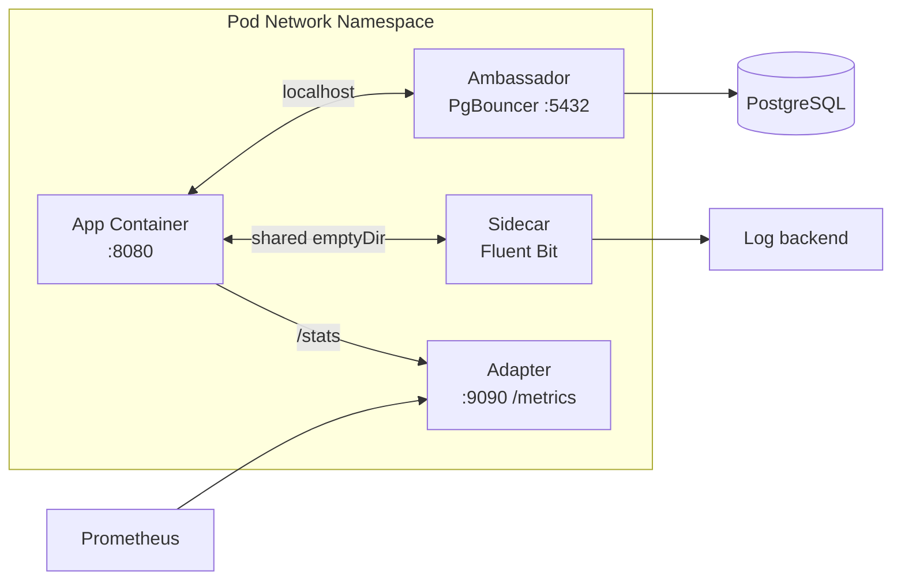

> 💡 **Quick Answer:** Containers in one pod share the network namespace (talk over `localhost`) and can share volumes (`emptyDir`). Three patterns: **sidecar** extends the app (log shipper, proxy, config reloader), **ambassador** proxies the app's *outbound* connections (DB pooler, cloud SQL proxy), **adapter** normalizes the app's *output* (metrics format, log structure). On 1.29+, declare long-running helpers as native sidecars (`initContainers` + `restartPolicy: Always`) so they start first and stop last.

## Pattern Comparison

| Pattern | Direction | Purpose | Example |
|---|---|---|---|
| Sidecar | Alongside | Add a capability without touching app code | Fluent Bit, Envoy, config reloader, Vault agent |
| Ambassador | Outbound | App talks to `localhost`; helper handles the real remote | PgBouncer, Cloud SQL proxy, rate-limiting Envoy |
| Adapter | Output | Convert app output to a standard interface | `/stats` → Prometheus `/metrics`, plain logs → JSON |

All three share: one network namespace, optional shared volumes, co-scheduling on the same node, and independent images/resources per container. For sidecar lifecycle details (startup/shutdown order, Jobs, migration) see [Kubernetes Sidecar Containers](/recipes/configuration/kubernetes-sidecar-patterns/).

## Sidecar: Log Shipper

```yaml
apiVersion: v1
kind: Pod
metadata:
  name: app-with-logging
spec:
  initContainers:
    - name: log-shipper              # native sidecar: starts before app, stops after
      image: fluent/fluent-bit:3.0
      restartPolicy: Always
      volumeMounts:
        - name: logs
          mountPath: /var/log/app
          readOnly: true
        - name: fluent-config
          mountPath: /fluent-bit/etc
      resources:
        requests: { cpu: 25m, memory: 32Mi }
        limits: { memory: 64Mi }
  containers:
    - name: app
      image: myapp:2.0
      volumeMounts:
        - name: logs
          mountPath: /var/log/app
  volumes:
    - name: logs
      emptyDir: {}
    - name: fluent-config
      configMap:
        name: fluent-bit-config
```

On clusters older than 1.29, move `log-shipper` into `containers` and drop `restartPolicy` — it then starts in parallel with the app with no ordering guarantee.

## Ambassador: Database Proxy and Connection Pooler

The app connects to `localhost:5432`; the ambassador owns auth, TLS and pooling to the real database.

```yaml
spec:
  containers:
    - name: app
      image: registry.example.com/app:v2
      env:
        - name: DATABASE_HOST
          value: "localhost"
        - name: DATABASE_PORT
          value: "5432"
    - name: pgbouncer
      image: bitnami/pgbouncer:1.22
      ports:
        - containerPort: 5432
      env:
        - name: POSTGRESQL_HOST
          value: "postgres.production.svc"
        - name: PGBOUNCER_POOL_MODE
          value: "transaction"
        - name: PGBOUNCER_MAX_CLIENT_CONN
          value: "100"
        - name: PGBOUNCER_DEFAULT_POOL_SIZE
          value: "20"
      resources:
        requests: { cpu: 50m, memory: 64Mi }
```

Cloud-managed DB variant (IAM auth + TLS handled by the proxy):

```yaml
    - name: cloud-sql-proxy
      image: gcr.io/cloud-sql-connectors/cloud-sql-proxy:2.8
      args: ["--port=5432", "project:region:instance"]
      securityContext:
        runAsNonRoot: true
```

## Adapter: Metrics Exporter

```yaml
spec:
  containers:
    - name: app
      image: registry.example.com/legacy-app:v1      # exposes custom /stats on :8080
    - name: metrics-adapter
      image: registry.example.com/stats-exporter:v1
      args: ["--source=http://localhost:8080/stats", "--format=prometheus", "--listen=:9090"]
      ports:
        - containerPort: 9090
          name: metrics
      resources:
        requests: { cpu: 25m, memory: 32Mi }
```

Real-world adapters: `nginx-prometheus-exporter`, `postgres_exporter`, `redis_exporter`, `jmx_exporter` — each scrapes the app over `localhost`.

## Adapter: Log Format Transformer

```yaml
spec:
  containers:
    - name: app
      image: registry.example.com/legacy-app:v1       # writes plain text to a file
      volumeMounts:
        - name: logs
          mountPath: /var/log/app
    - name: log-adapter                               # re-emits as JSON on stdout
      image: busybox:1.36
      command:
        - sh
        - -c
        - |
          tail -F /var/log/app/app.log | while read line; do
            echo "{\"ts\":\"$(date -Iseconds)\",\"msg\":\"$line\",\"app\":\"legacy-app\"}"
          done
      volumeMounts:
        - name: logs
          mountPath: /var/log/app
          readOnly: true
  volumes:
    - name: logs
      emptyDir: {}
```

This shell loop doesn't escape quotes in log lines — fine for a demo; use Fluent Bit or Vector parsers in production.

## Inspect a Multi-Container Pod

```bash
kubectl get pod app-with-logging -o jsonpath='{.spec.initContainers[*].name} {.spec.containers[*].name}'
kubectl logs app-with-logging -c log-shipper
kubectl exec app-with-logging -c app -- ls /var/log/app
kubectl get pod app-with-logging -o jsonpath='{range .status.containerStatuses[*]}{.name}{"\t"}{.ready}{"\n"}{end}'
```


```mermaid
graph LR
    subgraph Pod Network Namespace
        A[App Container<br/>:8080] <-->|localhost| S[Ambassador<br/>PgBouncer :5432]
        A <-->|shared emptyDir| L[Sidecar<br/>Fluent Bit]
        A -->|/stats| M[Adapter<br/>:9090 /metrics]
    end
    S --> DB[(PostgreSQL)]
    L --> ES[Log backend]
    P[Prometheus] --> M
```

## Common Issues

**Sidecar starts after the app (race condition)**
Regular containers start in parallel. Use native sidecars (1.29+), which must be started (and pass their `startupProbe`, if set) before the app starts.

**Pod never terminates / Job never completes**
A pod ends only when all regular containers exit. A classic sidecar keeps a Job running forever; native sidecars are terminated automatically once the main containers finish.

**Sidecar exits before the app drains at shutdown**
Classic containers all get SIGTERM at once. Native sidecars stop after the main containers; otherwise add a `preStop` sleep on the sidecar.

**Shared volume permission denied**
Containers run as different UIDs. Set a pod-level `securityContext.fsGroup` so shared volumes are group-writable.

**Quota or scheduling surprises**
Pod requests = sum of all containers (native sidecars included). Size sidecar requests explicitly — a ResourceQuota counts them.

## Best Practices

- One responsibility per container; keep helpers small and set requests/limits on every one
- Prefer native sidecars for anything that must be up before the app or outlive it
- Use `emptyDir` (not `hostPath`) for file handoff; `medium: Memory` for hot paths
- Communicate over `localhost` — no Service or DNS needed inside a pod
- If every service needs the same proxy, use a mesh (Istio, Linkerd) to inject it instead of hand-writing ambassadors

## Frequently Asked Questions

### What are the multi-container pod design patterns in Kubernetes?

Sidecar (extends the main container), ambassador (proxies outbound connections), and adapter (transforms output to a standard format). Init containers are a related but separate mechanism that run to completion before the app starts.

### What is the difference between sidecar and ambassador?

An ambassador is a specialized sidecar that sits on the outbound path: the app sends traffic to `localhost` and the ambassador forwards it to the real remote service, adding pooling, auth, TLS or retries. A generic sidecar can do anything alongside the app (ship logs, reload config).

### What is the adapter pattern in Kubernetes?

A helper container that reads the app's non-standard output (a custom stats endpoint, a log file) and exposes it in a standard form — typically Prometheus metrics or JSON logs — so platform tooling works without changing the app.

### How do containers in the same pod communicate?

Over `localhost` (they share one network namespace and IP, so ports must not collide) or through a shared volume such as `emptyDir`. Process namespace sharing is optional via `shareProcessNamespace: true`.

## Key Takeaways

- Containers in a pod share network and (optionally) volumes, and are always co-scheduled
- Sidecar extends, ambassador proxies outbound, adapter normalizes output
- Native sidecars (1.29+) fix startup order, shutdown order and Job completion
- Every container counts toward pod requests and quota
