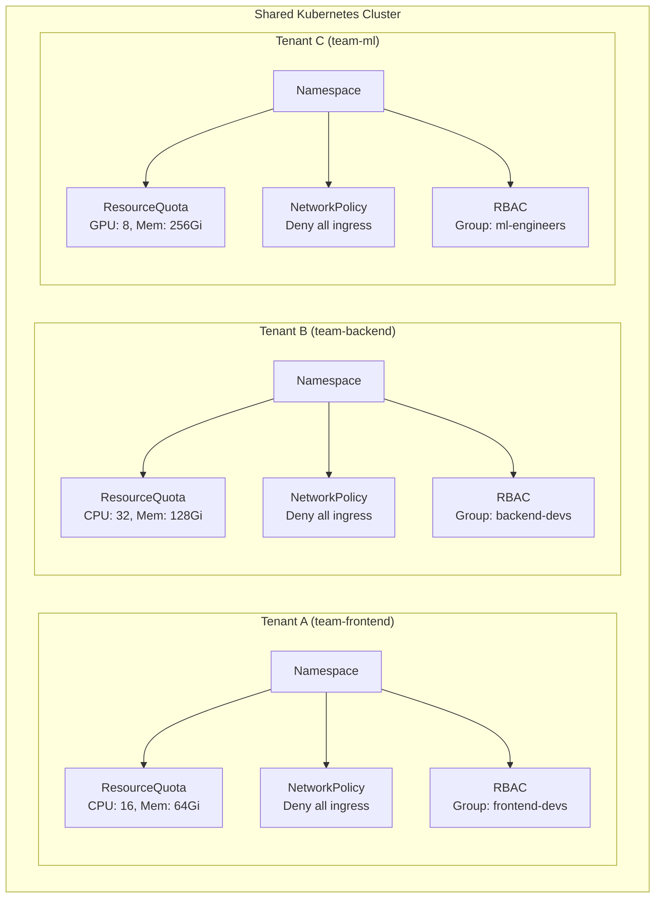

> 💡 **Quick Answer:** Implement multi-tenancy with defense-in-depth: namespace isolation + RBAC + ResourceQuotas + LimitRanges + NetworkPolicies + Pod Security Standards. For strong isolation between untrusted tenants, use vCluster or Kamaji for virtual control planes.

## The Problem

Enterprise platforms serve multiple teams, projects, or customers on shared Kubernetes clusters. Without proper isolation, one tenant can consume all resources, access another tenant's secrets, or intercept network traffic. You need layered controls that enforce boundaries without requiring separate clusters per team.



## The Solution

### Layer 1: Namespace Isolation with RBAC

```yaml
# Tenant namespace with labels
apiVersion: v1
kind: Namespace
metadata:
  name: team-frontend
  labels:
    tenant: frontend
    cost-center: cc-1234
    environment: production
---
# RBAC: team gets edit access to their namespace only
apiVersion: rbac.authorization.k8s.io/v1
kind: RoleBinding
metadata:
  name: tenant-admin
  namespace: team-frontend
subjects:
  - kind: Group
    name: "oidc:frontend-devs"
    apiGroup: rbac.authorization.k8s.io
roleRef:
  kind: ClusterRole
  name: edit
  apiGroup: rbac.authorization.k8s.io
```

### Layer 2: Resource Quotas and LimitRanges

```yaml
apiVersion: v1
kind: ResourceQuota
metadata:
  name: tenant-quota
  namespace: team-frontend
spec:
  hard:
    requests.cpu: "16"
    requests.memory: 64Gi
    limits.cpu: "32"
    limits.memory: 128Gi
    persistentvolumeclaims: "10"
    services.loadbalancers: "2"
    pods: "50"
    secrets: "20"
    configmaps: "20"
---
apiVersion: v1
kind: LimitRange
metadata:
  name: tenant-limits
  namespace: team-frontend
spec:
  limits:
    - type: Container
      default:
        cpu: 500m
        memory: 512Mi
      defaultRequest:
        cpu: 100m
        memory: 128Mi
      max:
        cpu: "4"
        memory: 8Gi
    - type: PersistentVolumeClaim
      max:
        storage: 100Gi
```

### Layer 3: Network Isolation

```yaml
# Default deny all ingress and egress
apiVersion: networking.k8s.io/v1
kind: NetworkPolicy
metadata:
  name: default-deny-all
  namespace: team-frontend
spec:
  podSelector: {}
  policyTypes:
    - Ingress
    - Egress
---
# Allow intra-namespace communication
apiVersion: networking.k8s.io/v1
kind: NetworkPolicy
metadata:
  name: allow-same-namespace
  namespace: team-frontend
spec:
  podSelector: {}
  policyTypes:
    - Ingress
    - Egress
  ingress:
    - from:
        - podSelector: {}
  egress:
    - to:
        - podSelector: {}
    # Allow DNS
    - to:
        - namespaceSelector: {}
          podSelector:
            matchLabels:
              k8s-app: kube-dns
      ports:
        - protocol: UDP
          port: 53
        - protocol: TCP
          port: 53
---
# Allow ingress from ingress controller only
apiVersion: networking.k8s.io/v1
kind: NetworkPolicy
metadata:
  name: allow-ingress-controller
  namespace: team-frontend
spec:
  podSelector:
    matchLabels:
      app: web
  ingress:
    - from:
        - namespaceSelector:
            matchLabels:
              kubernetes.io/metadata.name: ingress-nginx
```

### Layer 4: Pod Security Standards

```yaml
# Enforce restricted pod security on tenant namespace
apiVersion: v1
kind: Namespace
metadata:
  name: team-frontend
  labels:
    pod-security.kubernetes.io/enforce: restricted
    pod-security.kubernetes.io/audit: restricted
    pod-security.kubernetes.io/warn: restricted
```

### Layer 5: Hierarchical Namespaces (HNC)

For organizations with many teams under departments:

```yaml
# Install Hierarchical Namespace Controller
kubectl apply -f https://github.com/kubernetes-sigs/hierarchical-namespaces/releases/latest/download/default.yaml

# Create parent namespace
kubectl create namespace department-engineering

# Create child namespaces that inherit policies
kubectl hns create team-frontend -n department-engineering
kubectl hns create team-backend -n department-engineering
kubectl hns create team-platform -n department-engineering

# Policies propagate from parent to children:
# - RBAC RoleBindings
# - NetworkPolicies
# - ResourceQuotas (via Kyverno/OPA)
```

### Layer 6: vCluster for Strong Isolation

When namespace-level isolation isn't sufficient (untrusted tenants, CRD conflicts):

```bash
# Install vCluster CLI
curl -L -o vcluster "https://github.com/loft-sh/vcluster/releases/latest/download/vcluster-linux-amd64"
chmod +x vcluster && sudo mv vcluster /usr/local/bin/

# Create a virtual cluster for tenant
vcluster create team-ml \
  --namespace vcluster-team-ml \
  --set vcluster.resources.limits.cpu=8 \
  --set vcluster.resources.limits.memory=16Gi \
  --set sync.persistentvolumes.enabled=true

# Connect to virtual cluster
vcluster connect team-ml --namespace vcluster-team-ml

# Tenant gets full cluster-admin inside their vCluster
# - Own CRDs, operators, RBAC
# - Isolated API server
# - Resources mapped to host namespace
```

### Tenant Onboarding Automation

```yaml
# Kyverno policy: auto-create tenant resources on namespace creation
apiVersion: kyverno.io/v1
kind: ClusterPolicy
metadata:
  name: tenant-onboarding
spec:
  rules:
    - name: generate-quota
      match:
        resources:
          kinds:
            - Namespace
          selector:
            matchLabels:
              tenant: "*"
      generate:
        kind: ResourceQuota
        name: tenant-quota
        namespace: "{{request.object.metadata.name}}"
        data:
          spec:
            hard:
              requests.cpu: "16"
              requests.memory: 64Gi
              pods: "50"
    - name: generate-network-policy
      match:
        resources:
          kinds:
            - Namespace
          selector:
            matchLabels:
              tenant: "*"
      generate:
        kind: NetworkPolicy
        name: default-deny
        namespace: "{{request.object.metadata.name}}"
        data:
          spec:
            podSelector: {}
            policyTypes:
              - Ingress
              - Egress
```

## Common Issues

| Issue | Cause | Fix |
|-------|-------|-----|
| Tenant can list other namespaces | Default K8s allows namespace listing | Use OPA/Kyverno to filter namespace list or use vCluster |
| ResourceQuota not enforced | Missing LimitRange defaults | Pods without requests/limits bypass quotas — add LimitRange |
| DNS resolution across tenants | Default CoreDNS allows cross-namespace | Restrict with NetworkPolicy egress rules |
| CRD conflicts between tenants | CRDs are cluster-scoped | Use vCluster or Kamaji for CRD isolation |
| Noisy neighbor (CPU throttling) | One tenant consuming all CPU | Set `limits.cpu` in ResourceQuota and enforce with LimitRange |

## Best Practices

- **Defense in depth** — never rely on a single isolation mechanism; layer RBAC + NetworkPolicy + Quotas + PSS
- **Automate onboarding** — use Kyverno/OPA to auto-generate isolation resources on namespace creation
- **Label everything** — consistent `tenant`, `cost-center`, `environment` labels for policy enforcement and chargeback
- **Audit cross-tenant access** — enable API server audit logging filtered by namespace
- **Right-size quotas** — review usage quarterly and adjust; over-provisioning wastes capacity, under-provisioning blocks teams
- **Use vCluster for untrusted tenants** — namespace isolation has inherent limits (CRDs, node access, cluster-scoped resources)

## Key Takeaways

- Enterprise multi-tenancy requires 5-6 layers: namespaces, RBAC, quotas, network policies, pod security, and optionally virtual clusters
- Automate tenant onboarding with policy engines to ensure consistent isolation
- vCluster provides the strongest isolation without the cost of separate physical clusters
- Hierarchical namespaces simplify management for large organizations with department structures
