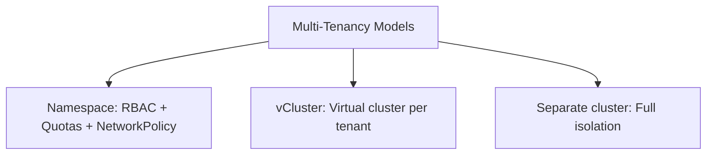

> 💡 **Quick Answer:** Implement multi-tenancy in Kubernetes with namespaces, RBAC, quotas, network policies, and virtual clusters. Covers soft and hard tenancy models.

## The Problem

This is one of the most searched Kubernetes topics. A comprehensive, well-structured guide helps engineers of all levels quickly find actionable solutions.

## The Solution

Detailed implementation with production-ready examples below.


### Soft Multi-Tenancy (Namespace-Based)

```yaml
# 1. Namespace per tenant
apiVersion: v1
kind: Namespace
metadata:
  name: team-frontend
  labels:
    tenant: frontend
---
# 2. Resource Quotas
apiVersion: v1
kind: ResourceQuota
metadata:
  name: tenant-quota
  namespace: team-frontend
spec:
  hard:
    requests.cpu: "8"
    requests.memory: 16Gi
    limits.cpu: "16"
    limits.memory: 32Gi
    pods: "40"
    services: "10"
---
# 3. Limit Ranges (defaults per pod)
apiVersion: v1
kind: LimitRange
metadata:
  name: default-limits
  namespace: team-frontend
spec:
  limits:
    - type: Container
      default:
        cpu: 500m
        memory: 256Mi
      defaultRequest:
        cpu: 100m
        memory: 128Mi
---
# 4. Network isolation
apiVersion: networking.k8s.io/v1
kind: NetworkPolicy
metadata:
  name: isolate-tenant
  namespace: team-frontend
spec:
  podSelector: {}
  policyTypes: [Ingress, Egress]
  ingress:
    - from:
        - namespaceSelector:
            matchLabels:
              tenant: frontend
  egress:
    - to:
        - namespaceSelector:
            matchLabels:
              tenant: frontend
    - to: []    # Allow DNS
      ports:
        - port: 53
          protocol: UDP
```

### Hard Multi-Tenancy (Virtual Clusters)

```bash
# vCluster — full virtual K8s cluster per tenant
vcluster create tenant-a --namespace tenant-a
vcluster connect tenant-a --namespace tenant-a
# Tenant gets full cluster-admin inside their vCluster
# but it's isolated within the host cluster namespace
```

| Model | Isolation | Overhead | Use Case |
|-------|-----------|----------|----------|
| Namespace | Soft | Low | Teams in same org |
| vCluster | Hard | Medium | Untrusted tenants, dev envs |
| Separate cluster | Full | High | Compliance, regulated |



## Common Issues

Check `kubectl describe` and `kubectl get events` first — most issues have clear error messages pointing to the root cause.

## Best Practices

- **Follow least privilege** — only grant the access that's needed
- **Test in staging** before applying to production
- **Monitor and alert** on key metrics
- **Document your runbooks** for the team

## Key Takeaways

- Essential knowledge for Kubernetes operations
- Start simple and evolve your approach
- Automation reduces human error
- Share knowledge with your team
