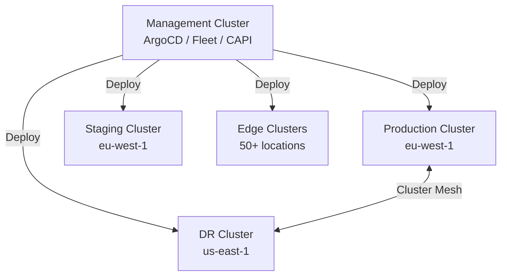

> 💡 **Quick Answer:** Use `kubectx` for fast context switching, Rancher Fleet or ArgoCD ApplicationSets for GitOps across clusters, and Cluster API for lifecycle management. For service discovery across clusters, use Cilium Cluster Mesh or Istio multi-cluster.

## The Problem

Organizations run multiple clusters: dev/staging/prod, multi-region for DR, edge clusters, or per-team isolation. Managing them individually doesn't scale — you need centralized deployment, policy enforcement, and service connectivity.

## The Solution

### Context Management

```bash
# Install kubectx
brew install kubectx

# Switch contexts
kubectx production
kubectx staging

# Rename for clarity
kubectx prod=arn:aws:eks:eu-west-1:123456789:cluster/production
kubectx staging=arn:aws:eks:eu-west-1:123456789:cluster/staging

# Quick namespace switching
kubens production
```

### GitOps with ArgoCD ApplicationSets

```yaml
apiVersion: argoproj.io/v1alpha1
kind: ApplicationSet
metadata:
  name: my-app-multicluster
  namespace: argocd
spec:
  generators:
    - clusters:
        selector:
          matchLabels:
            environment: production
  template:
    metadata:
      name: 'my-app-{{name}}'
    spec:
      project: default
      source:
        repoURL: https://git.example.com/apps/my-app.git
        targetRevision: main
        path: overlays/production
      destination:
        server: '{{server}}'
        namespace: production
      syncPolicy:
        automated:
          prune: true
          selfHeal: true
```

### Rancher Fleet for Edge

```yaml
apiVersion: fleet.cattle.io/v1alpha1
kind: GitRepo
metadata:
  name: my-app
  namespace: fleet-default
spec:
  repo: https://git.example.com/apps/my-app.git
  branch: main
  paths:
    - overlays/edge
  targets:
    - name: edge-clusters
      clusterSelector:
        matchLabels:
          location: edge
```

### Multi-Cluster Service Discovery

```yaml
# Cilium Cluster Mesh
apiVersion: cilium.io/v2
kind: CiliumExternalWorkload
metadata:
  name: backend-svc
spec:
  ipv4-alloc-cidr: "10.0.0.0/8"
```



## Common Issues

**Kubeconfig conflicts — wrong cluster targeted**

Use `kubectx` for explicit switching and `kubectl config current-context` before destructive operations.

**ArgoCD can't reach remote cluster API**

Register clusters with `argocd cluster add <context>`. Ensure network connectivity (VPN, peering) between ArgoCD and target clusters.

## Best Practices

- **Descriptive context names** — `prod-eu`, `staging-us`, not default ARN strings
- **GitOps for multi-cluster** — single source of truth, automated sync
- **Cluster API for lifecycle** — create, upgrade, delete clusters declaratively
- **Separate management cluster** — don't run ArgoCD on the same cluster it manages

## Key Takeaways

- `kubectx` + `kubens` for fast context/namespace switching
- ArgoCD ApplicationSets deploy to multiple clusters from one definition
- Rancher Fleet excels at edge/IoT with hundreds of clusters
- Cluster API manages cluster lifecycle (create, upgrade, scale)
- Cilium Cluster Mesh and Istio multi-cluster enable cross-cluster service discovery
