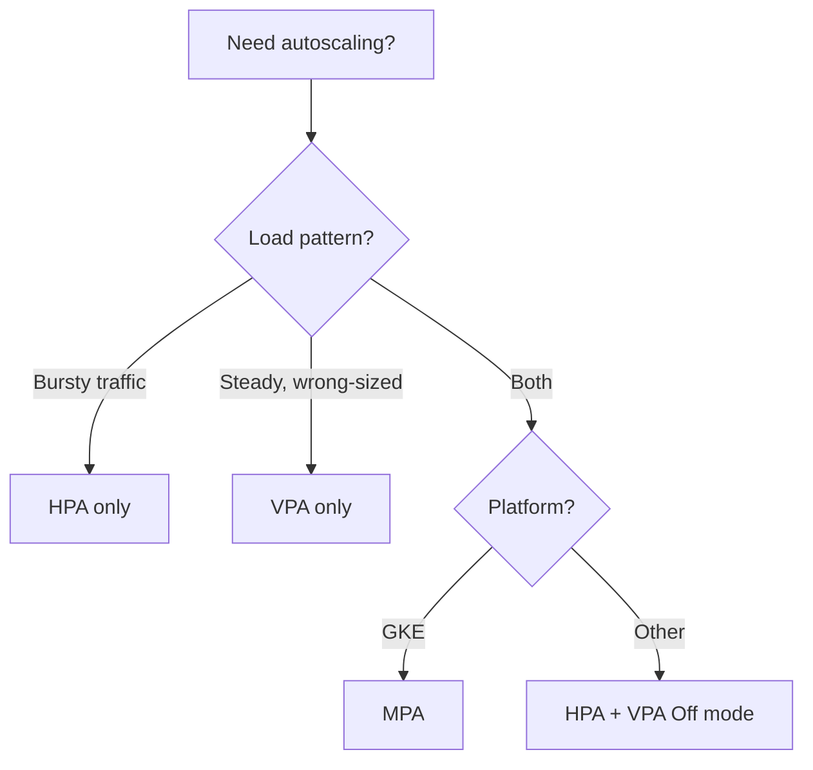

> 💡 **Quick Answer:** MPA (Multidimensional Pod Autoscaler) scales replicas AND adjusts resource requests simultaneously. It solves the classic "HPA or VPA but not both" problem. On GKE, use `MultidimPodAutoscaler` CRD. On vanilla K8s, combine HPA (for replicas) with VPA in `Off` mode (for recommendations) and apply recommendations via CI/CD.

## The Problem

HPA and VPA conflict when targeting the same resource (CPU):
- HPA wants to add pods when CPU is high
- VPA wants to increase CPU requests per pod
- Running both causes oscillation

You need both: right-sized pods AND the right number of them.

## The Solution (GKE)

```yaml
apiVersion: autoscaling.gke.io/v1beta1
kind: MultidimPodAutoscaler
metadata:
  name: webapp-mpa
  namespace: production
spec:
  scaleTargetRef:
    apiVersion: apps/v1
    kind: Deployment
    name: webapp
  goals:
    metrics:
      - type: Resource
        resource:
          name: cpu
          target:
            type: Utilization
            averageUtilization: 70
  constraints:
    container:
      - name: app
        requests:
          minAllowed:
            cpu: 100m
            memory: 128Mi
          maxAllowed:
            cpu: "4"
            memory: 4Gi
    global:
      minReplicas: 2
      maxReplicas: 50
  policy:
    updateMode: Auto
```

## Vanilla Kubernetes Alternative

Combine HPA + VPA in `Off` mode:

```yaml
# VPA in Off mode — provides recommendations only
apiVersion: autoscaling.k8s.io/v1
kind: VerticalPodAutoscaler
metadata:
  name: webapp-vpa
spec:
  targetRef:
    apiVersion: apps/v1
    kind: Deployment
    name: webapp
  updatePolicy:
    updateMode: "Off"
  resourcePolicy:
    containerPolicies:
      - containerName: app
        minAllowed:
          cpu: 100m
          memory: 128Mi
        maxAllowed:
          cpu: "4"
          memory: 4Gi
---
# HPA for horizontal scaling (uses memory only to avoid VPA conflict)
apiVersion: autoscaling/v2
kind: HorizontalPodAutoscaler
metadata:
  name: webapp-hpa
spec:
  scaleTargetRef:
    apiVersion: apps/v1
    kind: Deployment
    name: webapp
  minReplicas: 2
  maxReplicas: 50
  metrics:
    - type: Resource
      resource:
        name: cpu
        target:
          type: Utilization
          averageUtilization: 70
```

Then apply VPA recommendations via CI/CD:

```bash
#!/bin/bash
# Apply VPA recommendations during maintenance windows
RECS=$(kubectl get vpa webapp-vpa -o jsonpath='{.status.recommendation.containerRecommendations[0]}')
CPU=$(echo "$RECS" | jq -r '.target.cpu')
MEM=$(echo "$RECS" | jq -r '.target.memory')

kubectl patch deployment webapp --type='json' -p="[
  {"op": "replace", "path": "/spec/template/spec/containers/0/resources/requests/cpu", "value": "${CPU}"},
  {"op": "replace", "path": "/spec/template/spec/containers/0/resources/requests/memory", "value": "${MEM}"}
]"
```

## Decision Matrix



## Common Issues

| Issue | Cause | Fix |
|-------|-------|-----|
| HPA/VPA oscillation | Both targeting CPU | Use MPA or VPA in Off mode |
| MPA not available | Not on GKE | Use HPA + VPA Off pattern |
| Pods restarting frequently | VPA Auto mode with HPA | Switch VPA to Off |
| Recommendations not appearing | VPA needs history | Wait 24h for recommendations |

## Best Practices

1. **GKE users: use MPA directly** — It handles the coordination
2. **Others: VPA Off + HPA** — Apply VPA recommendations in maintenance windows
3. **Never run VPA Auto + HPA on same metric** — They will fight
4. **VPA for memory, HPA for CPU** — This combination works without conflict
5. **Review VPA recommendations weekly** — Even in Off mode, check if requests drift

## Key Takeaways

- MPA is Google's solution to the HPA vs VPA conflict
- On vanilla K8s, use VPA in Off mode + HPA with separate metrics
- The "VPA for memory, HPA for CPU" pattern works everywhere
- Always set min/maxAllowed constraints to prevent extreme resizing
- Monitor both scaling dimensions independently
