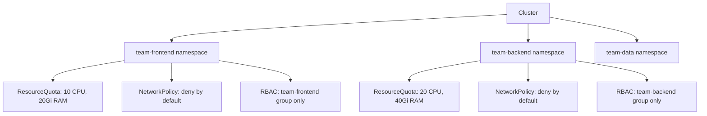

> 💡 **Quick Answer:** Design and manage Kubernetes namespaces effectively. Covers naming conventions, resource quotas, RBAC isolation, network policies, and multi-tenancy patterns.

## The Problem

Namespaces are the fundamental unit of multi-tenancy in Kubernetes. Poor namespace design leads to security gaps, resource conflicts, and operational chaos.

## The Solution

### Namespace Design Patterns

```bash
# Pattern 1: Per-team namespaces
kubectl create namespace team-frontend
kubectl create namespace team-backend
kubectl create namespace team-data

# Pattern 2: Per-environment
kubectl create namespace staging
kubectl create namespace production

# Pattern 3: Per-application (microservices)
kubectl create namespace checkout-service
kubectl create namespace payment-service

# Recommended: Combination
# team-frontend-staging, team-frontend-production
```

### Resource Quotas (Prevent Noisy Neighbors)

```yaml
apiVersion: v1
kind: ResourceQuota
metadata:
  name: team-quota
  namespace: team-frontend
spec:
  hard:
    requests.cpu: "10"
    requests.memory: 20Gi
    limits.cpu: "20"
    limits.memory: 40Gi
    pods: "50"
    services: "20"
    persistentvolumeclaims: "10"
    requests.storage: 100Gi
---
apiVersion: v1
kind: LimitRange
metadata:
  name: default-limits
  namespace: team-frontend
spec:
  limits:
    - type: Container
      default:
        cpu: 500m
        memory: 256Mi
      defaultRequest:
        cpu: 100m
        memory: 128Mi
      max:
        cpu: "4"
        memory: 8Gi
```

### RBAC Isolation

```yaml
# Team can only access their namespace
apiVersion: rbac.authorization.k8s.io/v1
kind: RoleBinding
metadata:
  name: team-frontend-admin
  namespace: team-frontend
subjects:
  - kind: Group
    name: team-frontend
    apiGroup: rbac.authorization.k8s.io
roleRef:
  kind: ClusterRole
  name: admin
  apiGroup: rbac.authorization.k8s.io
```

### Network Policy Isolation

```yaml
# Default deny all traffic in namespace
apiVersion: networking.k8s.io/v1
kind: NetworkPolicy
metadata:
  name: default-deny
  namespace: team-frontend
spec:
  podSelector: {}
  policyTypes:
    - Ingress
    - Egress
---
# Allow DNS
apiVersion: networking.k8s.io/v1
kind: NetworkPolicy
metadata:
  name: allow-dns
  namespace: team-frontend
spec:
  podSelector: {}
  policyTypes: ["Egress"]
  egress:
    - to:
        - namespaceSelector: {}
          podSelector:
            matchLabels:
              k8s-app: kube-dns
      ports:
        - protocol: UDP
          port: 53
```



## Best Practices

- **Start with observation** — measure before optimizing
- **Automate** — manual processes don't scale
- **Iterate** — implement changes gradually and measure impact
- **Document** — keep runbooks for your team

## Key Takeaways

- This is a critical capability for production Kubernetes clusters
- Start with the simplest approach and evolve as needed
- Monitor and measure the impact of every change
- Share knowledge across your team with internal documentation
