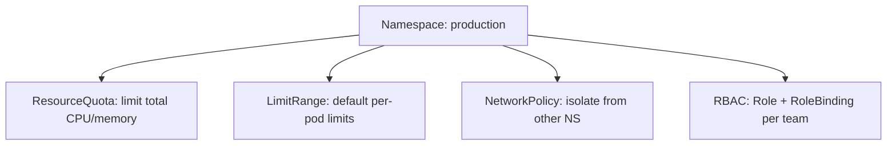

> 💡 **Quick Answer:** configuration

## The Problem

This is a fundamental Kubernetes topic that engineers search for frequently. A comprehensive reference with production-ready examples saves hours of trial and error.

## The Solution

### Create and Manage Namespaces

```bash
# Create
kubectl create namespace production
kubectl create namespace staging

# List
kubectl get namespaces
kubectl get ns

# Set default namespace for context
kubectl config set-context --current --namespace=production

# Delete (WARNING: deletes everything inside!)
kubectl delete namespace staging
```

```yaml
apiVersion: v1
kind: Namespace
metadata:
  name: production
  labels:
    environment: production
    team: platform
    pod-security.kubernetes.io/enforce: restricted
```

### Default Namespaces

| Namespace | Purpose |
|-----------|---------|
| `default` | Resources with no namespace specified |
| `kube-system` | Kubernetes system components |
| `kube-public` | Publicly readable (cluster info) |
| `kube-node-lease` | Node heartbeat leases |

### Namespace Isolation Stack

```yaml
# 1. ResourceQuota — limit resource consumption
apiVersion: v1
kind: ResourceQuota
metadata:
  name: compute-quota
  namespace: production
spec:
  hard:
    requests.cpu: "20"
    requests.memory: 40Gi
    limits.cpu: "40"
    limits.memory: 80Gi
    pods: "100"
    services: "20"
    persistentvolumeclaims: "30"
---
# 2. LimitRange — default per-pod limits
apiVersion: v1
kind: LimitRange
metadata:
  name: default-limits
  namespace: production
spec:
  limits:
    - type: Container
      default:
        cpu: 500m
        memory: 256Mi
      defaultRequest:
        cpu: 100m
        memory: 128Mi
      max:
        cpu: "4"
        memory: 8Gi
---
# 3. NetworkPolicy — namespace isolation
apiVersion: networking.k8s.io/v1
kind: NetworkPolicy
metadata:
  name: deny-other-namespaces
  namespace: production
spec:
  podSelector: {}
  policyTypes: [Ingress]
  ingress:
    - from:
        - namespaceSelector:
            matchLabels:
              environment: production
```

```bash
# Access resources across namespaces
kubectl get pods -n kube-system
kubectl get pods -A                  # All namespaces
kubectl get svc my-svc -n other-ns

# DNS across namespaces
# service.namespace.svc.cluster.local
curl http://api-server.production.svc.cluster.local:8080
```



## Frequently Asked Questions

### How many namespaces should I have?

One per team, environment, or application boundary. Common pattern: `team-frontend-prod`, `team-backend-staging`. Avoid too many (management overhead) or too few (no isolation).

### Can I move resources between namespaces?

No — you must delete and recreate in the new namespace. Some tools like `kubectl neat` can help export clean YAML for re-creation.

## Best Practices

- Start with the simplest configuration that meets your needs
- Test changes in staging before production
- Use `kubectl describe` and events for troubleshooting
- Document your decisions for the team

## Key Takeaways

- This is essential Kubernetes knowledge for production operations
- Follow the principle of least privilege and minimal configuration
- Monitor and iterate based on real-world behavior
- Automation reduces human error and improves consistency
