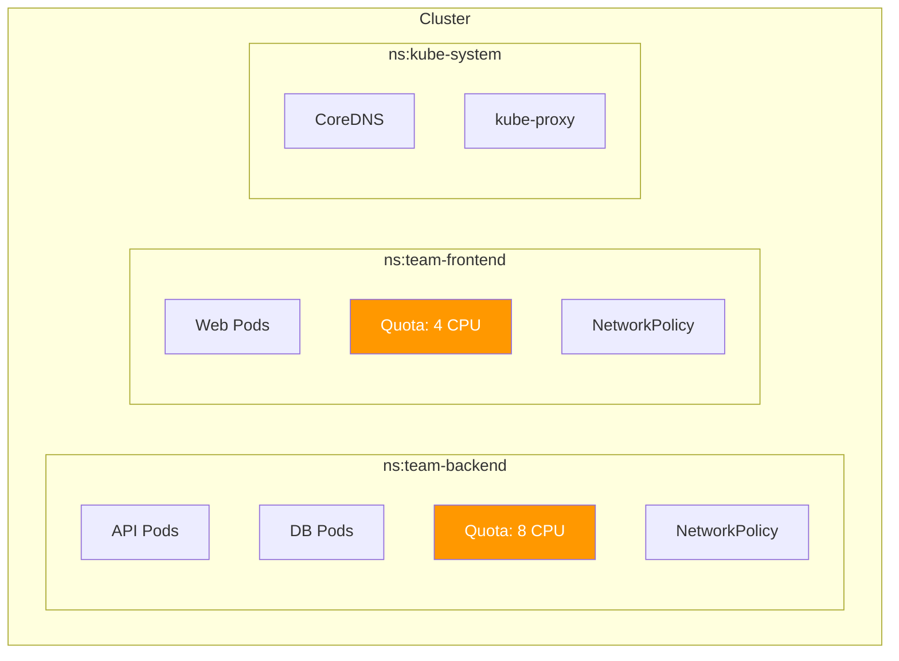

> 💡 **Quick Answer:** Namespaces partition a cluster into virtual sub-clusters for team isolation, resource quotas, and RBAC scoping. Create with `kubectl create namespace team-a`, then apply ResourceQuotas, LimitRanges, NetworkPolicies, and RoleBindings per namespace. Use namespaces for environments (dev/staging/prod) or teams — not for individual applications.

## The Problem

A single flat Kubernetes cluster without namespaces leads to:

- No resource isolation between teams
- RBAC that's too broad or impossible to scope
- Resource contention without quotas
- Naming collisions between applications
- No visibility into per-team resource consumption

## The Solution

### Create Namespaces

```bash
# Imperative
kubectl create namespace team-backend
kubectl create namespace team-frontend
kubectl create namespace staging

# Declarative
cat <<EOF | kubectl apply -f -
apiVersion: v1
kind: Namespace
metadata:
  name: team-backend
  labels:
    team: backend
    environment: production
    cost-center: eng-001
  annotations:
    owner: backend-team@example.com
EOF
```

### Namespace Provisioning Template

```yaml
# namespace-template.yaml — apply for each new team
apiVersion: v1
kind: Namespace
metadata:
  name: ${TEAM}
  labels:
    team: ${TEAM}
---
apiVersion: v1
kind: ResourceQuota
metadata:
  name: default-quota
  namespace: ${TEAM}
spec:
  hard:
    requests.cpu: "8"
    requests.memory: 32Gi
    limits.cpu: "16"
    limits.memory: 64Gi
    pods: "30"
    persistentvolumeclaims: "10"
---
apiVersion: v1
kind: LimitRange
metadata:
  name: default-limits
  namespace: ${TEAM}
spec:
  limits:
  - type: Container
    default:
      cpu: 500m
      memory: 256Mi
    defaultRequest:
      cpu: 100m
      memory: 128Mi
---
apiVersion: networking.k8s.io/v1
kind: NetworkPolicy
metadata:
  name: deny-all-ingress
  namespace: ${TEAM}
spec:
  podSelector: {}
  policyTypes:
  - Ingress
---
apiVersion: rbac.authorization.k8s.io/v1
kind: RoleBinding
metadata:
  name: team-admin
  namespace: ${TEAM}
subjects:
- kind: Group
  name: ${TEAM}-devs
  apiGroup: rbac.authorization.k8s.io
roleRef:
  kind: ClusterRole
  name: edit
  apiGroup: rbac.authorization.k8s.io
```

```bash
# Provision for a team
TEAM=backend envsubst < namespace-template.yaml | kubectl apply -f -
```

### Namespace Operations

```bash
# List namespaces
kubectl get namespaces

# Set default namespace for context
kubectl config set-context --current --namespace=team-backend

# View resources across all namespaces
kubectl get pods -A

# Delete namespace (WARNING: deletes ALL resources in it)
kubectl delete namespace staging

# View resource usage per namespace
kubectl top pods -n team-backend
```

### Default Namespaces

| Namespace | Purpose |
|-----------|---------|
| `default` | Fallback — avoid using in production |
| `kube-system` | Control plane components |
| `kube-public` | Publicly readable (cluster-info) |
| `kube-node-lease` | Node heartbeat leases |



## Common Issues

**Namespace stuck in "Terminating"**

Finalizers are blocking deletion. Check: `kubectl get ns <name> -o json | jq '.spec.finalizers'`. Remove stuck finalizers via API patch as a last resort.

**Resources created in wrong namespace**

Always use `-n <namespace>` or set your default context namespace. Never rely on `default`.

**Cross-namespace communication blocked**

NetworkPolicies are namespace-scoped. For cross-namespace traffic, create explicit ingress rules allowing traffic from the other namespace's pod CIDR or labels.

## Best Practices

- **Namespace per team, not per app** — avoid namespace sprawl
- **Always provision with quotas and limits** — naked namespaces invite abuse
- **Label namespaces** for policy targeting (Kyverno, OPA, NetworkPolicy)
- **Don't use `default` namespace** — no quotas, easy to forget `-n`
- **Automate provisioning** — use templates or GitOps for consistent setup
- **NetworkPolicy deny-all by default** — then allow specific traffic

## Key Takeaways

- Namespaces provide logical isolation for teams and environments
- Always pair namespaces with ResourceQuota, LimitRange, NetworkPolicy, and RBAC
- Automate namespace provisioning with templates for consistency
- Label namespaces for policy engines and cost attribution
- Namespace deletion cascades — it removes everything inside
